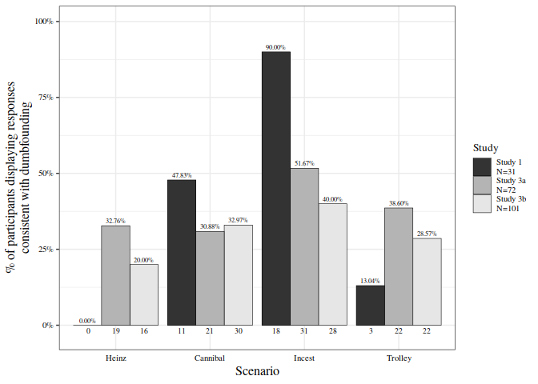

>Moral dumbfounding is defined as maintaining a moral judgement, without supporting reasons. The most cited demonstration of dumbfounding does not identify a specific measure of dumbfounding and has not been published in peer-review form, or directly replicated. Despite limited empirical examination, dumbfounding has been widely discussed in moral psychology. The present research examines the reliability with which dumbfounding can be elicited, and aims to identify measureable indicators of dumbfounding. Study 1 aimed at establishing the effect that is reported in the literature. Participants read four scenarios and judged the actions described. An Interviewer challenged participants’ stated reasons for judgements. Dumbfounding was evoked, as measured by two indicators, admissions of not having reasons (17%), unsupported declarations (9%) with differences between scenarios. Study 2 measured dumbfounding as the selecting of an unsupported declaration as part of a computerised task. We observed high rates of dumbfounding across all scenarios. Studies 3a (college sample) and 3b (MTurk sample), addressing limitations in Study 2, replaced the unsupported declaration with an admission of having no reason, and included open-ended responses that were coded for unsupported declarations. As predicted, lower rates of dumbfounding were observed (3a 20%; 3b 16%; or 3a 32%; 3b 24% including unsupported declarations in open-ended responses). Two measures provided evidence for dumbfounding across three studies; rates varied with task type (interview/computer task), and with the particular measure being employed (admissions of not having reasons/unsupported declarations). Possible cognitive processes underlying dumbfounding and limitations of methodologies used are discussed as a means to account for this variability.

<button type="button" class="btn btn-primary btn-sm" onclick="window.open('https://raw.githubusercontent.com/cillianmiltown/website_quarto/main/publications/pubs/searching-for-moral-dumbfounding/searching-for-moral-dumbfounding.pdf');" data-inline="true" >PDF</button>
<button type="button" class="btn btn-primary btn-sm" onclick="window.open('https://online.ucpress.edu/collabra/article/3/1/23/112379/Searching-for-Moral-Dumbfounding-Identifying');" >Source Document</button>
<button type="button" class="btn btn-primary btn-sm" onclick="window.open('https://osf.io/wm6vc/');" >OSF</button>

<html xmlns="http://www.w3.org/1999/xhtml" xml:lang="en">
<head>
<meta http-equiv="Content-Type" content="text/html; charset=utf-8"/>
<title>Bibliography</title>
</head>
<body>

  
McHugh, C., McGann, M., Igou, E. R., &amp; Kinsella, E. L. (2017). Searching for Moral Dumbfounding: Identifying Measurable Indicators of Moral Dumbfounding. <i>Collabra: Psychology</i>, <i>3</i>(1), 1–24. <a href="https://doi.org/10.1525/collabra.79">https://doi.org/10.1525/collabra.79</a>

  

</body>
</html>

# Searching for Moral Dumbfounding: Identifying Measurable Indicators of Moral Dumbfounding

Moral dumbfounding occurs when people stubbornly maintain a moral judgement, even though they can provide no reason to support their judgements (Haidt 2001; Haidt, Björklund, and Murphy 2000; Prinz 2005). It typically manifests as a state of confusion or puzzlement coupled with ( a ) an admission of not having reasons or ( b ) the use of unsupported declarations (“It’s just wrong!”) as justification for a judgement (Haidt, Björklund, and Murphy 2000; Haidt and Hersh 2001), particularly, when people encounter taboo behaviours that do not result in any harm. The classic and most commonly cited example involves an act of consensual incest between a brother and sister with the use of contraceptive (<em>Incest</em>). Another example (<em>Cannibal</em>) involves an act of cannibalism with a body that is already dead and is due to be incinerated the next day (Haidt, Björklund, and Murphy 2000).<a href="#fn1" class="footnote-ref" id="fnref1">1</a>

# Defining and Measuring Moral Dumbfounding

Definitions of moral dumbfounding vary within the moral psychology literature. It was originally defined as “the stubborn and puzzled maintenance of a judgment without supporting reasons” (Haidt, Björklund, and Murphy 2000, 2; see also, Haidt and Hersh 2001, 194; Haidt and Björklund 2008, 197). Some authors cite the original definition verbatim (e.g., Jacobson 2012; Royzman, Kim, and Leeman 2015); others include the maintenance of a moral judgement despite the absence of supporting reason, but omit any reference to stubbornness or puzzlement (e.g., Cushman, Young, and Hauser 2006; Dwyer 2009; Gray, Schein, and Ward 2014; Haidt 2007; Wielenberg 2014); and some refer to confidence in the judgement, but again, omit any reference to stubbornness or puzzlement (e.g., Cushman, Young, and Greene 2010; Hauser et al. 2007; Hauser, Young, and Cushman 2008; Pizarro and Bloom 2003; Sneddon 2007).

It is apparent from the literature that there is no single, agreed definition of moral dumbfounding. That said, an absence of reasons for, or an inability to justify or defend, a moral judgement, is consistently identified across definitions. However, even despite this apparent consistency, there remains considerable variation in the language used to describe this “failure to provide reasons for a moral judgement”. Indeed, the lack of definitional specificity has led to differing interpretations of moral dumbfounding. It also allows for the possibility of disagreement relating to the implications, both theoretical and practical, of moral dumbfounding.

According to the original definition, moral dumbfounding is “the stubborn and puzzled maintenance of a judgment without supporting reasons” (Haidt, Björklund, and Murphy 2000, 2). This definition contains four separate elements: (i) stubbornness; (ii) puzzlement; (iii) maintaining of the judgement; and (iv) the absence of supporting reasons. Of these individual elements, stubbornness and puzzlement, arguably, emerge as consequences of the combination of the maintenance of the judgement in the absence of supporting reasons. If a person maintains a judgement in the absence of reasons (and this absence of reasons has been pointed out to them) they will be perceived as stubborn; and, if a person becomes aware that they do not have reasons for their judgement, they may become puzzled.

Following this, and in line with the wider literature, the combination of elements (iii) and (iv), the maintenance of the judgement in the absence of supporting reasons are identified as essential elements of dumbfounding. This does not mean that stubbornness and puzzlement should be ignored entirely; accounting for them may be useful in differentiating between a failure to provide reasons and a refusal to provide reasons. However, viewing stubbornness and puzzlement as consequences of the maintenance of a judgement in the absence of supporting reasons, indicates that they are subsequent to, and not a necessary part of, moral dumbfounding.

This view of dumbfounding includes the elements of the phenomenon that are mentioned the most frequently within the wider literature. It is also consistent with the way dumbfounding is described in the original study by Haidt, Björklund, and Murphy (2000). They report interesting variation in a number of non-verbal behaviours that may be linked with stubbornness or puzzlement, but beyond these, they do not offer a specific indication of how stubbornness and puzzlement are operationalised. Furthermore, other than appearing in the introductory definition for dumbfounding, in the abstract, (Haidt, Björklund, and Murphy 2000, 2), the terms “stubborn” and “puzzled” do not appear again for the remainder of the paper, suggesting that they are not core elements of the phenomenon.

Haidt, Björklund, and Murphy (2000) report a range of responses that may illustrate a state of dumbfoundedness (admissions of not having reasons and unsupported declarations), however, they do not provide details of the numbers of participants they classified as dumbfounded, or specific response that may be used to make such a classification. The numbers of participants who provided admissions of not having reasons are reported, however it is unclear whether or not this may be taken as a specific measure of dumbfounding or even if such a measure exists. This vagueness in the initial operationalisation of dumbfounding is reflected in the wider literature, whereby evidence of, or, illustrations of, dumbfounding include unsupported declarations (Haidt 2001, 817; Prinz 2005, 101), and tautological reasons (“because it’s incest”; Mallon and Nichols 2011, 285). The current research aims identify specific measurable responses that may be used as indicators of dumbfounding.

Drawing on the work of Haidt, Björklund, and Murphy (2000), and the wider literature, the absence of supporting reasons appears to present in two distinct ways. Firstly, and non-controversially, participants may become aware that they do not have reasons and acknowledge this (admissions of not having reasons). Secondly, participants may fail to provide reasons. Measuring this failure to provide reasons is more problematic; if a participant does not admit to not having reasons, they attempt to disguise their failure to identify reasons. The use of unsupported declarations or tautological reasons as justifications for a judgement may be identified as a failure to provide reasons. Stating “it’s just wrong” or “because it’s wrong” does not answer the question “do you have a reason for your judgement?” (Mallon and Nichols 2011, 285).

# (The Short) History of Moral Dumbfounding</h1>

The earliest evidence for moral dumbfounding emerged indirectly as a result of a study by Haidt, Koller, and Dias (1993). This was a cross-cultural study examining the variability of the moral judgements of participants depending on age, socio-economic status, and nationality (USA or Brazil). Participants were presented with a range of moral scenarios, some of which were offensive, but harmless; for example, cutting up a national flag (Brazil or USA, matched to sample) and using it to clean the bathroom; a family eating their dog after it was killed by a car; and, a brother and sister kissing each other on the mouth. When asked to justify their condemnation of certain actions, some participants (from both countries) used unsupported declarations as a reason; for example, “Because it’s wrong to eat your dog” or “Because you’re not supposed to cut up the flag” (Haidt, Koller, and Dias 1993, 632). This study was not a direct study of moral dumbfounding, rather it was investigating differences in the way people reason about moral scenarios. The use of unsupported declarations in response to some moral scenarios was noted among a range of responses (Haidt, Koller, and Dias 1993).

A later study, by Haidt, Björklund, and Murphy (2000), directly investigated the phenomenon of moral dumbfounding. In their study two moral scenarios (<em>Incest</em> and <em>Cannibal</em>: see Appendix A) designed to elicit strong emotional reactions, but with no identifiable harmful consequences (emotional intuition scenarios), were contrasted against a traditional moral judgement scenario (<em>Heinz</em>) that involved balancing the interests of two people (reasoning scenario). They observed differences in responses between the two types of scenarios, participants were better at defending their judgement for the reasoning scenario than for the emotional intuition scenarios. It appeared that these emotional intuition scenarios could elicit dumbfounding as evidenced by significant increases in ( a ) admissions of having no reasons for a judgement, or ( b ) the use of unsupported declarations (“it’s just wrong”) as a justification for a judgement (Haidt, Björklund, and Murphy 2000, 12). Although interesting, that study (consisting of a final sample of thirty participants) has not been published in peer reviewed form and has not been replicated.<a href="#fn2" class="footnote-ref" id="fnref2">2</a>

The following year, Haidt and Hersh (2001) investigated differences between conservatives and liberals, across a range of responses to moral issues, and found that conservatives produced more dumbfounded type responses (e.g., stuttering, stating “I don’t know”, admitting they could not explain their answers (Haidt and Hersh 2001, 200), than liberals when discussing particular issues. Although this study did not investigate dumbfounding directly, the findings indicate that there may be individual differences that drive moral judgements which have not yet been fully investigated.

The phenomenon of moral dumbfounding has been widely discussed in the moral psychology literature (e.g., Cushman 2013; Cushman, Young, and Hauser 2006; Cushman, Young, and Greene 2010; Hauser et al. 2007; Prinz 2005; Royzman, Kim, and Leeman 2015), but there is limited available empirical information about the nature of moral dumbfounding and the reliability with which it can be elicited in everyday human behaviour. Some authors have argued that moral dumbfounding does not really exist (Gray, Schein, and Ward 2014; Jacoby 1983; Sneddon 2007; Wielenberg 2014; see also Royzman, Kim, and Leeman 2015).<a href="#fn3" class="footnote-ref" id="fnref3">3</a> The studies described in the present paper aim to replicate the initial interview study of Haidt, Björklund, and Murphy (2000), and to explore practicable methods for testing the phenomenon, and its variability, in larger sample sizes. This will allow for more detailed study of the phenomenon. A deeper understanding of dumbfounding will inform the continuing development of theories of moral judgement, furthering our understanding of the interactions between intuitions and reasoned judgements in the way in which people make moral evaluations.

# Moral Dumbfounding and Moral Intuitions</h1>

Moral dumbfounding is used as supporting evidence for a range of “intuitionist” theories of moral judgement (e.g. Cushman, Young, and Greene 2010; Haidt 2001; Prinz 2005).According to these intuitionist theories, our moral judgements are grounded in an emotional or intuitive automatic response rather than slow deliberate reasoning (Cameron, Payne, and Doris 2013; Crockett 2013; Cushman 2013; Cushman, Young, and Greene 2010; Greene 2008; Haidt 2001; Prinz 2005). Two of the most influential such theories of moral judgement have been Haidt’s social intuitionist model (Haidt 2001; Haidt and Björklund 2008) and Greene’s dual processes model (Greene 2008, 2013; Greene et al. 2001). Haidt (2001) in his social intuitionist model likens the distinction between fast moral intuitions and slow moral reasoning to the distinction between fast and slow thinking that appears in dual systems theories of cognition (Chaiken 1980; Epstein 1994; Zajonc 1980; see also Chaiken and Trope 1999; Haidt 2001; Kahneman 2011). In introducing and defending this model, Haidt makes specific reference to one of the dumbfounding scenarios, and the findings from the unpublished manuscript relating to this dilemma (Haidt 2001; see also Haidt and Björklund 2008; Haidt and Hersh 2001). Greene draws heavily on Haidt’s work in defending his dual-process model of moral judgement (Greene 2008). In more recent years, Cushman (2013; Cushman, Young, and Greene 2010) and Crockett (2013), building on the work of Haidt and Greene have continued the development intuitionist/dual-process theories of moral judgement (Crockett 2013; Cushman 2013; Greene 2008; Haidt 2001).

The current research, following from Cushman (2013) and Crockett (2013), takes moral intuitions as “model-free” (Crockett 2013, 364; Cushman 2013, 284) or habitual responses, emerging through a long history of reinforcement learning. According to this approach, consistent with other research on implicit learning (Berry and Dienes 1993; Reber 1989; Sun, Slusarz, and Terry 2005; see also Barsalou 2008, 2009, 2003; Evans 2003), the learning of a moral norm, leading to the emergence an associated moral intuition, can occur independently of the learning of the reasons for, or explicit rules surrounding the norm. Attributing moral judgements to intuitions in this way also means that moral reasoning does not necessarily cause moral judgements, rather, at least in some circumstances, reasoning is likely to occur post-hoc.

However, the claim that reasons for intuitions are learned independently of the intuition does not necessarily imply that there are no reasons for a given intuition. This leads to two difficulties in demonstrating this separation between intuitions and reasons for the intuition have been identified. Firstly, in many circumstances, it is possible to trace the emergence of a given social or moral norm to particular reasons. Pizarro and Bloom (2003) defend the claim that moral intuitions may be rational, and informed by prior reasoning or deliberation. A related, more general claim is that deliberative (model-based) responses can, over time, become automatic or habitual (e.g., Barsalou 2003; Cushman 2013; Dreyfus and Dreyfus 1990). Secondly, in many cases, after an intuitive judgement is made, reasons that are consistent with the judgement may be through post-hoc rationalisation (e.g., Cushman et al., 2006). This means that, although there is a clear theoretical case for a separation between intuitions and reasons for these intuitions, demonstrating this separation is problematic.

Moral dumbfounding, however, is a phenomenon that may demonstrate this separation between an intuition and reasons for the intuition. In certain cases, people maintain an intuition even though they cannot provide reasons for the intuitions. It is this standing, as a rare demonstration of a crucial theoretical point, that makes moral dumbfounding so interesting. Moral dumbfounding therefore, provides evidence in support of the claim that moral intuitions are habitual and “model-free” (Crockett 2013, 364; Cushman 2013, 284). Demonstrating this separation between intuitions and reasons for the intuitions also demonstrates a separation between intuitions and the reasoning process, providing evidence for the suggestion that moral judgements are not necessarily dependent upon moral reasoning and by extension, providing implicit evidence that moral reasoning occurs post-hoc.

The existence of moral dumbfounding, therefore, is compelling evidence for intuitionist theories of moral judgement. These theories are supported by a large body of other empirical evidence, however, they are also either directly (e.g., Cushman, Young, and Greene 2010; Haidt 2001; Hauser, Young, and Cushman 2008; Prinz 2005) or indirectly (e.g., Crockett 2013; Cushman 2013; Greene 2008, 2013) grounded in the assumption that moral dumbfounding is a real phenomenon. The present research aims, to test the validity of the claim that moral dumbfounding is a real phenomenon through an attempted replication of the widely-cited unpublished study by Haidt, Björklund, and Murphy (2000). This will also test the strength of existing moral theories grounded in its existence. In addition to this, we aim to identify specific, measurable indicators of dumbfounding and develop practicable methods for eliciting and measuring dumbfounding in larger samples. These may be used to explore the phenomenon in greater depth, informing the further development of moral theory.

# Challenges to Moral Dumbfounding</h1>

In recent years moral dumbfounding has been challenged by a number of authors (e.g., Gray, Schein, and Ward 2014; Jacobson 2012; Sneddon 2007; Wielenberg 2014), arguing, in line with rationalist theories of moral judgement (Narvaez 2005; Kohlberg 1971; Topolski et al. 2013), that moral judgements are grounded in reasons. Recent work by Royzman, Kim, and Leeman (2015), involving a series of studies focusing on the Incest dilemma, identified two reasons that may be guiding participants’ judgements. The reasons identified were: ( a ) potential harm – where participants believed that harm could arise as a result of the actions of the characters in the scenario despite the vignette stating that no harm arose; and ( b ) normativity – where citing a moral norm is seen as sufficient justification for making a judgement consistent with that norm. They found, that, when participants who endorsed either of these reasons were excluded from analysis, there were only four participants (from a sample of fifty-three) who rated the behaviour as wrong without offering a reason. Following a subsequent interview, two of these participants changed their judgement, and one changed her response to the question relating to normative reasons. This left just one participant who maintained that the behaviour was wrong without valid reason and, in their view, could be truly identified as dumbfounded. Consequently, they argue that dumbfounding is not as prevalent a phenomenon as portrayed by Haidt et al. (2000; Royzman, Kim, and Leeman 2015, 310). In identifying reasons that appear to be guiding people’s judgements, they claim to have found evidence for rationalist theories of moral judgement (Royzman, Kim, and Leeman 2015, 311) over intuitionist theories. They argue that the dumbfounded behaviours observed by Haidt, Björklund, and Murphy (2000) can be attributed to social pressure that exists in an interview setting, whereby participants accept the counter-arguments offered by the interviewer, even if they disagree, in order to appear cooperative (Royzman, Kim, and Leeman 2015, 299).

Royzman, Kim, and Leeman (2015) successfully identified reasons (harm-based reasons; normative reasons) that may underlie moral judgements in the case of the Incest dilemma, showing that, in the vast majority of cases, participants who rate the behaviour as wrong also endorse these reasons if given the opportunity. It is not surprising that instances of moral dumbfounding – defined as the maintaining a moral judgement without providing supporting reasons – can be dramatically reduced by providing participants with reasons for them to endorse (particularly in view of the extensive literature on confabulation, e.g., Evans and Wason 1976; Gazzaniga and LeDoux 2013; Johansson et al. 2005; Nisbett and Wilson 1977; Wilson and Bar-Anan 2008). If a participant endorses a reason that is consistent with their judgement this does necessarily not mean that this reason contributed to the making of the judgement. Whether or not participants are able to articulate or volunteer these reasons, without external prompts, has not been the subject of careful empirical investigation. The degree to which people falsely attribute every-day judgements to reasons, that are more accurately described as post-hoc rationalisations, is well documented (Greene 2008; Johansson et al. 2005; Nisbett and Wilson 1977).

The inability of people to articulate principles that are consistent with, and therefore may arguably be guiding moral judgements has been documented in a study by Cushman, Young, and Hauser (2006). They identified three distinct principles that appear to guide moral judgements; these are: ( a ) harm caused by action is worse than harm caused by omission; ( b ) harm intended is worse than harm foreseen; ( c ) harm involving physical contact is worse than harm without physical contact. They conducted a series of studies in which participants’ judgements were largely consistent with these principles. Interestingly, however, when questioned afterwards, participants were only reliably able to articulate two of these principles ( a ) and ( c ). Principle ( b ), while consistent with the judgements made, was not well articulated by participants. It appears that, making judgements consistent with a principle does not imply that participants can articulate this principle. It is this inability to articulate principles or reasons for a moral judgement that is the hallmark of moral dumbfounding and is of key interest in the current research.

# The Current Research</h1>

In response to the limited number of demonstrations of, and related uncertainty surrounding moral dumbfounding, the primary aims of the current research are to ( a ) to identify specific measurable indicators of moral dumbfounding; and ( b ) use these measures to examine the reliability with which dumbfounded responding can be evoked. We conducted four studies, each of which is a modified replication attempt of the original moral dumbfounding study (Haidt, Björklund, and Murphy 2000). In these studies, dumbfounding is measured according to two sets of responses: ( a ) an admission of having no reasons for a judgement (a measure of self-reported dumbfounding) and, ( b ) use of unsupported declarations (”it’s just wrong”) or tautological reasons (“because it’s incest”) as a justification for a judgement (measures of a failure to provide reasons). Study 1 was designed to replicate Haidt et al.’s (2000) initial study using the original methods (face to face interview). In Study 2 we piloted alternative methods (a computer-based task) in an attempt to evoke moral dumbfounding in a systematic way with a larger sample. In Study 3a and 3b the materials that were piloted in Study 2 were refined and administered to a larger sample in an attempt to systematically evoke dumbfounded responding.

# Study 1: Interview

The primary aim of Study 1 was to replicate the original dumbfounding study (Haidt, Björklund, and Murphy 2000). Four moral judgement vignettes were used (Appendix A). Three of these vignettes (<em>Heinz</em>, <em>Incest</em>, and <em>Cannibal</em>) were taken from Haidt, Björklund, and Murphy (2000). A fourth vignette (<em>Trolley</em>) was adapted Greene et al. (2001). Haidt, Björklund, and Murphy (2000) contrasted <em>Heinz</em>, a so-called reasoning scenario, against <em>Cannibal</em> and <em>Incest</em>, so-called intuition scenarios. Their study also included two tasks that did not have any moral content. For the purposes of consistency and balance, the non-moral tasks were omitted from the present study, and a second moral reasoning vignette was included in their stead, such that two reasoning vignettes (<em>Heinz</em> and <em>Trolley</em>) were contrasted against two intuition vignettes (<em>Incest</em> and <em>Cannibal</em>). We hypothesised that dumbfounding would be elicited and that rates of dumbfounded responding would vary depending on the content of the dilemma, with the intuition scenarios eliciting more dumbfounded responses than the reasoning scenarios. Two measures of dumbfounding were taken reflecting the two distinct ways in which absence of reasons may present: admissions of not having reasons (self-reported dumbfounding), and the use of an unsupported declaration (it’s just wrong) as a justification for a judgement, with a failure to provide any alternative reason when the unsupported declaration was questioned (a failure to provide reasons). As in the original study (Haidt, Björklund, and Murphy 2000), various non-verbal measures were also recorded in an attempt to account for stubbornness and puzzlement.

## Method

<h3>Participants and design</h3>

Study 1 was a frequency based attempted replication. The aim was to identify if dumbfounded responding could be evoked. All participants were presented with the same four moral vignettes. Results are primarily descriptive. Any further analysis tested for differences in responding depending on the vignette, or type of vignette, presented.

A sample of 31 participants (15 female, 16 male) with a mean age of <em>M</em>age = 28.83 (min = 19, max = 64, <em>SD</em> = 10.99) took part in this study. Participants were undergraduate students, postgraduate students, and alumni from Mary Immaculate College (MIC), and University of Limerick (UL). Participation was voluntary and participants were not reimbursed for their participation.

### Procedure and materials

Four moral judgement vignettes were used (Appendix A). Three of the vignettes (Heinz, <em>Incest</em>, and <em>Cannibal</em>) were taken from Haidt, Björklund, and Murphy (2000). <em>Incest</em> was taken directly from the original study however <em>Cannibal</em> and <em>Heinz</em> were modified slightly, following piloting.

The original version of <em>Cannibal</em> stated that people had “donated their body to science for research”; participants during piloting were able to argue that eating does not constitute “research”. In order to remove this as a possible argument, the modified version stated that bodies had been donated for “the general use of the researchers in the lab” and that the “bodies are normally cremated, however, severed cuts may be disposed of at the discretion of lab researchers”.

Similarly, piloting suggested that participants agreed with the actions of Heinz and condemned the actions of the druggist. The original wording of <em>Heinz</em> suggested that any discussion related to Heinz as opposed to the druggist meaning that, for <em>Heinz</em>, participants would typically be defending an approval of the character’s actions. However, for <em>Incest</em> and <em>Cannibal</em> participants generally condemn the actions of the character and as such are defending a judgement of “morally wrong”. In order to ensure that participants were consistently defending a judgement of “morally wrong” across all scenarios, <em>Heinz</em> was modified to include “The druggist had Heinz arrested and charged”. Any discussion on <em>Heinz</em> then related to the character whose behaviour participants thought was wrong.

In the original study by Haidt, Björklund, and Murphy (2000), <em>Incest</em> and <em>Cannibal</em> are presented as “intuition” stories, and contrasted against a single “reasoning” dilemma: <em>Heinz</em>. In order for a more balanced comparison, a bridge variant of the classic trolley dilemma (<em>Trolley</em>) was included as a second “reasoning” dilemma. In this vignette, participants judge the actions of Paul, who pushes a large man off a bridge to stop a trolley and save five lives. The inclusion of <em>Trolley</em> meant that there were two “reasoning” dilemmas to be contrasted with the two “intuition” stories.

Sample counter arguments were prepared for each scenario. To ensure that participants were only pushed to defend a judgement of “morally wrong” these counter arguments exclusively defended the potentially questionable behaviour of the characters. A list of prepared counter arguments can be seen in Appendix B. A post-discussion questionnaire, taken from Haidt, Björklund, and Murphy (2000) was administered after discussion of each scenario (Appendix C).

Two other measures were also taken for exploratory purposes.: Firstly, in response to a possible link between meaning and morality (e.g., Bellin 2012; Schnell 2011), the Meaning in Life questionnaire (MLQ; Steger et al. 2008) was included. This ten item scale, is made up of two five item sub scales: presence (e.g., “I understand my life’s meaning”) and search (e.g., “I am looking for something that makes my life feel meaningful”). Responses were recorded using a seven point Likert scale ranging from 1 (<em>strongly disagree</em>) to 7 (<em>strongly agree</em>). Secondly, in line with Haidt’s (2007; see also, Haidt and Hersh 2001) work, describing a link between religious conservatism and moral views, it was hypothesised that incidences of dumbfounding may be moderated by individual differences in religiosity . As such, the seven item CRSi7 scale, taken from The Centrality of Religiosity Scale (Huber and Huber 2012) was also included. Participants responded to questions relating to the frequency with which they engage in religious or spiritual activity (e.g., “How often do you think about religious issues?”). Responses were recorded using a five point Likert scale ranging from 1 (<em>never</em>) to 5 (<em>very often</em>).

The interviews took place in a designated psychology lab in MIC and were recorded on a digital video recording device. Participants were presented with an information sheet and a consent form. The consent form required two signatures: firstly, participants consented to take part in the study (including consent to be video recorded); the second signature related to use of the video for any presentation of the research (with voice distorted and face pixelated). Only two participants opted not to sign the second part.

Participants read brief vignettes describing each scenario, and were subsequently interviewed regarding the protagonists. All four scenarios were discussed in a single interview session, with a brief pause between each discussion for the participant to complete a questionnaire about their judgements, and to read the next scenario. The conversation continued when they were happy to do so. Each of the four moral dilemmas <em>Heinz</em>, <em>Trolley</em>, <em>Cannibal</em> and <em>Incest</em> (Appendix A) were presented in this way and participants asked to judge the behaviour of the characters in the dilemmas. The order of presenting the scenarios was randomised. Judgements made by participants were challenged by the experimenter (“Nobody was harmed, how can there be anything wrong?”; “Do you still think it was wrong? Why?”; “Why do you think it is wrong?”; “Have you got a reason for your judgement?”). The resulting discussion continued until participants could not articulate any further arguments. Participants filled in a brief questionnaire after discussing each dilemma. In this they were asked to rate, on a seven point Likert scale, how right/wrong they thought the behaviour was; how confident they were in their judgement, how confused they were; how irritated they were; how much their judgement had changed; how much their judgement was based on reason; and how much their judgement was based on “gut” feeling. Participants completed a longer questionnaire at the end of the interview. This contained the MLQ (Steger et al. 2008), the Centrality of Religiosity Scale (Huber and Huber 2012), and some questions relating to demographics The entire study lasted approximately 20 to 25 minutes. The videos were analysed using BORIS – Behavioural Observation Research Interactive Software (Friard and Gamba 2015). All statistical analysis was conducted using R (3.4.0, R Core Team 2017b)<a href="#fn4" class="footnote-ref" id="fnref4">4</a>; SPSS (IBM Corp 2015) was also used.

## Results and Discussion

The videos of the interviews were analysed and participants were identified as dumbfounded if they ( a ) admitted to not having reasons for their judgements; or ( b ) resorted to using unsupported declarations (“It’s just wrong!”) as justification for their judgements, and subsequently failed to provide reasons when questioned further. Table 1 shows the initial and revised ratings of the behaviours for each scenario.

<caption>
Table 1
</caption>
<caption>
<em>Ratings of each scenario for each study</em>
</caption>
<table>
<thead>
<tr class="header">
<th align="left">Study</th>
<th align="left">Judgement</th>
<th align="center">N</th>
<th align="center">percent</th>
<th align="center">N</th>
<th align="center">percent</th>
<th align="center">N</th>
<th align="center">percent</th>
<th align="center">N</th>
<th align="center">percent</th>
</tr>
</thead>
<tbody>
<tr class="odd">
<td align="left">Study 1</td>
<td align="left">Initial: Wrong</td>
<td align="center">27</td>
<td align="center">87.1%</td>
<td align="center">25</td>
<td align="center">80.65%</td>
<td align="center">26</td>
<td align="center">83.87%</td>
<td align="center">23</td>
<td align="center">74.19%</td>
</tr>
<tr class="even">
<td align="left"></td>
<td align="left">Initial: Neutral</td>
<td align="center">0</td>
<td align="center">0%</td>
<td align="center">0</td>
<td align="center">0%</td>
<td align="center">0</td>
<td align="center">0%</td>
<td align="center">0</td>
<td align="center">0%</td>
</tr>
<tr class="odd">
<td align="left"></td>
<td align="left">Initial: OK</td>
<td align="center">4</td>
<td align="center">12.9%</td>
<td align="center">6</td>
<td align="center">19.35%</td>
<td align="center">5</td>
<td align="center">16.13%</td>
<td align="center">8</td>
<td align="center">25.81%</td>
</tr>
<tr class="even">
<td align="left"></td>
<td align="left">Revised: Wrong</td>
<td align="center">26</td>
<td align="center">83.87%</td>
<td align="center">23</td>
<td align="center">74.19%</td>
<td align="center">20</td>
<td align="center">64.52%</td>
<td align="center">22</td>
<td align="center">70.97%</td>
</tr>
<tr class="odd">
<td align="left"></td>
<td align="left">Revised: Neutral</td>
<td align="center">0</td>
<td align="center">0%</td>
<td align="center">0</td>
<td align="center">0%</td>
<td align="center">0</td>
<td align="center">0%</td>
<td align="center">1</td>
<td align="center">3.23%</td>
</tr>
<tr class="even">
<td align="left"></td>
<td align="left">Reviesd: OK</td>
<td align="center">5</td>
<td align="center">16.13%</td>
<td align="center">8</td>
<td align="center">25.81%</td>
<td align="center">11</td>
<td align="center">35.48%</td>
<td align="center">8</td>
<td align="center">25.81%</td>
</tr>
<tr class="odd">
<td align="left">Study 2</td>
<td align="left">Initial: Wrong</td>
<td align="center">53</td>
<td align="center">73.61%</td>
<td align="center">68</td>
<td align="center">94.44%</td>
<td align="center">63</td>
<td align="center">87.5%</td>
<td align="center">50</td>
<td align="center">69.44%</td>
</tr>
<tr class="even">
<td align="left"></td>
<td align="left">Initial: Neutral</td>
<td align="center">9</td>
<td align="center">12.5%</td>
<td align="center">3</td>
<td align="center">4.17%</td>
<td align="center">3</td>
<td align="center">4.17%</td>
<td align="center">6</td>
<td align="center">8.33%</td>
</tr>
<tr class="odd">
<td align="left"></td>
<td align="left">Initial: OK</td>
<td align="center">10</td>
<td align="center">13.89%</td>
<td align="center">1</td>
<td align="center">1.39%</td>
<td align="center">6</td>
<td align="center">8.33%</td>
<td align="center">16</td>
<td align="center">22.22%</td>
</tr>
<tr class="even">
<td align="left"></td>
<td align="left">Revised: Wrong</td>
<td align="center">51</td>
<td align="center">70.83%</td>
<td align="center">67</td>
<td align="center">93.06%</td>
<td align="center">66</td>
<td align="center">91.67%</td>
<td align="center">48</td>
<td align="center">66.67%</td>
</tr>
<tr class="odd">
<td align="left"></td>
<td align="left">Revised: Neutral</td>
<td align="center">7</td>
<td align="center">9.72%</td>
<td align="center">3</td>
<td align="center">4.17%</td>
<td align="center">3</td>
<td align="center">4.17%</td>
<td align="center">9</td>
<td align="center">12.5%</td>
</tr>
<tr class="even">
<td align="left"></td>
<td align="left">Reviesd: OK</td>
<td align="center">14</td>
<td align="center">19.44%</td>
<td align="center">2</td>
<td align="center">2.78%</td>
<td align="center">3</td>
<td align="center">4.17%</td>
<td align="center">15</td>
<td align="center">20.83%</td>
</tr>
<tr class="odd">
<td align="left">Study 3a</td>
<td align="left">Initial: Wrong</td>
<td align="center">54</td>
<td align="center">75%</td>
<td align="center">67</td>
<td align="center">93.06%</td>
<td align="center">61</td>
<td align="center">84.72%</td>
<td align="center">48</td>
<td align="center">66.67%</td>
</tr>
<tr class="even">
<td align="left"></td>
<td align="left">Initial: Neutral</td>
<td align="center">6</td>
<td align="center">8.33%</td>
<td align="center">3</td>
<td align="center">4.17%</td>
<td align="center">7</td>
<td align="center">9.72%</td>
<td align="center">10</td>
<td align="center">13.89%</td>
</tr>
<tr class="odd">
<td align="left"></td>
<td align="left">Initial: OK</td>
<td align="center">12</td>
<td align="center">16.67%</td>
<td align="center">2</td>
<td align="center">2.78%</td>
<td align="center">4</td>
<td align="center">5.56%</td>
<td align="center">14</td>
<td align="center">19.44%</td>
</tr>
<tr class="even">
<td align="left"></td>
<td align="left">Revised: Wrong</td>
<td align="center">53</td>
<td align="center">73.61%</td>
<td align="center">67</td>
<td align="center">93.06%</td>
<td align="center">57</td>
<td align="center">79.17%</td>
<td align="center">43</td>
<td align="center">59.72%</td>
</tr>
<tr class="odd">
<td align="left"></td>
<td align="left">Revised: Neutral</td>
<td align="center">11</td>
<td align="center">15.28%</td>
<td align="center">4</td>
<td align="center">5.56%</td>
<td align="center">12</td>
<td align="center">16.67%</td>
<td align="center">15</td>
<td align="center">20.83%</td>
</tr>
<tr class="even">
<td align="left"></td>
<td align="left">Reviesd: OK</td>
<td align="center">8</td>
<td align="center">11.11%</td>
<td align="center">1</td>
<td align="center">1.39%</td>
<td align="center">3</td>
<td align="center">4.17%</td>
<td align="center">14</td>
<td align="center">19.44%</td>
</tr>
<tr class="odd">
<td align="left">Study 3b</td>
<td align="left">Initial: Wrong</td>
<td align="center">81</td>
<td align="center">80.2%</td>
<td align="center">85</td>
<td align="center">84.16%</td>
<td align="center">71</td>
<td align="center">70.3%</td>
<td align="center">66</td>
<td align="center">65.35%</td>
</tr>
<tr class="even">
<td align="left"></td>
<td align="left">Initial: Neutral</td>
<td align="center">9</td>
<td align="center">8.91%</td>
<td align="center">13</td>
<td align="center">12.87%</td>
<td align="center">20</td>
<td align="center">19.8%</td>
<td align="center">14</td>
<td align="center">13.86%</td>
</tr>
<tr class="odd">
<td align="left"></td>
<td align="left">Initial: OK</td>
<td align="center">11</td>
<td align="center">10.89%</td>
<td align="center">3</td>
<td align="center">2.97%</td>
<td align="center">10</td>
<td align="center">9.9%</td>
<td align="center">21</td>
<td align="center">20.79%</td>
</tr>
<tr class="even">
<td align="left"></td>
<td align="left">Revised: Wrong</td>
<td align="center">87</td>
<td align="center">86.14%</td>
<td align="center">82</td>
<td align="center">81.19%</td>
<td align="center">73</td>
<td align="center">72.28%</td>
<td align="center">59</td>
<td align="center">58.42%</td>
</tr>
<tr class="odd">
<td align="left"></td>
<td align="left">Revised: Neutral</td>
<td align="center">10</td>
<td align="center">9.9%</td>
<td align="center">15</td>
<td align="center">14.85%</td>
<td align="center">19</td>
<td align="center">18.81%</td>
<td align="center">17</td>
<td align="center">16.83%</td>
</tr>
<tr class="even">
<td align="left"></td>
<td align="left">Reviesd: OK</td>
<td align="center">4</td>
<td align="center">3.96%</td>
<td align="center">4</td>
<td align="center">3.96%</td>
<td align="center">9</td>
<td align="center">8.91%</td>
<td align="center">25</td>
<td align="center">24.75%</td>
</tr>
</tbody>
</table>

Twenty two of the 31 participants (70.97%) produced a dumbfounded response (admission of having no reasons; or the use of an unsupported declaration as a justification for a judgement, with a failure to provide any alternative reason when the unsupported declaration was questioned) at least once. Examples of such responses included “It just seems wrong and I cannot explain why, I don’t know”, “because I just think it’s wrong, oh God, I don’t know why, it’s just [pause] wrong”. Table 2 shows the number, and percentage, of participants who displayed dumbfounded responses and non-dumbfounded responses for each dilemma. The rates of each type of dumbfounded response are also displayed. Figure 1 shows the percentage of participants displaying dumbfounded responses for each dilemma. Table 3 shows the responses to the questionnaires presented between dilemmas.

<caption>
Table 2
</caption>
<caption>
<em>Observed frequency and percentage of each of the responses: dumbfounded, nothing wrong, and reasons provided</em>
</caption>
<table>
<thead>
<tr class="header">
<th></th>
<th></th>
<th align="center">N</th>
<th align="center">percent</th>
<th align="center">N</th>
<th align="center">percent</th>
<th align="center">N</th>
<th align="center">percent</th>
<th align="center">N</th>
<th align="center">percent</th>
</tr>
</thead>
<tbody>
<tr class="odd">
<td>Study 1</td>
<td>Nothing wrong</td>
<td align="center">6</td>
<td align="center">19.35%</td>
<td align="center">8</td>
<td align="center">25.81%</td>
<td align="center">11</td>
<td align="center">35.48%</td>
<td align="center">8</td>
<td align="center">25.81%</td>
</tr>
<tr class="even">
<td></td>
<td>Dumbfounded</td>
<td align="center">0</td>
<td align="center">0%</td>
<td align="center">11</td>
<td align="center">35.48%</td>
<td align="center">18</td>
<td align="center">58.06%</td>
<td align="center">3</td>
<td align="center">9.68%</td>
</tr>
<tr class="odd">
<td></td>
<td>(admissions)</td>
<td align="center">0</td>
<td align="center">0%</td>
<td align="center">8</td>
<td align="center">25.81%</td>
<td align="center">10</td>
<td align="center">32.26%</td>
<td align="center">3</td>
<td align="center">9.68%</td>
</tr>
<tr class="even">
<td></td>
<td>(declarations)</td>
<td align="center">0</td>
<td align="center">0%</td>
<td align="center">3</td>
<td align="center">9.68%</td>
<td align="center">8</td>
<td align="center">25.81%</td>
<td align="center">0</td>
<td align="center">0%</td>
</tr>
<tr class="odd">
<td></td>
<td>Reasons</td>
<td align="center">25</td>
<td align="center">80.65%</td>
<td align="center">12</td>
<td align="center">38.71%</td>
<td align="center">2</td>
<td align="center">6.45%</td>
<td align="center">20</td>
<td align="center">64.52%</td>
</tr>
<tr class="even">
<td>Study 2</td>
<td>Nothing wrong</td>
<td align="center">8</td>
<td align="center">11.11%</td>
<td align="center">4</td>
<td align="center">5.56%</td>
<td align="center">2</td>
<td align="center">2.78%</td>
<td align="center">10</td>
<td align="center">13.89%</td>
</tr>
<tr class="odd">
<td></td>
<td>Dumbfounded</td>
<td align="center">45</td>
<td align="center">62.5%</td>
<td align="center">46</td>
<td align="center">63.89%</td>
<td align="center">54</td>
<td align="center">75%</td>
<td align="center">45</td>
<td align="center">62.5%</td>
</tr>
<tr class="even">
<td></td>
<td>Reasons</td>
<td align="center">19</td>
<td align="center">26.39%</td>
<td align="center">22</td>
<td align="center">30.56%</td>
<td align="center">16</td>
<td align="center">22.22%</td>
<td align="center">17</td>
<td align="center">23.61%</td>
</tr>
<tr class="odd">
<td>Study 3a</td>
<td>Nothing wrong</td>
<td align="center">14</td>
<td align="center">19.44%</td>
<td align="center">4</td>
<td align="center">5.56%</td>
<td align="center">12</td>
<td align="center">16.67%</td>
<td align="center">15</td>
<td align="center">20.83%</td>
</tr>
<tr class="even">
<td>(critical slide)</td>
<td>Dumbfounded</td>
<td align="center">13</td>
<td align="center">18.06%</td>
<td align="center">14</td>
<td align="center">19.44%</td>
<td align="center">18</td>
<td align="center">25%</td>
<td align="center">14</td>
<td align="center">19.44%</td>
</tr>
<tr class="odd">
<td></td>
<td>Reasons</td>
<td align="center">45</td>
<td align="center">62.5%</td>
<td align="center">54</td>
<td align="center">75%</td>
<td align="center">42</td>
<td align="center">58.33%</td>
<td align="center">43</td>
<td align="center">59.72%</td>
</tr>
<tr class="even">
<td>Study 3a</td>
<td>Nothing wrong</td>
<td align="center">14</td>
<td align="center">19.44%</td>
<td align="center">4</td>
<td align="center">5.56%</td>
<td align="center">12</td>
<td align="center">16.67%</td>
<td align="center">15</td>
<td align="center">20.83%</td>
</tr>
<tr class="odd">
<td>(coded)</td>
<td>Dumbfounded</td>
<td align="center">19</td>
<td align="center">26.39%</td>
<td align="center">21</td>
<td align="center">29.17%</td>
<td align="center">31</td>
<td align="center">43.06%</td>
<td align="center">22</td>
<td align="center">30.56%</td>
</tr>
<tr class="even">
<td></td>
<td>Reasons</td>
<td align="center">39</td>
<td align="center">54.17%</td>
<td align="center">47</td>
<td align="center">65.28%</td>
<td align="center">29</td>
<td align="center">40.28%</td>
<td align="center">35</td>
<td align="center">48.61%</td>
</tr>
<tr class="odd">
<td>Study 3b</td>
<td>Nothing wrong</td>
<td align="center">21</td>
<td align="center">20.79%</td>
<td align="center">10</td>
<td align="center">9.9%</td>
<td align="center">31</td>
<td align="center">30.69%</td>
<td align="center">24</td>
<td align="center">23.76%</td>
</tr>
<tr class="even">
<td>(critical slide)</td>
<td>Dumbfounded</td>
<td align="center">12</td>
<td align="center">11.88%</td>
<td align="center">19</td>
<td align="center">18.81%</td>
<td align="center">16</td>
<td align="center">15.84%</td>
<td align="center">16</td>
<td align="center">15.84%</td>
</tr>
<tr class="odd">
<td></td>
<td>Reasons</td>
<td align="center">68</td>
<td align="center">67.33%</td>
<td align="center">72</td>
<td align="center">71.29%</td>
<td align="center">54</td>
<td align="center">53.47%</td>
<td align="center">61</td>
<td align="center">60.4%</td>
</tr>
<tr class="even">
<td>Study 3b</td>
<td>Nothing wrong</td>
<td align="center">21</td>
<td align="center">20.79%</td>
<td align="center">10</td>
<td align="center">9.9%</td>
<td align="center">31</td>
<td align="center">30.69%</td>
<td align="center">24</td>
<td align="center">23.76%</td>
</tr>
<tr class="odd">
<td>(coded)</td>
<td>Dumbfounded</td>
<td align="center">16</td>
<td align="center">15.84%</td>
<td align="center">30</td>
<td align="center">29.7%</td>
<td align="center">28</td>
<td align="center">27.72%</td>
<td align="center">22</td>
<td align="center">21.78%</td>
</tr>
<tr class="even">
<td></td>
<td>Reasons</td>
<td align="center">64</td>
<td align="center">63.37%</td>
<td align="center">61</td>
<td align="center">60.4%</td>
<td align="center">42</td>
<td align="center">41.58%</td>
<td align="center">55</td>
<td align="center">54.46%</td>
</tr>
</tbody>
</table>

<img src="data:image/png;base64,iVBORw0KGgoAAAANSUhEUgAAAqAAAAHgCAIAAAD17khjAAAACXBIWXMAAA7DAAAOwwHHb6hkAAAgAElEQVR4nOzdeTxV6R8H8OfcjWuJLCFRErIkiQiDLFGThqJ9r9FiZNqbmmkaNTVpX6Z91b437fuuTUkbbQqhyBou7j33nt8fVIir5Vq6v8/7j14c5zz3e0/33O95nvMsFMMwBAAAAOQLq74DAAAAANlDggcAAJBDSPAAAAByCAkeAABADiHBAwAAyCEkeAAAADnEqe8AalFaWtqyZcvqOwpZYhhGLBaz2WyKouo7FvlUeoY5HHm+LuqXRCKRSCQ4w7VHLBYzDCNnZ9jQ0HDMmDH1HcX3R64+BJUUFBTI2ceCpunc3Fw1NTUul1vfscinkpKS/Px8DQ0NFguNW7VCIBAUFRVpamrWdyByKz8/XywWq6ur13cgshQWFlbfIXyX8C0GAAAgh5DgAQAA5BASPAAAgBxCggcAAJBDSPAAAAByCAkeAABADiHBAwAAyCEkeAAAADmEBA8AACCHkOABAADkEBI8AACAHEKCBwAAkENI8AAAAHIICR4AAEAONYjlYrMeHlgxc5vi9D1T2nGIOPm/OeuSzW3YcS9MRk7w1kop/6sX/8b8aYfV3e31tc1MNaNX7GoeMdtDob7jBwAAaGgaRIJv3NqhSf6sVIYQwmTtm7qgZMKFwPbMjSme04+18t5Z/tcWHdefbrn4dE+1qxdSmgkyNB2DkN0BAAA+1SCa6FlsDodNEUIIKb569FJTGwsOIVzLtlonts/dV/7X/ZcFEoYwhFAURT+7LjRzUq7n0AEAABqkBlGD/4jJz8ikVFXYhBDCU1URvXyUTMw//EpnsX6c2Gn++i2HOprZtLkVpe+e+G/IX7RTRys7fy8zxbIyQkJCUlJSCCHa2toWFhY5OTn19W5kjmEYQkh+fj5FUfUdi3wqPcO5ubk4w7VEIpEwDCNPV2VDI5dnmKbp+g7hu9TAEjylqqNNFQokhBBCFwoUjK1bpOV++JXXRFffbegqN0IIk7Xrkobt3cWj1MZe7W8edSZWZObILS2jbdu2+vr6hBAWi8Visbhcbn29G5mTSCRCoZDD4bBYDaLpRf6IxWKJRMLlcpHgawlN0zRNy9NV2dCIRKLSz3B9ByJLuB6/TgNL8ETRyddp0cOndA9rEv8wwz1gjq84+OOvXRx4ZfsJbiYrOflS1zg8HiEcHq9cvgsODi794enTp2fPnlVRUanzd1FbaJoWCoV8Pl/Ort6Go6SkRCQSKSsr4xaqlggEArFYLE9XZUOTn58vf2eYzWbXdwjfpQaR4DPjzt96+Tb31v3XFrZ6veaGztm2+XCC8LbChL97mDZtX+7XAI2y2zjhnXiOvbe6zbigy7u2HHIya9MZCQ8AAOAjqvSh4/dGmJGWp9FUW/rtSWkNfsyYMXUUVO2jaTo3N1dNTQ01+FpSUlKSn5+voaGBGnwtEQgERUVFmpqa9R2I3Cqtwaurq9d3ILIUFha2dOnS+o7i+9MgavBfjtekqXZ9xwAAANBwoZoCAAAgh5DgAQAA5BASPAAAgBxCggcAAJBDSPAAAAByCAkeAABADiHBAwAAyCEkeAAAADmEBA8AACCHkOABAADkEBI8AACAHEKCBwAAkENI8AAAAHIICR4AAEAOIcEDAADIISR4AAAAOYQEDwAAIIeQ4AEAAOQQEjwAAIAcQoIHAACQQ0jwAAAAcggJHgAAQA4hwQMAAMghJHgAAAA5hAQPAAAgh5DgAQAA5BASPAAAgBxCggcAAJBDSPAAAAByCAkeAABADiHBAwAAyCEkeAAAADmEBA8AACCHkOABAADkEBI8AACAHEKCBwAAkENI8AAAAHIICR4AAEAOIcEDAADIISR4AAAAOYQEDwAAIIc49R1ArWMYpr5DkJnS98IwjDy9qQYFZ7i2fTjD9R2InMMZBiLfCV4ikQiFwoKCgvoORGYkEgkhpKioqKSkpL5jkU9isZgQUlhYSFFUfccin2iaZhhGnq7KhkYkEsnfGS69MOFLyXOCZ7FYPB5PVVW1vgORGZqmc3NzlZSUuFxufccin0pKSvLz81VUVFgsPL2qFQKBoKioSJ6uyoYmPz9fLBbL2Rlms9n1HcJ3Cd9iAAAAcggJHgAAQA4hwQMAAMghJHgAAAA5hAQPAAAgh5DgAQAA5BASPAAAgBxCggcAAJBDSPAAAAByCAkeAABADiHBAwAAyCEkeAAAADmEBA8AACCHkOABAADkEBI8AACAHEKCBwAAkENI8AAAAHIICR4AAEAOIcEDAADIISR4AAAAOYQEDwAAIIeQ4AEAAOQQEjwAAIAcQoIHAACQQ0jwAAAAcggJHgAAQA5xPmMfiVhCsVmUKCVq1+7zKY3dBg50bcat9cgAAADgq0mtwUuSVvxo7hG84ERCsST9aIiX589LTt49PXfY1BM5TF0FCAAAAF9Oag2efsENOHB6hDmHSd/bL3hThtvSm0fHmLBf7dgaIyKevLqKEQAAAL6Q1ARPcVl0kYjQabvCxu+jvVesCDbhEkLnS1gqVF0FCAAAAF9OahM918GZmeVo3KLN8PPNxm2LDDbOf3R4SeiPPTdnaLLrKkAAAAD4ctI72XEtRh+42etVJkuvWWMuIXSOion3qEWduZpN0fseAACgAasxUVOkOCP25OXnYkIkmQ/OX0tVamlhqqtUF7EBAADAV5Ke4Jm3x3+xM+vgN2xNLE0IS9c1yCFpzoiI6MI6ig4AAAC+itQET0cvmnm97ZR1y4ealD1zV7Ea+ovJgWkbX0rqIjgAAAD4OlITvDijyCl84x9DXJsrfeg1z5QU58XeiRPVfmgAAADwtaT3ordpr/b8SdHHSW1KXhyYELI6QdegKXrRA8BHdGrya7TrATQoUnvRs5r1G6EX0tnlXh7RSEjYlRRz8dL9t7x2E/+bYPM5U9wCgBwS3Vk8dN5drjJ59Zg//tyq1gfCJv+XrmA7evWvGSv+jjJy72hipx61NT4g9Cf1+g4V4P9aDYmabdBr9bkfbh46cOH+8zSVH8f6Tffu5W/fBDPRA/y/YkRGg9ftGcenYxbMSXbhRC89y/ULjejl2oJz7bfbuiNHtc2JTX4o0uqoVt+BAvy/+4zx7Dwdu8AxU2cvXji+q0HJ47NHr6fgATzA/y1KSUODTwgdf7HAzFWVGHTtaXJ3hm/XiPuSljY6b+ISUsUKydl8e7WM+AevMN4GoB5hsRkA+HLi5+dzW7o3pnhN2/uNXnJmh9vdQ/FavWeONhRpmRZncpo9mBVxj7x9EPcOXxUA9UX6MLkX3IADp9dO7tbq3f5fgzdluC06f3HPrmMb2mfE1EMlvvhJ3Etx3b8sAHxCknTurUEn7feja9ja+ma6GizC17ey0nvzlDJSvJ+i3cbcmFuAnncA9UZqgn+/2Exy6WIzc0sXm5HU5mIzTPrW3qbmtvb29vZtWxj22ZNLJKmRA6zNzc0tfliVpMV6dy3il6lr9+0/dunhs4ebwn4/X1JLgQBAtSQpZ9N0PfRZRBizOuy3Nccu3DHs0c+QRQghTEGaRiv7dt0d3508fl2kaYQBNwD1RWonO66DM9PL0Tg68bXQ4v1iM1tW/7smvvORfrUUT3GW2fSYeGsVQgqOhE0p9lYTxq5/6LovOtJUhUUIk75h3umWi0/3VLt6IaWZIEPTMUihlgIBgGqxDIP//oUQQni2o5baVvgTpebexZkQEjKnXX1EBgAfNLTFZvgWHawJIYTknz8tdAtXlyTHvbi/xtMg3HjEqsh/uvEkEoYwhFAURT+7LjQbqFxLcQAAAHzXahzPTilqGjZ7v3Pj5uaNCRFcuxRnpGtXq2Pl3p07Jeo0W51iNx6w8uSAhS+O/TVkbNh2+/1Bkzr9tn7LoY5mNm1uRem7J/4b8hft1NHKzt/LTLHs0CFDhiQnJxNCmjZt2q5du6ysrNoMtB7k5eVRVG09I/k/xzAMISQnJ6e+A2lAzpw5c/v2bVmVxjCMs7Ozm5ubrAqESko/w3L2vUfTdH2H8F2qIcELHh9YsHDb1afpBUJJWW9YUV7iS+vlaW52tRlW3tlTdKc56u+zGL/lj3/9cazLpVSJuuvvq1wJIUzWrksatncXj1Ibe7W/edSZWJGZY9kdh7+/f15eHiGkuLi4pKRESUl+lr6TSCRFRUWKiopsNp5s1gqapktKSvh8Pm6hPrh8+bKpqamsSisuLo6KiurSpYusCoRKSkpKJBIJn8+v70BkicXCCuVfQ2qCp+/O6zVwpbijh7OdpXLZ+aXzU7lF/Fr+8ss7e4ruNFedIoQwDENRFGEKc5Q6uJt+CFdwM1nJyZe6xuHxCOHweOX+9/39/Ut/ePr06dmzZ+Xpg07TdFFRkYKCApeLuYZqRUlJSUlJiaKiIr5QPuBwOLK9iCiKkqersqEprezK2RnG9fh1pCZ4SWYG02vjrU1+FZ90008eJtRmBZLJPX1S7DmvMUUIfeefbmHR1gMHOGs3HjbdU/X9LsI78Rx7b3WbcUGXd2055GTWpjMSHgAAwEdSEzzPbWzouVPxBcROpfxmRiis1WHwlHrQuvWlP3La/3byalX7tO47UINLOO3DlrWvzVAAAAC+T1ITvDjpUUrq3qVeV+3NVT+uFytIuq0ccmejVX2uN8Nr0lS7Hl8eAACggZOapdlNVd5EvZDo8FJT8t5vY4qzXmS2rmH6STru8HHOj91NKzbkS7IfnbuaotXBvZ0uRq8DAADUJunVcGW3Yev2L/Z0qvgMvjj6Wrz0Hg8l9w9sThBlq78hxp49fFo3ogghwpj1m1K8ere8vzk81m/GUEvkeAAAgFpTQzs739HTicl7euH05dgXeUrNLR3cPW10Fe2dpM5RVXJn0aL9h2L2R1u1NRQvWn9jx5mZDnzxi4uvtAcZNdNqOdZ9YujWlA0jmkkrAwAAAL5BDQmeyb74V89+cy+9FhEuX5kjFHBNe8/fuSHYWsoQDNHt/XccNz08+ZOFBpcQUfzKVRcEDl25uTlCvhJFCOG3bZ255CgZMUqmbwQAAAA+ktrUzuSemDJqr1ZI5LWX2UXFhfmCkvxHG3wfL5x/Vdoyz4xA22OEv4UGlxBCil9cPHcvR0SIKFvAqHAIIUT48vmLZ09l+B4AAACgEqk1eNGtK5w/z+3uq/v+NoCl1MxxUAR/5epooYs7r5qjeB070mE/TzCy0Cp6fuXA7gvEfdyOI4fSIk4WzPiLEM6rreFrniiOle3bAAAAgPKkd5ajNFqZaFXahclNePpGKO0oFcewuT8bv7l08OCVLJOha/fvmOFdEnVPyctFJXrT9B4+408WGPn6fnPkAAAAUC3py8XaWaSH/X1y5kSflsoUkRRlPI46vmfNwj3q865JnziO3cRpzIqjYz5uCJx/OJAQQsTGqnwtV7Z3cEcZxA4AAADVkJrgqcZdpwy57u+k1VOkqlCck1tEE65+pz92ruui/uWT0QuuXYqzd7Oz6zOuVpepAQAAgBp70VOaHrMvPe535ujF2IS3LB1TW49uHqaqNWX3+lqDDgAAAErVPN8snZ308k1uPq2o2ayJXrMmyjXW3ettDToAAAAoIz3BM1lnJvsELYp5x1LS1NVSKMrMJCZ9IratHmapWP1B9bQGHQAAAHwgtRe96Oa8kOUZbv+cScjNf/sqMSUzP+fuio43ps04+07KZPQ8t7GhOgnxBZU21/YadAAAAPCB1Bo8k5NV1HnWpomeGmWN6xTfwHnkignh/9wQeXWubhx8w12DDgAA4P+F1Bo8z2XQAM2ct5IKG5nc1CIFDRYhhDBZxw5e/mRIfNkadFRWasoHrxKevcgsrmENOgAAAJAR6evBv8niFR8Y1jfR1fjD3PPClEtn09p0+eO3/Ywg9dZ1tSneAZUPq2YNuptXH0mfVgcAAABkRGqCZ2kUPTgdm6iVK3hWvnsci9w6dZIQIsxOzPauqlbOd/R0qrxNUpCclGnj8o3hAgAAwOeQPtGNRpdhK/dF9u6sUvXfJan79iS8/4WODncKPBVw6NJkheV+PVc+o8vvSRekp+b57sjpL4uYAQAAoAbS+7xRGt16dyYSsYRisyhRStSu3edTGrsNHOjajEsIISz9wD767/dlGbr2H6xh24zN1vD5ockWhfbd22sqvO9kR79Lib0owTh4AACAuiE1wUuSVvj5HtAfOn5SaNdG50K8AiML23d3vnbhUeHuBV0aV0rXLB33sHB3QgghrYfMXRHk4NKqwrB30d2bD/EMHgAAoE5ITfD0C27AgdMjzDlM+t5+wZsy3JbePDrGhP1qx9YYEfGsbpgcISw9p8oP2wvPHky1DWoni5ABAACgJtKfwXNZdJGI0Gm7wsbvo71XrAg24RJC50tYKp+0tq/q4xKZJK6mIIngzbM0u5XeP/apXO8HAACAWiB9uVgHZ6aXo3F04muhxbhtkcHG+Y8Ob1n975r4zkf6Vd73B8uSiJTWXe21eITJv3f0PN3Bx1ZHsSyd02+j85U1yFsJaYzZagEAAGqf9E52XIvRB272epXJ0mvWmEsInaNi4j1qUWeuZtNPnqZbjFi4MdCpkzmHiB+tnO0Q/kffCvvkHwv7+QUmugEAAKgbNXZ7o0hxRuzJy8/FhEgyH5y/lqrU0sJUV+nTgvRcO5lzCCFEnFKo2rpJpYLZnKKYG3H0J4cBAABALZCe4Jm3x3+xM+vgN2xNLE0IS9c1yCFpzoiI6EJpB3HtWqdE/Hn42buyKW4ZQdLFxQNHbee3aon2eQAAgDohvRd99KKZ19tOWTfq9Yuy1KxiNfQXE5eJG4NOhRpVd29AafqFT0gY+KPx8BJNvUZM7utXadklyraT/xtnjZVmAAAA6oT0uegzipzCN/7h+2TePy/eb2NKivNi78SJiJFC9Qeq2P168GHv6GPHox4mvBY2am7dqYe/gy5XdmEDAACANNJ70du0V9v/pOhj37iSFwcmhaxO0A1tWnNjO0/PPmC4/ceVaATXLsXZu9khy0OdoFPPbzyY1rKTj7ulNofJOTl28qtpawek/vt3lJF7RxM79ait8QGhP6nXd5gAALVF+mIzzfqN0Avp7HIvj2gkJOxKirl46f5bXruJ/02wkXqc4PGBBQu3XX2aXiCUlN0diPISX1ovT3Ozk13oANVhcs9NG3c5YNNfHZUJIUzu1V374gs6ENHd/bd1R45qmxOb/FCk1VGtvsMEAKhF0p+Ki96+1R6xdY/41pEL95+nqfw41m+6dy9/+yZSq+H03Xm9Bq4Ud/RwtrNULntQT+encov4mOQG6oT4+frZd8zHdzp/OaHTDy3FN4+ldwxqeyuJcFra6ByPS0htopCSzbdXy4h/IDRsY6Bcc4EAAN8fqQleeGZa517Pp9+9MC7EoddnFynJzGB6bby1ya/iFyf95GECetFDXSi6c1voMNbeonhJ8M9PJwY2dfjJK+U6IYTS7T1z9MMExrA49mGzB7MiSvr1z4tTc7BohFtPAJA/UofJcR37jxw+OKDy6LbiS6evCKs/iuc2NlQnIb6g0mZGKBR9ZZAAX4TXRFdPq0mT5j90tymOj4u/tGbab2uv3jmweP9TMV/fykrvzVPKSPF+inYbc2NuwWtJfYcLAFAbpK8ml5XHK97f2+2UnWNzpbJKjqQwJfqCQlhs52qPEic9Skndu9Trqr256oeaESNIuq0ccmejFUbKEULKdQFzEJ+OWLnvfKzi0M2R/QvWoAuYLPBcf+l57b+DZ4zTdAaG/tKjBZuIrk7Ji/+1pymbEMIUpGm06tDO+uGRk8evO1t6oF0JGiB8RcC3k97JTlscf/BaqpaR5NLL99sYYXbiaztpk86ym6q8iXoh0eGlpuR9OKo460Vma0xVW6pcFzDhg+utJ68+OPX4yKADca3z0QVMNjit+v4+gRBCvMs2cF3mrX+/wiGl5t7FmRASMgerG0LDhK8IkAnpq8mpdx767+61QT6Nym9lMg/uiZX20FLZbdi6/Ys9nSo+gy+OvhaP9eAJqdQFrE3H9oSQQkljK5sWrfJ1TqILGMD/O3xFgGzU0GKu5hPkU3kbpRXQ20vqUXxHT6dKm4ru3GHbOmMQPCEVu4AlR+4YoEM/O57qPv5nNV0WuoB9sYSEhNjYWFmVJhKJNDQ0vLykf8ABahW+IkA2auGRuOjGoiELr1fohSfOf3n7pePmWFsPvuxf77vzvgtY8+42K86nSwqyL7yw6O+jKyouUeDrW1mJn26njFreP6cdaG5cHPNaQhrhIbEUx48fj42NVVeX2cPI7OxsJHioV/iKANmohQQvSYm5Ep/VzlyTV7aBEbx+lmvgqJ6dJibG+CSW7wI2oI/CllEhB9kGO3eIW/RZPKOLAoUuYF+sRYsWTZo0kVVpt2/fllVRAF8FXxEgG7WQ4CmtPhtudPNWKb+tIGrW5BgLQ3wSCSGVu4BtOzus/B/RBQzg/x2+IkAmaur2RscdPvxUXHmrJPvRmcOn7r4pqeoQnnul7E4IUWlnmbdm9TUMhAcAAKgTNdXgS+4f2JwgylZ/Q4w9e/i0bkQRQoQx6zelePVueX9zeKzfjKGWlZaVEz/5b8mhx3S5LXTO45PbDwn7hMo4+JoxDCMWf3J/UofEYrFAIJBhaUVFRaqqqvX7phoUiUT2E9WIxWKGwaDOMrVxKvABLq+oqIim6Zr3+zwCgYDL5crZGZbRh5DJubowLOK6gpmVVvHrpKf8ngeX9lT63IPp1MvrFi3eIf757JKuUtZSbVCkJ/iSO4sW7T8Usz/aqq2heNH6GzvOzHTgi19cfKU9yKiZVsux7hNDt6ZsGNGswkH0g+0zZp5rrNvofZ95iuKpGrr9uX6yQ932opdIJCKRqKioqE5ftaKzZ8/Onj1bhk+IU1NTr1y5IhKhMaRMbZyK4uJiikLH5DIyzD2lGIap36uyoRk2bFhBQeWpP79aXl7egAEDBg4cKKsCGwLZ3MeXXPpzyC6TQzf/sGKTorgVfX5PeyshzUnq3i33Ow/tUtO0Apymdm1IfFyWjC+HWiU1wYtu77/juOnhyZ8sNLiEiOJXrrogcOjKzc0R8pUoQgi/bevMJUfJiFEVjqJ0B+5P3eWrUe+D3lksFo/HU1Gp/LygLvH5fEdHxzZt2siqwN27d/P5fC4XIw7LKCgoyDxbKCsrs1j1/vltKGT+YaMoqn6vyoZGV1fX0tJSVqUlJiayWCw5O8Nstiw6cAnfpL5JSryRJLRqyeNbjAzvf7SYET7fNGbifwF3hxBS0z09paChoUJlyCCQOiP1W4wRaHuM8LfQ4BJCSPGLi+fu5YgIEWULGBUOIYQIXz5/8exp5aN4Ln6+Giwm7+mFvesXz1u4ZtfJ2DeobwIAQH1S8R4+WOvcqA4/hGx7VMBw2/YMMBM+v3HhccaLM2v+/e9hRlzkwFbKvuszJLlx/01yVjOddENECCElLw7+PX3e2jWL5/57vnTpisIH6wONeHqBa+LyGFL0YkMv1zEn3jTERS2k1uB5HTvSYT9PMLLQKnp+5cDuC8R93I4jh9IiThbM+IsQzqut4WueKI799Dgm++JfPfvNvfRaRLh8ZY5QwDXtPX/nhmBrjIIHAIB6QWl2XXHjqvUvAyYNdrx4cv7WFSNt1c09fzDg5nmPDPlJg2KauLVi7yOEUrfo+qNt48OEEEKEsRFD1mttOxJsyBLdfLNtVxohRLnNsMW/7Wu3MZelQhFSkmfQd7KPbkNs85Mek4pj2Nyfjd9cOnjwSpbJ0LX7d8zwLom6p+TlohK9aXoPn/EnC4x8fSsfxOSemDJqr1ZI5LWX2UXFhfmCkvxHG3wfL5x/tbDW3gYAAEANKLV2I7feuXcoRPPkL64+c+5JWRe1tMVedHvr1kyr9k1ZhBCWaiOVsnZ8lkG/CUEZ6/69LKDjT2Ra+zdviOm95l707CZOY1YcHfNxQ+D8w4GEECI2VuVrubK9gztWPkR06wrnz3O7+364oWEpNXMcFMFfuTpa6OLOq7w7AABALWNyz+y+3q53Fy1K0chv7uFN6ZZBB44+mzKs2v1L/y0uKnonyfu0/V3F49fRTdyW7vb7Ib/dEN0G2if3a247BNcu3Raxm9j1GTc+yKqKnhyURisTrUoFM7kJT99IuVkCAACoNZQSuTLn9xMZDCGEUDy+IlfLykqfxeVyiUBQxIhEIkpRiU9lZWSJiSD+5r2cwuy3hRKu1Q+OwqMbD72WECJ+l1dQkpP1rjTbs02Hje906/fJabY+mg00v9eU4AWPD4T/3KOzm7NTx/fsLIz9ViV+ej9DCwSlCZxrZ5G+7O+TLwoZQgiRFGXEnd08s1en3wudOqDrN0B9olOTXzfEvkAAtY/T0qxF8r454ctWRkwd3m9Z8bi9i7qrsxq7dHN+vmTEbzvuvWNUfUYHs//1dQyYfF7NxdNGKeneG3GToIUb+maGe3XqN27x1RKTDtqpl+PzS28SNP1G9Wrh5OPZqKZXrjdSm+jpu/N6DVwp7ujhbGepXHYrQOencov4n96vrPmx2XSdzcmR3ZWoxl2nDLnu76TVU6SqUJyTW0QTrn6nP3au66LeUG9zAOSc5MW2sMn/pSvYjl49ofDg9idaLUpiXhoM68vb8neUkXtHEzv1qK3xAaE/yWzNHoCGhmU8duvxT7ayzUJOJIe8/63z/Bup80t//PX9+G9Dv/ln/Mo2TplY7lAmN5nVeZD7Z0+VU/ekJnhJZgbTa+OtTX4VFxymnzxM+GRQ4n0SvGteVyVCSMmxiM0GMy897nfm6MXYhLcsHVNbj24epsppSamNmus3zK4IAHJNGL39LNcvNKKXawuF5H8P3Gm1clD7x+ePvL7z6rbuyFFtc2KTH4q0OtY00wcAEEIIKU68fiWFyf3vhunIfg25X5nUfMtzGxuqkxBfeYolRij8dFx7h842zRQkDCGECIuLxYSlbuEzYMyUP/+cNKqvpym/IOXG9kMxGA4PUC8MuvY0uTvDt2vEfdpgwBiddbRxkI0AACAASURBVCOmnjQeFWzSykbnTVxCqlghOZtvr5YR/+AVhroA1ET88vDMIf5DdrcaM7RVg15CTWoNXpz0KCV171Kvq/bmqh9a1xlB0m3lkDsbrSoe2ssnZ2AH7WOpQkIktFA8e2aF5niJWCxRCNwbFibT4AHgs/Catvcb3d7XYeagQ3HCoelUa9PsNWPG8k7uHTxz9MMExrA49mGzB7MiSvr1z4tTc7BohIdpANVjm489lVrFFDANjtQEz26q8ibqhUSHl5qS934bU5z1IrP1pxP/861G73vSN+HOnceJJzftU//ppxblGgcYYU5S9NEMNM8D1CO2tr6Zrlr81qMKA9asH9uqz5RbRYN76VtZiZ9up4xa3j+nHWhuXBzzWkIaNehaCQB8Hunj4JXdhq3bv9jTqeIz+OKbVx9VmavZ6sYdPI3bqQrY2j17GlXaZaD73cf42gCoB8KY1ZP2Up29dAx79DNq9dTp9NWzUSYc314/8AkhhClI02jVoZ31wyMnj193tvTAZQogH2qY6Ibv6OlUeZukIDkp08al2mO4HYJ6ElKSdvvsxTvPM9l6ZjYdXewMlDlW7ay+OVwA+HI821FLbT/8Zjtssi0hhLy/hik19y7OhJCQOe3qITYAqC1VJXg6Otwp8FTAoUuTFZb79Vz5rMLqeHRBemqe746c/lIKLX6wst9PEw+9LCIUl6/MEdLa7uNXb57VBV3oAQAA6kZVCZ5l6Np/sIZtMzZbw+eHJlsU2ndvr6nwvtcN/S4l9qJEWh8c8aNFQyecUem97PSUPq5mWgoscX5i1LYFs9caLRvVGlPdANQqmqZjYmJkWGB6eroMFzMFqBfv3r27du3aNxaip6fXtm1bmcRTN6pM8DruYeHuhBBCWg+ZuyLIwaXiSADR3ZsPpdTF6cSnr9rNuLrhF5Oyo9iqLVxHz6fnr4oRtXZAhgeoTVlZWb6+vurqMpuyJisry8PDQ1alAdSLZ8+eDRkyRFVV9VsK8fT0XL16taxCqgPSZ7J7eD3J0tmxcp8bbjsHac/qePa+nmqJdKWtbHZuZiYmyQSofXw+X0NDQ1alFRZibDzIAz6fr6b2TbM58XgNeVabKkgfB/9k7aDhc506dQ3sF9TZWlvqWzu/ftmDwrLRc0wrzWOjhxX52Wq8L57Jv7crquX6mtauAwAA+J5IUo/NW3qDY6DPenX2rv6sLWHm0geiCJNOLfx9i8LEyPFtq0mJdNbDwytmblOcvmdKu2/KmtLHwVtNPhLVWjfxytH9c0MW56uaufv37u5ipFpV+3zxjYgJW3LVNFV575/PP39y+uOfWWrO4dNreNsAAADfFTp21R+XjY8dH6lHvTOfuz5dTFo83z51v878aV5VV4p5BtYamU9SpDRosxq3dmiSPyv10wlnvpDUfu0cM0szDlutlXv/KYvWbVo6svnVce31W7r0nbr6TEJhpZf2/mVqxNGMrDevq5b6eI+fchaa6AEAQI6w9cyN7v7Vd+qBp4JGrmOD7bmCxJORe0+d3n/pfuxiH4NBh4vfPdk22LzT0iRJQeym2Qu2Hvzv8M0UMSl4sKKbfpux57Mk4qR1Q4dvf/XxuTaLxeZw2DKYT1J6E/2Lp0nNTVuKUqL2rFmxYv3BOwXNPAaFje7dnnV/47RDdIuuI37uaqJSGgXX5pfxH49kit7EP3iallVQUjo9PREXvDzxxHDJjO4K3x4zAABAg0Dp9d8epTRjWIijw6G5m5cFt1c3tjBSjXHp4WbNkpg0iiVUI5OO1jqbiThuxeSLrfdtCVB9m71xbaJKm1H/jNkZcjuTcc4S2gcPNqiFR9jSO9nFrhg+/nnO9XMP8nWc+obtWP9zd2tNDiGEuLr6008j3Nz6vLl2eHiLis0ATPaFaV17zr+VI65YyVcM2rtE1uEDAADUn2KBgGccEHHBPXBJ/wCfwfwHh/pUs+ODmGR1Jz4hFIfDJoQQjuXIMH3fZcctrRRdg2ul+570qWck6TE33lqM3nTj5fMrG6b2KMvupZistxlvoy7d/2SFOOHVTVs5wftuPE7LyS8ok5+VdG3WD4oyDx8AAKD+pOxYEJkkJqzGHUKnBqq/ScmVEBYlEQrFhBAWmxGJxExh4svXebkCXQPW3ehEMWEkEnFRQQFNKC3/iV1vj9uk0MmidjqoSa3Bs5r23X6vezedCncBYqGQ8HhswrHsN3tVJzvvT9rcOa0snVxcfuxgVn7Iu7KyY/DA/O9siAEAAIA0+jp5u8Nn5jjoSxKiC4MXjGrN5qi4OCRGhm83mtTFLyBr1oDQex247g56QpNBc9qOGDFU9OvwRvrG1MvHeS42atb+/t2NfCs1g9OZcedvvXybe+v+awtbvW+oGUtN8Fwn/26fbCw4PHUKM3FlUNNG7XqPqGo8PNsiZHKrZXvi2vW3UHq/TVKYdnvDocwxY7riGTwAAMgLvt/CE36lP44q22TQf9v1stnc/z7lVX7n5ef8CSGEBLgRQsS0qOBelILXQL1KTekcLcu+6+L7fntsNcwOL3gYOaFPFydrk5ZGpVrotxy4fN+J2Mrz2JRH5+WmX/2trQr1EVtF32HaRcG3xwsAAPDdE938087IeZV2T191GfSXr1oNnewWTtqSZ99tYMfmO/bQPQbZKzHC9Bsx7OD5PlIa24UXZw1dVeA7baGjaVOVsvKZkqxHx5IxDB4AAIAQrsPs2JTZtfsa0ofJpev23jh9SHMWyTNInJL7U/AAXYrpvWvCnJiCjt5q1d10UCrqpkGzVv7lVnHaeYnXqzeYiB4AAKBOSJ/oprkkLvLguai4LGWfwU13/brmblZeyt1713bsjPqk7/xHXIdxY7Xv3i6otJlOSU4TyyBiAACABoHJf3Z4spOGYZ9dKRJCCJN1b8swW6fxh58WVDENXVHcnpljB/q5eQ1eHVtMCKGzHh74K7DHvLvSnnl/C+lT1Zr18Mjq3MOjaPSVh/+M/93Mw1V7dAFDKbssaCWltV38+OTpqM2ndv5n0uxj7z9GkBJv+OdTZzuZRQ4AAFCvKFWTrv27e13YEtY3wuz01HaabfsE9nzdpKupyidt3My7+EzTCUu3quRuC+y899EIm/Yym5K2OtLnzqG0fZfEZMwt4fI5hDj+dSW+6/ELz3g23p4tpCR4tpEhO0VoaNZMV/VD6UxJZhaPVWs9CQAAAOqHosOM3e4rffv+an1ldVc1jqJilYmVamTrakMIKXxZYB06qA2HECKrKWmrU/PkeJQC/31FXKGZQ8BAB3H67p0X/Af4VDvgTdFpyL9bWrvYK1XYKoy5+aiGPvsAAADfHV7r0ZEbHriOGLT6wl5jQggh9P2Vw3478vb9Aiwsbb+5G8dYU2nn/vl12tYXJkr9+5m1qvX1Vat6AfpOuOtPq15W88CcLswq9N3hP0BKoQq2LvaVNhXdiSZtndHJDgAA5A+l3WXx7nFdfHv/PsyveSAhHOsxkcfGfLJbU8/pe26GHh7mH3m/X7htbWf4qsrnWLm0N4zq0M3HSLmKlnhhZuzxbGlVcdGNRUMWXheW3yTOf3n7pePmWFsP/reFCwAA0JBIRCIJQwhRtB6/ffl9l4GHBvScUU0NvjTjchR1LMyb1sG48SpvIBScBkX8be1iV00jPN317hMpoUlSYq7EZ7Uz13w/Vp4RvH6Wa+Conp0mJsYYCw8AAPKByX9yfMeRfW+1fByGtNNgNe25atfjsReoqmrwTPq+0CF7FH/q59WUHfBHb11KdlPSVqfqFgJFe5cP3d3pzHunjl15mFKo3MzEytHD1UydY9nOUkqRlFafDTe6eauU31YQNWtyjIUhsjsAAMgNStWs+/zL3T9uUO4wbZUNXVVmpXQCl58ILL9FZlPSVkf6IwAm68xkn6BFMe9YSpq6WgpFmZnEpE/EttXDLKXca/Dcu3lX3qbSzjJv5Opro5a54TE8AADILYrHayh5TmqCF92cF7I8w+2fM0vGeBgpU4QwRa+uRc6aNsNw6zyvRtX17Rc/+W/JocflB+7TOY9Pbj8k7BMqu7gBAAA+k7Kysq2t7TcWoqenJ5Ng6ozUBM/kZBV1nrVpoqdGWTKn+AbOI1dMCP/nhsirc3XT0dMPts+Yea6xbqP3NzEUxVM1dPtz/WSHhnJbAwAA/0cKCwuzs7NNTU2/pZDExEQZhVNHpCZ4nsugAXvuvpUQjXIPz5nc1CIFExYhhDBZxw498g5wrZjqKd2B+1N3+Wpg0DsAADQQzZs3/8ZK/KNHj2QVTN2QvtjMmyxe8YFhfRNdjT8MbxOmXDqb1qbLH7/tZwSpt66rTfEOqHQUz8XP95OiCs/uuWAb1E0Dk9kBAID8kKQem7f0BsdAn/Xq7F39WVvCzKV3JxcmnVr4+xaFiZHj21adgAtj146fvvZMTIFl2MZtU5yqXditZlITPEuj6MHp2EStXMGz8gGzyK1TJwkhwuzEbO/3k+iu6uMSmVTdYjISwZtnaXYrvX/s0/gLQi1+Eve6lYURut4DAEDDRMeu+uOy8bHjI/Wod+Zz16eLSYvn26fu15k/zavq59g8A2uNzCcpkir/SIj46ZFbRnOO3F6eun3QD79H9j0b2vyrm8OlJnhKo8uwlfsie3dWqfrvktR9exLKfv7BsiQipXVXey0eYfLvHT1Pd/Cx1VEsS+f02+h8ZQ3yVkIa15yuJamRg7rMvSOiVHwWnl9ilvzfnHXJ5jbsuBcmIyd48W/Mn3ZY3d1eX9vMVDN6xa7mEbM9qp0zFwAAoDax9cyN7k7qO1V77Z89XMcGC7iCxJORe0+1dXRuYh4zye9uyLMVZvtC/TfYnjw3PGfLkrMcS2PBzRSxfsGDFd26rWm59eISt4INI8KVwtf0N+AQQtgtegwx5bEI0Xe0b7VHSeFbmr1rWGxGo1vvzkQillBsFiVKidq1+3xKY7eBA12bcQkhhKUf2Ee/bFeLEQs3Bjp1MucQ8aOVsx3C/+jbtPxdR/6xsJ9ffNaSOcLYnQ9d90VHmqqwCGGydo9cUDLhQmB75sYUz+nHWnRcf7rl4tM91a5eSGkmyNB0DEJ2BwCA+kLp9d8epTRjWIijw6G5m5cFt1c3tjBSjXHp4WbNkpg0iiVUI5OO1jqbiThuxeSLrfdtCVB9m71xbaJKm1H/jNkZcjuTcc4S2gcPNnifjXk8HiGE0M9Pv/KYNlL3WxK81Kq/JGnFj+YewQtOJBRL0o+GeHn+vOTk3dNzh009kfNJrmbpuXYy5xBCiDilULV1k0oFszlFMTfiPmPRW3Fy3Iv7azwNDN0nHUkWF189eqmpjQWHEK5lW60T+y8LJAxhCKEoin52XWjmpPwlbxYAAECWigUCnnFAxIVHJ4dmhvsM3vq6upps8YOYZPUmfEIoDodNCCEcy5Fh+nuWHT97T9HVrlJzvuDetkPaoZMcqmk+/0xSa/D0C27AgdMjzDlM+t5+wZsy3JbePDrGhP1qx9YYEfGsbpgc1651yi9/Hg6f0s2kEYsQwgiSLq0ZP2o7f1DIZzxOZ7casPLkgIUvjv01ZGzYtoNdMilVFTYhhPBUVegs1o8TO81fv+VQRzObNrei9N0T/w35i3bqaGXn72X2fu6doKCgly9fEkIMDQ2dnJwyMzM//3TI3Lt372ReZl5enszL/H4VFhbKvMzs7GyZl1lnGn7wDMPU71XZ0BQVFcm2QLFYLGdnWCQS1XcI1UrZseCq9/QhzRt3CJ0auHJSSq6EsCiJUCgmhMViMyKRmClMfPk6T1uga8C6G50odm0lkYiLCgpoQmn5T+y6sNem9qf3VEiOwpdnDrx2HhtozBWlJmXqNtf72p5o0p/Bc1l0kYjQabvCxu+jvVesCDbhEkLnS1ifrmVf7ihNv/AJCQN/NB5eoqnXiMl9/Sotu0TZdvJ/46w/e+kcfssf//rjWJdL77S0qUKBhBBC6EIBr4muvtvQVW6EECZr1yUN27uLR6mNvdrfPOpMrMjMsWyUfXBwcH5+PiFEIBBkZ2erqHzbLdC3UVSU/fzCfD6fzUbXwzI8Hk/mF7+ysjJFfa8DPgQCQX2HULP6vSobmrImWdlhsVhydoYb8jeevk7e7vCZOQ76koTowuAFo1qzOSouDomR4duNJnXxC8iaNSD0Xgeuu4Oe0GTQnLYjRgwV/Tq8kb4x9fJxnouNmrW/f3cj3xblmrzFyXtG+P8Wy9NY+gcRSWx+P722+VfHJjXlch2cmV6OxtGJr4UW47ZFBhvnPzq8ZfW/a+I7H+kntVQVu18PPuwdfex41MOE18JGza079fB30P28aW4YhqEoijCFOUod3K1dM5yWPXxK97Am8Q8z3Ls4vL8QBDeTlZx8qWscHo8QDo9X7vR4e5fNlPv06dOzZ8/WRor9fDK/dEvL5HIxZ1CZ2jgVCgoKLNb3Oo+DgkJD75dCUVT9XpUNjcyzl/yd4YZ8PfL9Fp7wK/1xVNkmg/7brvcv/fHvU17ld15+zp8QQkiAGyFETIsK7kUpeA3UK//u2Ia9Iu/1kk1s0uvUXIvRB272epXJ0mvWmEsInaNi4j1qUWd2Y92azzZPzz5guH3lQfI1uvNPl7Bo64EDnLUbD5vu2UhVPDd0zrbNhxOEtxUm/B3wfhy98E48x95b3WZc0OVdWw45mbXpjIQHAADfC9HNP+17HrFbcHiteq01F9bYaE4paho2e79z4+bmjYkkc+/OKKP+PrVTT2j/28mrFQJs2XPGDEII6V7hXqF134EaXMJpH7asfa2EAQAAUGu4DrNjU2bX7mtUleDp6HCnwFMBhy5NVlju13Plswp93+mC9NQ83x05/Ws3rhrwmjTVrtcAAAAAGrSqEjzL0LX/YA3bZmy2hs8PTbYotO/eXvPDYHv6XUrsRcn32gEJAABAVpj8Z0dmDR6yy3DltR19mrGYrHuRk4auUZ+5OdzPtFJndCZ9a58f5jxTU2ET4dt084j7G0z3yGhK2upUmeB13MPC3QkhhLQeMndFkINLqwp9QER3bz784h4PTN65U/Guvo54Vg4AAPKBUjXp2r+714UtYX0jzE5PbafZtk9gz9dNulbO7oSQ4iyz6THx1iqEFBwJm1LskX7kgKympK1ODc/gWXpOLpU2FZ49mGob1E7KQUz+/R1/z9sa9fRNXrG4dMy/WJCZ8tZ149tPV6EBAAD4jik6zNjtvtK376/WV1Z3VeMoKlaZWPkWHawJIYTknz8tdAvXNFIeYiajKWmrU0Uc37psDH03ot/Pm9hunV19W6iXVdjp/NT7V9ho2AcAALnDaz06csMD1xGDVl/Ya0wIIYS+v3LYb0fevl9ShqXtN3fjGGsOIeTduVOiTrPVKR4lsylpq1NFgv/WZWMk6a+Zfpuvr++iVGEzHX//WcOdqwAAAOBrUdpdFu8e18W39+/D/JoHEsKxHhN5bEwVO+adPUV3mvN+aJxspqStThUJ/luXjeG5DO519H6ykLSuOMcLxUINHgAA5ItEJJIwhBBF6/Hbl993GXhoQM8Z1dbg886eojvNLc3vMpuStjpVJHiWnmsnPUKI9GVjQs0qhnJ8cXj0u/d5XyyOGhaU0Nn2Q69AOj/t3mVm8JW1rT97tloAAIAGjcl/cnzHkX1vtXwchrTTYDXtuWrX47EXqOpq8Ezu6ZNiz3mNKdlOSVsd6VPVfsGyMYoJm+ZsKTZopv6hm/yr3U8//JUufJua7TFIlpEDAADUK0rVrPv8y90/blDuMG2VDV1dZqXUg9atL/1RllPSVkf6YjNfsGyMW+istf16DXbiESIsKmLz+RVH1qU8exgdl482egAAkGcUj9dQhoPX1GL+2cvGsM0GDC79qeRYxKIW06e3K180V/PV4UuFw3+SVdgAAACfS1lZubCw8MKFC99SiLW1taziqRuf80j8s5eNYbKjd229khx7Larx4oXnPz67pwvePLmw53hL+4h+zWS/uBoAAIA0hYWF+fn5lpaW31JIYmKijMKpIzLt80Zp2LgY7+4VfjGOG/fgYy2fohQ0jG26h4/5oaG0WwAAwP8XCwsLDw+Pbynh1KlTsgqmbsi4UzvXoNv8I/ssLxsM6tGqcj88iQRT2AMAgFyRpB6bt/QGx0Cf9ersXf1ZW8LMpY92EyadWvj7FoWJkePbVp2Ai+L2zFt95M691xp9F6wZZaP49aHJfO5bQml1GvppdieSzP07z5TI/NUAAADqDR276o/LxmMmho6a8HuopThdTIqebA+bc1ZY3QE8A2uNzCc5kmr+zLyLzzSdsHTr4UNDCjbsfURXs9tn+ZwELxFLGEKIKCVq68JZczdeThFVtRcdHd6hufPcu7Q4bnFXc5OKjPTUmw7+L/9bIgUAAGhg2HrmRnf/6jv1wFNBI9exwfZcQeLJyL2nTu+/dD92sY/BoMPF755sG2zeaWmSpCB20+wFWw/+d/hmipgUPFjRTb/N2PNZEnHSuqHDt78qS+VUI1tXG1WKCF4WWIcOasORJB2Ys3j/mZ3TRoZfzpM2x1wVpDbRS5JW+Pke0B86flJo10bnQrwCIwvbd3e+duFR4e4FXSrPRY9FZgEA4P8Mpdd/e5TSjGEhjg6H5m5eFtxe3djCSDXGpYebNUti0iiWUI1MOlrrbCbiuBWTL7betyVA9W32xrWJKm1G/TNmZ8jtTMY5S2gfPNigXDYWp53759dpW1+YKPXv1yIvR8nSz9ORbP7hwL3fXF2/pCub1ARPv+AGHDg9wpzDpO/tF7wpw23pzaNjTNivdmyNERHPSv3ha2WRWQAAgIarWCDgGQdEXHAPXNI/wGcw/8GhPtXs+CAmWd2JTwjF4bAJIYRjOTJM33fZcUsrRdfgCgmV3dRz+p6boYeH+Ufe7zfN2/7CnUuxaUKxiP7CGrzUlEtxWXSRiNDJu8LG76O9564INuESIsmXsD5d6rYcIa3p5PLJU3huO4d26EUPAAByJGXHgsgkMWE17hA6NVD9TUquhLAoiVAoJoSw2IxIJGYKE1++zssV6Bqw7kYnigkjkYiLCgpoQmn5T+x6e9wmhU4WVfXL4yjqWJg3eTC35/wMR3cHIxWG+cL8XsNUtQ7OTC9H4+jE10KLcdsig43zHx3esvrfNfGdj/Sr/qiSo7/6nDD+NWRgV5smGPUOAADyS18nb3f4zBwHfUlCdGHwglGt2RwVF4fEyPDtRpO6+AVkzRoQeq8D191BT2gyaE7bESOGin4d3kjfmHr5OM/FRs3a37+7kW+LclVtJn3f2CF7FH/q59WUHfBH76bCXZavVoSElzjzG93de/ylp7/R58cmfZgcYzRk781eaZksvWaNuYTQOSom7t3GmP7s0FRKzZ9Sa9+zl5Ho6vKJq7IUzTyC+naz1/uGfv4AAAANFN9v4Qm/0h9HlW0y6L/tev/SH/8+5VV+5+Xn/AkhhAS4EULEtKjgXpSC10C98gmV0glcfiKw3IZ+m++U1qiDQ740NqlN9CXHIhY94GgaNmtc2rbOadzc3MZVNXrj+ezqevgTQniew0O9PYJ+mbVszfJpPzaKXfVrv/4h/+yKTq+y8z0AAMD/G9HNP+2MnFdp9/RVr7X+59XU4L9l0llx8osU/ZbN2YwgJfrM0eMnThw+GVt467VQ1chkjEPtvRMAAIDvBNdhdmzK7Np9jWoS/LdMOkvfXhL8Z0mjZ2dO3UjjW3UO6r/4/AE/BwMlpHYAAIC6Um0Tfemks6s3XU189VFy8vPYC/uWB9upSsvWkjdR/0WV2Aya8EuQu11bu47ONsjuAAAgd5j8Z4cnO2kY9tmVIiGEMFn3tgyzdRp/+GnBJz3emfStvU3Nbe3t7e3btjDssye3MHbtyB/tWuq19vvn2pdOYfN5pHWyo7Q6De1RxXbBtUtx9m521VXiKd0+O+J+6q7LJoQw+c/PbFsyZEGGac+QMX2qXGcWAADgu0SpmnTt393rwpawvhFmp6e202zbJ7Dn6yZdTT8dS16cZTY9Jt5ahZCCI2FTij3SjxwwmnPk9vLU7YN++D2y79nQ5jKfKaaGxWYEjw8sWLjt6tP0AqGk7AZDlJf40np5mptddcdwbbw8lNmEMMVpt4/t3rFj554Td7IavSpRbbFq4g8aqMoDAIAcUXSYsdt9pW/fX62vrO6qxlFUrDKx8i06lC4nn3/+tNAtXNNIeYgZj0WIvqN9qz1KCrWRG6XPZHd3Xq+BK8UdPZztLJXL7i3o/FRuEV/qPDdnZg+5JFZ+ePTwpWclOvbd+k3bs6G3Txst1N4BAEAO8VqPjtzwwHXEoNUX9hoTQgih768c9tuRt+8HnLG0/eZuHGPNIYS8O3dK1Gm2OsWjeIQQQj8//cpj2kjdOk/wkswMptfGW5v8lCtspp88TJC2HJ448fjaG+16DIw4NjDIs7W69JXzAAAAvnOUdpfFu8d18e39+zC/5oGEcKzHRB4bU8WOeWdP0Z3mvB9QJri37ZB26CQHlVoJSmqC57mNDT13Kr6A2FV4cUYolDakndVi0O74rX7NFWQSIAAAQMMlEYkkDCFE0Xr89uX3XQYeGtBzRrU1+Lyzp+hOc0vzu/DlmQOvnccGGnNFqUmZus31ZF0dlprgxUmPUlL3LvW6am/+sds8I0i6rRxyZ6NVdYdy7br5yTRGAACABojJf3J8x5F9b7V8HIa002A17blq1+OxF6jqavBM7umTYs95jSlCxMl7Rvj/FsvTWPoHEUlsfj+9trnMo5Oa4NlNVd5EvZDo8FJT8j7EV5z1IrN1rfToBwAA+I5Qqmbd51/u/nGDcodpq2zo6jIrpR60bn3pj2zDXpH3etVudNJ70Su7DVu3f7GnU/ln8GLhu+jbCVj4FQAAoDKKx2soXcprGCbHd/R0qrSp4PDMzczEDlIOEhYVsfn8iovBpzxP1WrVAmvOAABAnVNWVk5NTd25c+e3FGJhYSGreOpGTePgH0b+MXvn9bjnLXMquAAAIABJREFUb/JLV5pnhO/SM6i+XsuCmlY3F33JsYhFLaZPb1e+aK5m8papt4Yv6tcMVX8AAKhbhYWFDMNYWVl9SyEJCQmyiqduSB8HH7tw0pY8+24DOzbfsYfuMcheiRGm34hhB8/3qTK7f8sSNQAAALXG2dm5V69veug9d+5cWQVTN6T3ok/X7b1x+pDmLJJnkDgl96fgAboU03vXhDkxBR291T4dlv8tS9QAAAB8dySpx+YtvcEx0Ge9OntXf9aWMHPpo92ESacW/r5FYWLk+LZVJ+CiuD3zVh+5c++1Rt8Fq4NEW/+cnfjT3jneX1E7lprgOc0lcZEHz3mY2zj4DG4a8Osay3/7at27d21HetTf3l2rerXSJWosLxsM6tEKE9wAAIB8o2NX/XHZ+NjxkXrUO/O569PFpMXz7VP368yf5lV1SuYZWGtkPkmRVPlHQph38ZmmE5ZuVcndFth5b9yIaXqF8TeEXxeb1EfibLMeHlmze3j0mB9D2Yz/3Wyjq7a6oee8hy2tpGRvSqvT0Kqyu+DapdvS5scBAAD4zrD1zI3u/tV36oGngkauY4PtuYLEk5F7T53ef+l+7GIfg0GHi9892TbYvNPSJElB7KbZC7Ye/O/wzRQxKXiwopt+m7HnsyTipHVDh29/RZeWRzWydbVRpYjgZYF16KA2HK6iIpVyct4vgc423r+fz/yi2KT3eaO0fZfEZOTGzunAISqOf12Jv34gcuuR64d/NZVaPRc8PhD+c4/Obs5OHd+zszD2W5VY3S0LAADAd4jS67896t8ON35xdBi09jGtRCkZWxiptnDp4WZtaWPSiCJUI5OO1jpsIo5bMfli6+CBAf49nFuwiUqbUf+MaXTvdiZDpwrtg4MMyrWni9PO/T109JIjp28m04QwjIbrryv2nVpsvn/Kqi+KrYZe9IQQcf7Tc8euPEwpVG5mYuXo0X+Aeg0d4b9uiRoAAIDvTbFAwDMOiLjgHrikf4DPYP6DQ32q2fFBTLK6E58QisNhE0IIx3JkmL7vsuOWVoquwRWa89lNPafvuRl6eJh/5P3AHyiuspICITxHN5uMY18Um/QEz2SdmewTtCjmHUtJU1dLoSgzk5j0idi2epillBHtX7lEDUB5dGryWz1DPQyrBICGLGXHgqve04c0b9whdGrgykkpuRLCoiRCoZgQFovNiERipjDx5es8bYGuAetudKLYtZVEIi4qKKAJpeU/sevCXpvan95TVXLkKOpYmDf98BcmP5dy8vii2KQmeNHNeSHLM9z+ObNkjIeRMkUIU/TqWuSsaTMMt87zalRdffzrlqipBQzDSCQSmqbr9mUrEIvFtVEmRclVa0jxs7N7zl2LupjlEbG4d7Ok7eOmHslQaDfy37Gvl8291sLN0aS9+rXt8T+FdFf/9FiJRPYPfmiaZrG+11uL+v3Af6bvIsg6I/PPMMMwcnaGGabhTo+ur5O3O3xmjoO+JCG6MHjBqNZsjoqLQ2Jk+HajSV38ArJmDQi914Hr7qAnNBk0p+2IEUNFvw5vpG9MvXyc52KjZu3v393It0W5rxsmfd/YIXsUf+rn1ZQd8EdvXW6ym2vx+Q27hY1zmeEL+n5RbFITPJOTVdR51qaJnhpl6YTiGziPXDEh/J8bIq/O1fXZ/7olamoBwzBisbikpKTuXvITIpHs72pEIlFt3DfUHyZf2arnUJdO3N82pRXlJ0eeYfkE/9XDuTl1889bWsMGt869nxArUOugWOV/ZW18kQmFwu/3Fkoo/MoOt3WGYZj6vSobmtq4nOXsDDfkBM/3W3iibH21UWWbDPpvu96/9Me/T3mV33n5OX9CCCEBboQQMS0quBel4DWwQkslpRO4/ERguQ0t+qzaXk2rf02kLxfrMmjAnrtvJUSjXPMBk5tapGDCIoQQJuvYoUfeAa4VU32DWaKGxWJxuVxlZeWad601ioqyn55XUVGRy5WrKQWUlfmvLy6YfJQz/CdVZYl/b4utc3rs7Lrn5CB7/fOJb3KaqL8tVHfRK0xOEBq2Maj038nj8QQCgWzjUVJS+n5r8EpKSvUdQg0oiqrfq7KhkfnlLH9n+Pu9Hqsnuvmnfc8jdgsOr1WvtdqE9Ilu3mTxig8M65voasx/v02YculsWpsuf/y2nxGk3rquNsU7oPJhVS1RQ0hx9LV4+fs/Atlg67mP+/txz+HL73j9be83ur2vw8xBh+LHz5g5+mECY1gc+7DZg1kRJf3658WpOVhU+3QIAOA7wXWYHZsyu3ZfQ2qCZ2kUPTgdm6iVK3hWvgcAi9w6dZIQIsxOzPauqlbOd/S0Tb199HBe616erag3l7ccK3bv19neqZ1MQwf5wjPt3cdtrWJp8mZr65vparAIX9/KSvx0O2XU8v457UBz4+KY1xLSCJ01AQBqJDXBUxpdhq3cF9m7s0rF7RKJhMViESJJ3benirn3mbfHQzv1WvlIHLi3h2crBV3XIId140ZEBK+dbC9XrUYgI+Lnu8Mj89q56DTu8bPpvdVhe6nOXjqGPfoZlj4IKkjTaNWhnfXDIyePX3e29EB2BwD4HNL7vFEa3Xp3rrxRkrl/553u/X0UCEs/sI/+JwfR0YtmXm87Zd2o1y/KvotVrIb+YuIycWPQqVAjtNJDZexWvf8K//DbqKW2Ff5Kqbl3cSaEhMxBCxAANCxM/rMjswYP2WW48tqOPs1YTNa9yElD16jP3BzuZ6ryycNEOuvh4RUztylO3zOlHYeIk/+bsy7Z3IYd98Jk5ARvHUmFv8pCVfmWjg7v0Nx57l1aHLe4q7lJRUZ66k0H/5cvpUhxRpFT+MY//tfefQY0dbVxAD83JGEPGTJliAgyFIuAoiLiALFOHHXXPXBUbV/31rpq3QNnxb0nbsUFKogiKCDKEEEBZUMYSe59P+AAlCFcCMT/70NrEvLkycm597nznN+djRS+XkRfkJ8ZEhyOoWoBAEBqUMpmHkN6dtZ+Nm3Qmqd5hNJo8Vs/z56DPb5T3QkhnAYWjg2zY7MZQgiTenL2PwW9J/bzHNv147J5l7JKvMqO720mcAydh4xQ/8VARkbdrX3D/bJ2Pe00ZD8nK8pKCLlNl3eVE8/WTvXUy7yvORbEnP7La0e0zhQ9HF0FQtatW5efn89WtIcPH9rY2LAVDQDgR8k5Ljzmss190B/N7+3wUOXKyZW1/83hyHC5MkX1M//+xTt6vfZwCSFWLTQvn7qX/2t32S+vsuO7BV7bZdpSF0IIIRa/r9zS37FdybljhE8fPS/nSDvHYPAYXa+u7Z5lEvXo6KNvnty+E/qB3/LPczNta/EmeKizVq1apaenx1a01NRUU1NTtqIBAPw4vsVEnz1hzmOG7/A7UbQ6EoVuGzXnwofPYxhxtHqs3Dup+dcayGSnfKSUlWQIIYSvrCT6+EHAEFmW06qg5HK0m2ne84/Uam+hShEijL5zM69FV+uWjuWeDS0s1PTccbP9o7On/UJfv1PqPrXHPBcnaz3LmrvZD+qTovEJWIzGVigAgCqitLqtPza9m/vA+aN6GPUjhNt8ko/vpHL+Xllbi8oV0IQQIsoV8BtqK7JfIctfOeYHLna1c+051zeNIYQQXuOWWrf+nLDzRbnHVwt81/wbKuLrOg7wmr18/aZ/V8yd3N+p2fv9sw+XOQEuAABAvUQLhTRDCJFrPuPQZpvz/55NZwgRhW4b3r3bF92HbwstOeimnJO70/vnUSJCRBHPU1y6OZY1OGw1lD8WfeDFV133BU7vZadRtGlBqdhNHNPAYcY+t8sTjb7dNmDSgo4euBcfEuDfYP26W19fF+UkvfQ7fqmx/ZrBBjXwHQAAACSAyX556fCFkx803Rx/b6nO0fPcfjRyqh9Vxh686GP4rcDYDxmBoe8tf9EdsHLK3wf/Ox9d+Fh25oo+6pTo44tir7IxCGr5Y9Hnq9gP7GunU/yPxDlZqcGPngsnGn17toBSt21nemzA0tvhvPCwr8dgKUpW3dS259JJ7aVqfFUAAPi5UcrmPdfe7fn1CUWHudttRWVUVq6m1aBdEV8mjGnsuXAhIYT0/DQebMlXWVBugec52GTM3x1mNt6maNYYJvf1iRnT/ksxXmBcxvt4jX5de+Gk1d1Gw/s2wSXzAABQF6ipqYWGhkZHf2dotsozNjauxF9RfH5d2ZctfyQ7ta5TB64Z69IyVbepnlxOYvjjwMg0Fedll6ZZlV29Kc2OI/sSQmgxTclwKGGC/9FjtxIadBg2zNmgrnxrAAD4iZiamu7Zs0fSWdS2Cq6ipzTbzzp9q9dN31tBYa90m7Yf5ODxW48WahRdzuV59JstPdxP64+c8dcUD5WbXp37+eTa9Wwb4Pci99g/3RrgSnoAAICaV4k70ylVi86DLb7OaUt/PPFpqNrvE8Xw+py+NqYZl0k+MXjcvpQOGx9dnGQm8/bwgSdC0gkX2QEAANS87xV4UdBSp35X+5y98z/ZzT08t70qcW2/KCc5MdP9cPqQMkNSPI4oT0hE745Om3FS1GXLlnFmPEJE2TTnu2P3AQAAAOtqYqhax7bMgNamQXHvCy2nH/QZZ5r94vz+HVu9I7peGFwD3wAAAAC+Uf5QtYVGA5dv6e9UfKhaYcLruN6pOeUNkMOznHj60YC3Hzm6Bg14hIjSlcy6TPi3q0wDHYw5BgAAUCvKLbkFvv8cUWpd8n43nkb84WPRWhXcA0fJaRgaNCi6aJ7bwKiZlVWzhmF+/gXVzBYAAAAqpYyL7KowJl01z9wDAAAAe8oo8FUYk66aZ+4BAACAPWXeJsdr9OvaC0c0NrxxnfS7o14lRqip5iSzAAAAwJ7y7oOnVESvdky/rOHiN93sh8ad5eg6tSO0mGZKjWTXEiPZAQAA1Ipy96l5rYeMHz2iT+NS1T3/zrV7hWW/i36zpXsz13H/XI7Op5MvenXuNHbDlafXVo6afTmdYSNlAAAAqEi5I9nRqZn8/FMDO1xt1dpI4dMJdDo3IchPdlpI1zLfhZHsAAAAJK3cAs/REkecCUjUNKHvxH5+jilMi3vfqrxdcYxkBwAAIGkVzSY3cuuxnf3dVIo9KS54d+ZseDmlGiPZAQAASFoFk82ouvV3K/VUzoV/bnD+7FvOm8oYyY6noYer6AEAAGpFBQVe8NxnwfIjD8JfJ2WLGEIIYQqzklOoQZ039dcr72w6JadhaPD5IxoYNWtAiCDgTriJTitcSA8AAFDzyi3wopB1f+3PtP91WBujw8dFfYfbKzCFyQ+fyIxb61butXKCyNP/rDt4Pyo5p5D+dLZemBkX23zzuw6t2EsdAAAAylJugRcn6wzcO+93Iw7JbBQ3K6PXuKE6FDPw6My/n+S06aJa1ml40dPVA4ZtE7dxbdvKSvHTQXlRdiIvTx7X2AEAANSOcgs814gO9zlz07WZraPbCL0+f3hbbR2k+exZwOFk/xVdPMraiac/pjAD9gbu66FY4mnRy+fRPzRcDgAAAFRVuZe9yZj3dU1d3te179onlO2M+eZ7nbXUDDutft7Yukk5pZrfYeoU7eiInFJPM4WFQhYSBgAAgIqVf5EdpeW+4UnKygKePJeQ1kvuRXhc8nvFt+3erWk5BV785kVC4omNne/bN1P+clCeEbx5rOgVvNe6gqv6AAAAgAUV11txdtRN33vPE3IVDcysW7sOGapWwc1uMnpKSf4xtDY/MSHz83NMfmrMRwuMVAsAAFA7yi/wTOr1/7n1//dJFkdBQ0dTNu/jR2L225qDO0ZZyZXzLsUOo3adWt/JqeQ5+PyggAjcBw8AAFAryi25wkervTandFh1PToj+8PbuISP2elPt7R5OHfhjaxyd8blW3dyUsiM8juxe/3qdd5Hr4QkCQmRs3fCbHIAUDmixPj3tKSTAKjXyi3wTHpqXtdl+/7sZKJYdDKdkm/UdvyWmUoBD8u9Xo5Ju73YtZlNpwHjZi5Y+OeoHnbmtoN3huaxmDYASI+80EMLJvRp23rQ7kghoWMOTunXf8AIn2ilgsdb5m/0vREYlRG1b/O5DEmnCVDPlFvg+e2GD9VI/1ByM5rJSMyTVecQQgiT6nvm7jcTxzIZl2dNOKHp5RMQm5aXn5stKMh+scc9ct3a+7mspg4AUqHwda7F/3acubZQ5fTpqLygQzd4Paas2T2no9zTU491erm14GXFPxdqOqhKOk+Aeqb8gW6SUvn5p0cNinM2lf/8XGHCnRvvbLotmHOKESQGPlCd1aVPqXcJA+9xF908Nkjn88YDR8Gg9fA18tt2BBW2c8F0sQBQAt+mjR0hJJduYG3bSKaRh6fZgYXu/3kcvzLcVvtSeHRiQ9mENHl71ZSIsEJDm0aKFcYDAEJIRdPFqueFXQuJ08wQvCp+WxyHBF69QggpTItL6/Kdk/GUehMzzVKHBpiM6KgkpernCwBSSfjqUqLLjLEqfI5dj4l27o6Lh5+NmLFw8cTn0Yxhfshzg7BlawoGD8kMV3W0VMGYmACVUf50serdRm076TOwaxmVmU48eTz6m2d5rSyTp624svhPt8aKFKHzUiL9Lx33XndcbXVAtS6yy38Z/r6JpQlGwwOQOjkRfjGWQ9x0hPkFsnKyhMho6ZvrqHOIvL61tTjqEGXSOPSmVr9mpvlP3tNEBSsBgMqoYKAb9V8Hdi37ZY5+v9/0v31TA49Zvz/o7aTpKVSWzU/PyBMRnn7HBUd2dVOrzIZ3bsjOGfN2Xn+SYzVt78FZTqpMos/wbiuDhZSS27pb6w0C1sw9r+Zir69l3lQjaMtRozXLXWUrERUA6irh670TppyRaXTksNi438iGN65xunbWNuw72LDoUp+cd+pNHFo2f37hyqUHba1cUd0BKqlGBpajNFyX34kcfP3i7ZDoDxztpr+4/uraVLlyh9WiLgSa/H3h8ebEQ8Pbz/cZdGN86pHnzieDfJoqcQhhkvesvtZ4/TVP1ft+CQaCFI3W/VHdAeo5XpNRB2+M+vKwR8cSr1KqLt3aEkK8/m5Zy3kB1HPfK/AigYBWUKjO1XB0euS9ME7rIZPcKEKE0XduvslsYl3RCHhFjPv+3pTPIUS/tX2T4wqydHx4TKh3p0ZLTcds91n1K5+mGcIQQlGU6NWDQvNh37ngJjk5WSQSEULS0tIYhhGLxdX4JtVF0+zfykvTtGS/lNQTi8UMU1/HXawXfaNeJFlrWO9sEl/vsa7+Lo+S9Z0C793dYJ72f/E+PRWqGDM/cLFrxxWxbgeiTw3WoAivcUutzTMmBEzfNK7cAfCK8Pl8QggRvb721nXueB2u0tBtV4aui/Fd8vvUaYfsT/X/q+Oc3fvPtjG3tQn013eJ2+q1ROTUxrpV787mn2NPnjw5NjaWEGJoaOjk5JSenl7F78GGnJzSk+5UX3Z2NusxobjMzMyK/6iuqvvJX7lyhcUks7OzN2zYwOXW41ku8vPz2Q1I07Rk13usK9pngx/1naUilIw7utpDgRBS4Lt6S6OZM5uX+iM68c17XSP9snbIhYEXX3XdFzi9l53Gp+FxVOwmjmngMGOf2+WJRpXajRc8O3hWa8pfjp8v7pNv3H3JAt9udxJpNef5250JIUzq0TvqvzxdP0F16v0hzfyvhwjNW3+6hG/GjBm5ubmEkMzMzHfv3ikrK1fmI2uIvLx8xX/0gxQUFGRkcCKyBikpKVFUfb1SOy+vHgwp1bt3b7ZC7d27V0FBQVa2Hp+s+7RXwx4OhyPZ9R7r6vUGnAR9p9UcutoayNIMIRQpzM8vfZxHlJ0QeOhs6rRp+mUtUEy+iv3AvnY6xUOLc7JSgx89F040qngxLIy9fvp926n9THnCxDcftQ11uBRFmNx0BQeXpl9iCh7FKzi5UwFcPp8QLp9fbLuhTZs2Rf+IiopKTk6W7JLP47E/PC+Px6uJsPAFn8/ncOrrxAmsV4u6T1ZWtl4XeNa31ymKqtcN8q36u8EtWd8p8APc0oc5aPkmFhJCiwrFyxeXaFlaLKZl+52YNq3MkDwHm4z5u8PMxtsUXVfH5L4+MWPafynGC4wrsREWf3xM7zkhfPWNC4iQtp290mR8/8fNhw1tq9Vg1LxOX7ZJC4MjuPZd1Gyn9797dP9ZJ3Obrih4AAAAX32n5MpbTzz5clB0cHBk3JV9J9V69TIuti/DFKa/CbqYUt7eDaXWderANWNdWqbqNtWTy0kMfxwYmabivOzSNKtKbKcaDvB5NqD4E7999z49i0HD1HmEazdtk13FMQEAAH42ZexTy6iZOnQybakskNHy9DQpVc6HuTyNLLdUU5rtZ52+1eum762gsFe6TdsPcvD4rUcLdRYPQ/Eb6mmxFw0AAEDalHvQnOfQ35MQJjPq9rW7ITGZCkZWji6dbHV41i2tKwxMqVp0HmzRmbVEAQAAoPIqOCvOpN1e4jl45Z33QsKTV+QWCnhNB649smdcc/avDQcAAADWlD8fPCZ+BQAAqJfK3YPHxK8AAAD1U/k3+5Y58WthDaYEAAAA1VVugee1skzetOJKTC5DCCF0Xkr4jf8WD+g4P9fJAbedAwAA1GHlzwdfvYlfAQAAQEIquIq+OhO/AkgJOjPyyPzVaV67p1iIw496B6kaZoXmus3ok+W9wt/EpY1ZKzX/AxF9pvRSk3SiAGVAH/4pVWLwWI6apdtQS7eazwWgbuKomjbiZ8bThORd23BBccXBHvkxA5f6ams+1hk/oUV6SPxzoWYbVUlnCVA29OGfUn2dUQOgVlEUoQghBelpqbl5DEdLWzY6Sr65dlJ4dKJYNj5N3l41JSLsbWVvH6UzIw9NGbk5UkxIYfjRzfsvn9u8+nCUMO/xlvkbfW8ERmVE7dt8LqMmvw/8fNjtw1AfoMADVJ6q+yibgLVbDx24HquhZ/Hb4omGQs2m+R+5BmHL1jwjH8LCs5jKhCnancr5vDvl4d6jt9KZtb4Bpx7r9HJrwcuKfy7UdMDuFNQElvow1Aco8ACVR2l5rD2yeZxtlsBxTPcGlLy+tbVuUhRlIheaoGXTzJSX856ubCTsToFEsNeHoc6rZIEvTAo6vXPTpq3bd58Owk3wdUzx470RZ/adved3bOPegGwc72UNkx0bFvM29uU7AclPenHn1P4HVktXujUomg055516E/uWPVtnXbn0QKhh8oNTKmF3CmpFDfZhqLsqcZEdkxX4385I0z79JvRRlxEkht7yOaY3cIAdrqWvK75ePkMn3Tod3GTbcLvIWxfeB7/F5TMsoZSbTjodVPRvBasOnlYdir2m6tKtLSHE6++WVQqt5bH2iEfBi3Vjinan1K2txVGHKJPGoTe1+jUzzX/yniYqWOFCddVgH4a6qxJ78IX+F+McfnM2VedTREZRv2W3X97e9MdefJ3y6Xgvp9HQSdq7xsy+YjphnFkTWxzvrauwOwUANa8Se/DcJhpBgwbPGd6zjbWRXGrU48uHHrXYOb3mU4MfR2clUxZN07wnTeVfOTFi8cTn0Yxhfshzg7BlawoGD8kMV3W0VMGRl/IFBQVNmzaNothpJ4Zh5syZo6enV+JZ7E5BTTp69OiLFy/YiqamprZ06VK2okFt+l6BF4Ue2xSs3KGLc0sDJQ4hMmZeOxYnj/vDa21MLiNv5Oq1YZdXU+xW1EXiFwcuyg713j21yW+zAvNGDNDH8d4fl5WV5e7uzla0q1evpqamli7wADVJTk7OzY21oUu8vb3ZCgW17HsFXqaRburEqXPvNFfJzpM3aNmhS5cuHZZdeb08LzOLKKnJo0DUMV+P91o2cXe6cv+GvxnXfUB7eUI+He91aNn8+YUrlx60tXLFj1f7Xr58SdOsXZisqqpqbGzMVjQAkGLfK/BUA+f5c5ymC9bsGKCQ8/bJ7WtX101aGZerYNjSuXOXLi6tTFQrcWAfak3x472/jPrfL4QQ0u7zazjeK3G+vr42NjZsRXvx4sWePXvYigYAUqyMUi2jqMhPfR96KyQkkWPQZuK60epccfab4NvXrv07aWVMtorHkn1eLVHmASrWrl07Dw8PtqKtXLmSrVAAIN2+X6RFL/zjc7WTlFp297R+GxZ0drO/2dAx7Y0ceox16DGWEHFOdiGqu8ScP39eRoa1Y+2Ojo66urpsRQOoE4rNrSJDiCjx1t4z7xp3dHPMO7Yac6tUH5q3nvhunabj/cXd/h7TXpsihJi37t7U7ODqk/Ftxxt9uqlORklZvhZzhJJevnzJVqi4uDixWOzp6clWQIA64evgEITJuDl3+t0++5a0URQGzMHgEGxA89YT3y3wlLp+4v5Z65V/79TcgJMcFXL7P++3Q3tiVNs6okWLFmyFYvFIAEDd8mlwCPHr3cuDm83oeOtudMd2jW21L4VHJzaUTfg0OEShoU0jRUlnWi+heeuD71ZtSq338rmNfKd3a9nUrLmz5zw/88XLe6jUdmoAANWVF/y40NHN3lLx0qSxh6kBGAyYXWjeOq2M3XKqYZdlN6OT4iPCIuKTom8u66yF4VEAoP7hN9TR1WzY0Kh9T9uCuGQac6uwC81bp5V33J2namBhbWGgyqu1bAAAWPB1cAi+82RPwbkz132DtYcOtZIhGAyYBWjeegIXwwOA1Ck+OESTQfNnEkJIl8+vYXCI6kLz1hO4cg4AAEAKocADAABIIRyiB4D6bdy4cVwuO6syhmFMTEwWLFjASjSpMXr0aLZCZWdn9+rVa8iQIWwFhHKgwANA/TZ//nwlJSVWQhUWFm7ZsoWVUNJk+fLlbIWKiIiIjo5mKxqUD4foAQAApBAKPAAAgBRCgQcAAJBCKPAAAABSCAUevkFnRh6aMnJzpJiQvNBDCyb0adt60O5IYd7jLfM3+t4IjMqI2rf5XIakswQAgPKgwMM3iuaCzKEJKXyda/G/HWeuLVQ5fTo8+NRjnV5uLXhZ8c+Fmg6YCxIAoE5DgYfv+TQXJN+mjZ0yIYT+WUFPAAAaNUlEQVRuYG1r3MRWOyk8OlEsG/9pLsi3uZJOEwAAyoICDxURvrqU6DLDXVVnIOaCBACoN1DgoXw5EX4xlkPcdIT5BQRzQQIA1Bso8PCNr3NBCl/vnTBl8+F/pvw+fJVfDkMwFyQAQH0hzUPVMgxD07RQKJRgDiKRSIKfXhlisfibJpIzGXssoOifw/ZdHvb5aZFQSIhC284OhJBxS6wJIYRItnl/QhV2afwi1VT7Kw2a/rkOhH1vnVMBhsHJwKqQ5gJPCKFpWiwWSzYBCX56ZUi8ieCHMAxT/u9V97tcHVf7S8TPVr2q0MI/WxOxRZoLPEVRXC5XTk5Ogjnw+XwJfnpl8Hg8yTYR/BAZGZnyfy9ZWdlaS0Yq1f5KQ0bm5zrTVYV1DoeDs8lVIc0FHipj5cqVly5dYitaamrq2bNn2YoGUG/QmZFH5q9O89o9xYKTdHnz0TzzBvFJtuMGCPeu8DdxaWPWSs3/QESfKb3UJJ0o/ERQ4H929vb2CxcuZCva/Pnz2QoFUJ8UDQ8VTxMifLTJJ2/YQbdG58ZNOKrR6LHO+Akt0kPinws122B4KKhVOO4BAMCGouGh6MSHQSJ9fRkiq6f+PlRog+GhQGJQ4AEAWERRFEVRhFAcSixS7ofhoUBiUOABANjD0XNoxU96LyaF7zMNHax5GB4KJAYFHgCg2r4OD8VznNCPc/3SjZOvW88cqEMRDA8FkoKL7AAAqo1SbjrpdFDRvw17T/cq8ZqqS7e2hBCvv1tKIDP4eWEPHgAAQAphDx4A4AfEx8fv2bOHxYDPnj2zsrJiMSBAERR4AIAf8ObNGx8fHzU11oasSUxMZCsUQHEo8AAAP4bD4bA4vixFUWyFAigO5+ABAACkEAo8AACAFEKBBwAAkEIo8AAAAFIIBR4AAEAKocADAABIIRR4AAAAKYQCDwAAIIVQ4AEAAKQQCjwAAIAUQoEHAACQQijwAAAAUggFHgAAQAqhwAMAAEghFHgAAAAphAIPAAAghVDgAQAApBAKPAAAgBRCgQcAAJBCKPAAAABSCAUeAABACqHAAwAASCEUeAAAACmEAg8AACCFUOABAACkEAo8AACAFOJKOoF6g0m6vPlonnmD+CTbcQOEe1f4m7i0MWul5n8gos+UXmqSzg4AAKAE7MFXkvDRJp88t15unob+a4/ePPVYp5dbC15W/HOhpoOqpHMDAAAoDQW+cujEh0EifX0ZIqun/j5UaKOdFB6dKJaNT5O3V02JCHubK+kEAQAAikOBrySKoiiKIoTiUGKRcr/FEw2Fmk3zP3INwpateUY+hIVnMZJOEQAA4AsU+Mrh6Dm04ie9F5PC95mGDtY8eX1ra92kKMpELjRBy6aZKS/nPS3pHAEAAL6o8xfZiePP/b0rvpmtTHiM2fiZneUfrp17Xs3FXl/LvKlG0JajRmuWu8rWRh48xwn9Hl64dEP5deuZk3UoQgiT8069iUPL5s8vXLn0oK2Vq0xtpAEAAFApdb3Ap56c/U/BTL9+dszDWZ3m+Rq32X2t8fprnqr3/RIMBCkarfvXSnUnhBCOYe/pXsWfoFRdurUlhHj93bK2cgAAAKikul7g71+8o9drD5cQYtVC8/Kpuy1ohjCEUBQlevWg0HyY4rdviYmJKSgoIIS8f/+epmmRSFTbSRcjFosl+OkSIdkGl3oVdmm0fzVV2MI/4ULNriqslhkG1zhVRV0v8CkfKWUlGUII4SsriVI53f/suHb3/rNtzG1tAv31XeK2ei0RObWxbtW7s7ncp7fMmjUrNjaWEGJoaOjk5JSRkfFDn3jjxo2bN2+yln9KSnJycnh4OFsBRSKRt7c3W9Fyc3MLCgrmz5/PVkCBQFBhgwuFwrdv37L1iUKhMCAgIDQ0lK2AYrGYxRZOT0+PjY0NCAhgK6CysnL5LSwQCAQCAYstXFBQcOzYMbai0TSdm5vLYgsnJyevWLFCRoadU2QMw5iampbfwgzDZGRk5OTksPKJhBCxWMxiCxcUFGRmZrLYwjk5OSyuIvLy8tzc3H50tYzN1qqp6wVeW4vKFdCEECLKFfAb6uh3GLm9AyGEST16R/2Xp+snqE69P6SZ//UQoXlrXtFbFixYkJ+fTwj58OFDbGysquqP3afu6enp6enJ8tdgiVgszsnJUVRU5HLr+g9XjuTkZEmnUCahUCgQCJSVlTmc+nr9qaqqakpKiqSzKFN+fn5hYaGKioqkE6m6du3aJSUlSTqLMgkEApqmlZSUJJ0Im+r1Gk+C6nqrObk7/fs8StS3OYl4nuLSzZH/6XnBo3gFJ3cqgMvnE8Ll84utjZs3b170j6ioqDdv3vB4vFrPuqZQFEUI4XK50vSl6hSapgkhPB6v/hb4Ok4oFBJC0IFrDofDYRhGylq4aNUHP6qur8U0B6ycQs7+d/7MzvOyM1f0Uf/0KxcGR3DtrdQ8pvdPO7r/7HWxQQvp6c3Mx9ev03HCCeoTdNpahgaHyqjrBZ5wG3suXDimZ59JSxf0Mvx6ms1i0DAHHlGwm7Zp5ejePdqZ1trF9EVyg3csWnfivPfqXcHZ1QrEZN6aMWBFqJgQQvL9V/R07eja5a87tErVNlfz4v02jBi68YWYEELo5Hvei/8Y2fvXsfujqnRRUMloiZeXjvrVwdSq79Zn+VVKrgof+s3DKijewoSIU/x3rd1y8u7r7KqtHL/Np2T8akSjk65tWedz+tDqJfvCBFVK7kc/kUm+tm2dz+mzPv9suZZSxWLxbadlrUHYSO+b36u6HeAHVHsB/ILFtQS7Hfh7AWuxhaFCdb7Afx+/oZ6W5M4u0G/+W3LPYnT/nsOtghZ5V2PhZTL9Dx8JyaAJIYRJu3yLnnzw0s0b+0Y3reIFQ7IGDgai2KIx9ZjMbB3PhRv27uufceFBRlWWteLRhE/vZw/cefHho8VyWzf7FVQtvR/90G8f/rDiLUyYD1dmjD5mMNKrn3MT5aptQpXOp0T8akUTBm5c96b1oL6DR+idn+MTX0PDJpXoIemXd9/R7tGn94AmEeeCCqsS7ttOy16DsJBe6d+LhQ5QedVfAL8EYnEtwW4H/iZgrbYwVKyeFnjJyva/k2RirkQIv2mTLL/bH6u48DIZ/mcSHPu3lKcIIUQYnxJ3f4atifP8W1UNSDgcrozMp5+UatDETFOc5L8vrM1f/TWqsqwVj8az7edpziUcNTPzJg2Ua7DXFP/Qbx/+oJItnO+/clZsn3numtVY8ZTMp2T86kUrjItOluFRhFI3ahgdGCaseo6V/URKrVN/xUOLr6Xkm4+f2alKx8BKd1o2G4SF9Er9Xmx0gMqr/gJICGF9LcFuBy4dsHZbGCqGAv/j6MzUdL6SIkUIpaAol5r8oUqbv0x6wMWUNn1tPi9bfNvxe66GPDvc/u6sdUHs3BLC5MSERsTc/3vMisBq14ui25BEMY+EPca1rh8XPJRqYWHQyQucRjK3N0/p22+FPwtTB5T+BatHzs5Jw+/InXeJz0LixDxebawhOY16TW/3aFBTx3kBuVU7DFWy07LbICykVxLrHaBC1V8Aa3QtwfLvJYkWhgrU9avo6yKOmpa66EMeQwjJzytQ1WhQleVDFLZz44nXGv5X3z8IfZe41mHDrK7aFOHqus6ZZOEVV0AcWPhlKCXzrmM3GKa5Tg/+wDjoVXsxFsdduKY1eqJZ/eg0pVt4tXmqvMv4wQPbDTZOtF99bpLTsCr9cGXGL/oFq0zGbOrJPZd9bwUmvhW0cm1VG9tQwpD1G8Rr7/ucHDZq4o7Od2Y2qdqZoc+dNjfMj80GYSu9L8Sp7HaAilV7AazRtQTLHZhIooWhAvVjXV3HKLVpr335dR6x5UdHy7WfpFOVwyDc5rOOnyOECO/92e/O8L++LFp0Vo6OTWu5ct/7Yx9kaO7YQqXqhwg/Y7JDLzwxGtbHhJP7MZWjqSHPRnI1qXQL60eH6Z1KFBCipK6lo6RY7X3ksn7BKuM0sO4+UG7XqAsD5vdVr4UVI53kH8Rt9YelR+uNI/ter87+VlGnVWo+gM0GYS+9T3iWtnonWewAlVSdBbBG1xKsd2BJtTCUDQW+CjhGvy902uBz/qJMiPm8KdasDKElfLp+2PJ452GumnrDJ1pVMWRewqPHr5PePn2d3sxc9d2J2YuCTbq31eQOmNmxKqcwi0dTfrN/1MgtmQ29dzGFyt02HJ6mUbUMf+hDG8iUflgdMmZjFzms3H5YtlFC/tDZ3as2DAiL+ZSOJnr39PatuxFqs3f3s6yx/fcSn6jfe5juv//6CIw+aA4ZYlOFVQErnbbm0isdkI0OUHn02+ougN+qfoOz24FLB6zdFoaKUVI8xm9UVNSNGzcmTZok6URYIxKJMjIyVFVVpWwUi7qjoKAgOztbXV0dA93UEIFAkJeXp6FRU1uIkJ2dLRaL1dTUJJ0Im6ZNm7Zx40ZJZ1H/YC0GAAAghVDgAQAApBAKPAAAgBRCgQcAAJBCKPAAAABSCAUeAABACqHAAwAASCEUeAAAACmEAg8AACCFUOABAACkEAo8AACAFEKBBwAAkEIo8AAAAFIIBR4AAEAKocADAABIIRR4AAAAKYQCDwAAIIVQ4AEAAKQQV9IJ1KzExMTAwEBJZ8EasVick5OjqKjI5Ur5DycpQqFQIBCoqKhQFCXpXKRTQUFBQUGBioqKpBORWgKBgKZpJSUlSSfCJpFIJOkU6iVprhOamppNmzaNiIiQdCKsYRhGJBJxuVyUnxpC07RYLEYL1xyxWEzTNI/Hk3QiUkssFjMMI2X7AN27d5d0CvUSxTCMpHMAAAAAluEcPAAAgBRCgQcAAJBCKPAAAABSCAUeAABACqHAAwAASCEU+Dok9ubizhpqLvOvxwgYQcz1BS5qDTouuB4jKP13ub7jnOc+FEoixfqEyYk8uWjCpDkr1m3ZsX7umF89Vz7+sXtpi9q5MDVo5+Rec68Xfv+P8uOurh3563y/Ml7+qcTd/qe3gVyLCQeDk8WSzkXarO9u18tr/rJR9srGv/61+M/fO9hPLqtLfu2T6Jw/O6m6V7K+M+nwq4PukQIPl8YKFGns4mGvc4J4uDRWKP13ih5bb7rhRuLyiWP3DvI47Hrp0nQLWUIInag9fY/gx24J/dTO3Fzd3IiHZa0j5QztdbPCX2NzixBi7NzX2Xilont/O22ZKgfJe3lo9inttXM781nMrP6zmnJgirul+GLClgircQv+ajLt5tWosoZq+NIn0Tl/dijwdQxFqK///PQfJjP45NGQDyl3biR2X7e1D+/utsVbs0ce+cvw4b7lB+OsjfOvn45w2nFueNSqTTmWduIbyxbGTXh4dVLjn/rwTLD32odtVh6xkC16yNEfMG9cJvXm9N+nGXud4JOv3NcscMi6X7wBTwwRHC728NTQrD2Lt2aPPLLAXk6OSriyevK+K/czO/57ZInp3dVfgzirKqoqY2PrM4oUDRGU//Ze8ba9MNsq+vTeB+KG2ffO5XpunutMPSnWpQfqRxzyDtEyybseaTKv+wufE1dbtG5nOsjZRNLfpg7p6m5JCPlyYIRSczBN2zhiwjuNyLOhfa5dGZV9cNt9uSZKkTeCDSasHmPxqU9yPnfOkuuQ7jnbf3P3bnzg9oYOOXvGLFVY6j2kEUqBNPqpa0BdRGc83L9qxYoVK1as+u9hOkMIIeLnW1dfEapom9tQVxZvf8zRtVZJDv0gIrJaMrH+Qfy2M9bvHMs9ezla1WPG4tFdlZ48VJ+1aezPXd0JITGvEtR0dWS/PsFtqKMh/piuYNW+U3e7nFOnn4lKNWC8eomHbxp+amdCCMOoO/+x5eTV9c1Ozdoeklw8iKS+Xx1Xqm0jn238O7TV8P79Jk7o04gjLNWlhR/9j5+MkHMcMbWPmaKppYmycbu+qO7loxT1ebH37tO/Hg45N9nk5ebp141//81z5Lwxatsnb48qfYakVIPL2UxYNUnl2eOPjCix0H5cf1R3aYUfto7hqLUeMXueE48Q4cOMQ7cJISQ3NCTnl389PQ04ngP+IoSQAhVFihBC8VRVlHW19fkcvixfWCCUVVXN85s258Ugny3NsEupq6+RmpCYT0jxppC16mLvF3wn5F2hWChiSjWgiFuyPTkqRe1MCKF4igqyhPBbd7BN8U22GGHv/yWIRL5c3VeqbdOCnyQo9uUQwrPsO5yQrEOlurT1ihGThjg4d1h7eG0jSadeT3D4KsrKZla/6KkokrzIsJe0BZcQwrP8xfztxddi85J//M06hFiNn6bvvumSlbWc8zicDJFaP/t+Xh3DMAxhij1gGIYQOV2tmJPHIgsIoZPuXw/J+fZdn/4veLDir4c9N85ozktPSPj2z34ubb1mtgzw3vvy87lz8YewsPjglZ5rU1q7OJoolRiiuVSVLrNoM9kZlJMz9c93gwAhhDCkVKMUPVA0Nkw+ezRUQIgo4XHwO17JLp2V8krYdW/grampSxZfzuNQdGEhLtIrA8OQb3sdv1kLkxePQoWEMDnpQhsH69I7bt+uQyjN3n96PJ6+T7ajZdWvl4C6DgW+Dom7c/FRYlKQ7+3YPCYv7s7FwKSkIN87ceIOfy5ucrx3K+deo3dmNbOReRsQFJv2MvDF+/jQyOSEsJCEt48fx3yIDDq/fOp+5U4WCed3rZju/VjSX0bSuOaTj5/sF7Vg5NQFqzbt2rPb5yFlpN/Q3Oqtt9fS/W/kVZ6euBQZV6IBAwMeFX/40P9mUTunccw6OOff2nPszLEzzOh/hlhbFA8SlfDkcXRabMiLj5L+xpL39sEF/ze5L66dCfmQl1CibcMNJ6+2v/abY5fhsy/TTXXlS3ZpJUGwzz97rr1WaDN+kKNi03aOcT5LDwVL+tvUOUz68wtXQrPjAy4ExOczmZGBER9jA+++zmaIjOWU7ZMFB9YcPn/yRPagf4fxQ4r65PvPnTOrbckGJ4QQfvPevXt2dzdGDZBimGwGAOAnIxYJ857t2Jk8bLqHGuZNlF7YegMA+KkIHy1qZdJ2u5anO6q7dMMePAAAgBTCHjwAAIAUQoEHAACQQijwAAAAUggFHgAAQAphJDuAWlcQdWLOtFV3Chu3MFakFDULU9T+ODjfrtYWRlHYus69jnc65r/AHisAAOmF5RugluUHLOo7JfqvJ0Ej9DhE8PLghJ4zP7wX1+LCKKPr0HcQsTTA8TsAqYYCD1C7RJFXL73itTNQ5xBCiIL50O3bn86ISWeITm3dk0xptp+6on0tfRgASAoKPEDtkmmor8t95/PnDNfj6/qZyROi2GHaZG25oheZ1Ee7Npx+J6+YFnj7bYv/bV3oridDRInXvfcFfkgNu/tI4DR/2yKPhkm3927defihyZxV+qfnbr74guuy4vj+Mc34hNCJV/9efZ3XVDcr8O67tsu3jrcWR/ru233gxFPz2X8yG6bsTe27eWurl3t3+zdedXbOL1zCZDzeuep4mo569ougF9yuC1eOs8PoJwDSgQGA2pXtv8hRlUM4KjbDtz36KPr6QmHYWlfXpU8FDMMUBs624OuOv17A5D2Y13eOv4BhGPGbLR3llbtsjxMJsx7Na8FTtBy0LTBdlB+2wlGu4ahLeQzDZJ0erKk/8UYBw4ii1rRW6er9jhYVpF6daMxt0Pav8+Gvbu3ccujWrfU9NHnN5gQJGUYY+W8HizG+GTTDMOKEwwP0VF02Rom+nzYA1C84CwdQ25ScFl277/NHO8XIA17trDvO9k0omlY+5/LaDUyf35vLE0J4rWbsO7BlQitu6um1u6PjLq9ZsmTJsj0hhQq59y/dyZRRMjLUlpF1GDLaXk1G1typlWZW9OsPNCFyzbpPnN7PhkcIJa8gL3r75p1Yhq9qbKzNVbH71b1Zk45jvQZ3dO7i0Ejm0yeuXB1m39NVlSKEcPQ9p/2m5f/3qqsCybUNALAGBR6g9lEq1kPW+4X5bx9hKfBf49l5xo1Mhohe+D/M1TVoWLRQUlqtB/S1VRNHBD3jtRm9YNGiRYsWLdl1/6NYcH64OkVI8cPoXB6PiERCQgjPYvDSP2yTz6wa12/s3kiRSCgihBCKIoTH/zrtN0UVfYYo+vGTdEVV5c8ThvJtnezk0p6FxNVCEwBATUOBB6hVdELEyyyGEEI4Gvbj9946P9OWE7XrnxMpDJ2bnVvwITm95HzqhYX5abGxGZWcMoL54Le4W7eFkS1m7d877ptpwb9FUUza++T8zw+5SspyHL6s7A99IwCom1DgAWoV/e7I0u3hok+PKPV2owfacOmsjGyGa2xmTN8/cOiVuOg1JjPQ925qI1Mj0f1jp97Sn95RGHn8SGD+9yITQoQPVo9dS0Zvn9PNVIkiFW4UcJs4ttIoeHDrQd6nJwTJyQKjdu0Mq/MFAaCOQIEHqFUyRo1S14yYdzu1qGLTSQ8DYlQ7jujTmMMxGTKll/LDhX1GbvJ9EHjzwMIZZ4mVjulvY7ry/BYMnvnfrWdh947+PWVLrr2dHKHFYkLIpxouEgoJTTOE5L6OSixMDA9PzfsYdvV+jDA7PT0rO0dM0wwRiz5vVBBGJBIRsVhMiGLXOfOcBRf2nEtiCCFM8sVzr3sum+nAk0C7AADbZBYvXizpHAB+IhQ/M+xhgjDx4a2g4NvnfLbtfKDjtWvreBtFilCKVl06asT7Hd+1fe/l6AZ9ly3rZ8SnlJt3cuSF+x7YvnXP+QjZTrNXjrHhvb3x76odfi/TOHq/OBolHV2+9kRoQr5Ciw6dXMzy7x3Z5X3k3kfjQYPMQs8cuPJKQT3V978jga+ScuT1zC0tGqTc3vPP5iNBr9NEWpatfvmlk6ebyv1t26++jI954Pe+w5o1/Q1R3wGkAuaDBwAAkEI4RA8AACCFUOABAACkEAo8AACAFEKBBwAAkEIo8AAAAFIIBR4AAEAKocADAABIIRR4AAAAKYQCDwAAIIVQ4AEAAKTQ/wH/2OU2FWUg8wAAAABJRU5ErkJggg==" alt="Rates of observed dumbfounding for each scenario across each study." />

Rates of observed dumbfounding for each scenario across each study.

<caption>
Table 3
</caption>
<caption>
<em>Responses to post-discussion questionnaire questions</em>
</caption>
<table>
<thead>
<tr class="header">
<th align="left">Study</th>
<th align="left">Question</th>
<th align="center">Heinz</th>
<th align="center">Cannibal</th>
<th align="center">Incest</th>
<th align="center">Trolley</th>
</tr>
</thead>
<tbody>
<tr class="odd">
<td align="left">Study 1</td>
<td align="left">Changed mind</td>
<td align="center">2.87</td>
<td align="center">3.40</td>
<td align="center">2.63</td>
<td align="center">2.60</td>
</tr>
<tr class="even">
<td align="left"></td>
<td align="left">Confidence</td>
<td align="center">5.30</td>
<td align="center">4.77</td>
<td align="center">5.40</td>
<td align="center">5.07</td>
</tr>
<tr class="odd">
<td align="left"></td>
<td align="left">Confused</td>
<td align="center">3.00</td>
<td align="center">3.67</td>
<td align="center">3.33</td>
<td align="center">3.70</td>
</tr>
<tr class="even">
<td align="left"></td>
<td align="left">Irritated</td>
<td align="center">3.00</td>
<td align="center">3.33</td>
<td align="center">3.13</td>
<td align="center">3.37</td>
</tr>
<tr class="odd">
<td align="left"></td>
<td align="left">‘Gut’</td>
<td align="center">5.23</td>
<td align="center">5.20</td>
<td align="center">4.97</td>
<td align="center">5.07</td>
</tr>
<tr class="even">
<td align="left"></td>
<td align="left">‘Reason’</td>
<td align="center">4.83</td>
<td align="center">4.40</td>
<td align="center">4.43</td>
<td align="center">4.77</td>
</tr>
<tr class="odd">
<td align="left"></td>
<td align="left">Gut minus Reason</td>
<td align="center">0.40</td>
<td align="center">0.80</td>
<td align="center">0.53</td>
<td align="center">0.30</td>
</tr>
<tr class="even">
<td align="left">Study 2</td>
<td align="left">Confidence</td>
<td align="center">6.10</td>
<td align="center">5.86</td>
<td align="center">5.62</td>
<td align="center">5.26</td>
</tr>
<tr class="odd">
<td align="left"></td>
<td align="left">Confused</td>
<td align="center">2.40</td>
<td align="center">3.08</td>
<td align="center">4.14</td>
<td align="center">3.17</td>
</tr>
<tr class="even">
<td align="left"></td>
<td align="left">Irritated</td>
<td align="center">4.58</td>
<td align="center">4.68</td>
<td align="center">4.32</td>
<td align="center">4.28</td>
</tr>
<tr class="odd">
<td align="left"></td>
<td align="left">‘Gut’</td>
<td align="center">5.29</td>
<td align="center">5.54</td>
<td align="center">5.82</td>
<td align="center">4.96</td>
</tr>
<tr class="even">
<td align="left"></td>
<td align="left">‘Reason’</td>
<td align="center">4.89</td>
<td align="center">5.19</td>
<td align="center">4.89</td>
<td align="center">4.93</td>
</tr>
<tr class="odd">
<td align="left"></td>
<td align="left">Gut minus Reason</td>
<td align="center">0.40</td>
<td align="center">0.35</td>
<td align="center">0.93</td>
<td align="center">0.03</td>
</tr>
<tr class="even">
<td align="left">Study 3a</td>
<td align="left">Changed mind</td>
<td align="center">2.38</td>
<td align="center">1.67</td>
<td align="center">2.00</td>
<td align="center">2.00</td>
</tr>
<tr class="odd">
<td align="left"></td>
<td align="left">Confidence</td>
<td align="center">5.22</td>
<td align="center">5.50</td>
<td align="center">5.38</td>
<td align="center">4.81</td>
</tr>
<tr class="even">
<td align="left"></td>
<td align="left">Confused</td>
<td align="center">2.75</td>
<td align="center">2.96</td>
<td align="center">3.25</td>
<td align="center">2.89</td>
</tr>
<tr class="odd">
<td align="left"></td>
<td align="left">Irritated</td>
<td align="center">3.94</td>
<td align="center">4.64</td>
<td align="center">4.07</td>
<td align="center">3.60</td>
</tr>
<tr class="even">
<td align="left"></td>
<td align="left">‘Gut’</td>
<td align="center">4.78</td>
<td align="center">5.44</td>
<td align="center">5.44</td>
<td align="center">4.92</td>
</tr>
<tr class="odd">
<td align="left"></td>
<td align="left">‘Reason’</td>
<td align="center">5.07</td>
<td align="center">5.26</td>
<td align="center">5.11</td>
<td align="center">5.06</td>
</tr>
<tr class="even">
<td align="left"></td>
<td align="left">Gut minus Reason</td>
<td align="center">-0.29</td>
<td align="center">0.18</td>
<td align="center">0.33</td>
<td align="center">-0.14</td>
</tr>
<tr class="odd">
<td align="left">Study 3b</td>
<td align="left">Changed mind</td>
<td align="center">1.74</td>
<td align="center">1.60</td>
<td align="center">1.57</td>
<td align="center">1.83</td>
</tr>
<tr class="even">
<td align="left"></td>
<td align="left">Confidence</td>
<td align="center">5.78</td>
<td align="center">6.16</td>
<td align="center">5.81</td>
<td align="center">5.36</td>
</tr>
<tr class="odd">
<td align="left"></td>
<td align="left">Confused</td>
<td align="center">2.06</td>
<td align="center">2.07</td>
<td align="center">2.12</td>
<td align="center">2.22</td>
</tr>
<tr class="even">
<td align="left"></td>
<td align="left">Irritated</td>
<td align="center">4.42</td>
<td align="center">4.01</td>
<td align="center">3.56</td>
<td align="center">3.39</td>
</tr>
<tr class="odd">
<td align="left"></td>
<td align="left">‘Gut’</td>
<td align="center">4.42</td>
<td align="center">4.43</td>
<td align="center">4.47</td>
<td align="center">4.01</td>
</tr>
<tr class="even">
<td align="left"></td>
<td align="left">‘Reason’</td>
<td align="center">5.46</td>
<td align="center">5.69</td>
<td align="center">5.26</td>
<td align="center">5.58</td>
</tr>
<tr class="odd">
<td align="left"></td>
<td align="left">Gut minus Reason</td>
<td align="center">-1.04</td>
<td align="center">-1.27</td>
<td align="center">-0.79</td>
<td align="center">-1.57</td>
</tr>
</tbody>
</table>

In line with the original study (Haidt et al., 2000), the videos were also coded, by the primary researcher, across a range of measures. Haidt, Björklund, and Murphy (2000) report differences, between intuition and reasoning scenarios. They do not, however, report comparisons between participants identified as dumbfounded and participants not identified as dumbfounded. The current research, aiming to identify measurable indicators of dumbfounding, categorised participants as dumbfounded according to the two types of verbal responses (admissions and unsupported declaration) and compared these groups with participants who were not identified as dumbfounded, across a range of measures. There were two stages in this analysis. Firstly, all participants identified as dumbfounded were compared against participants who provided reasons only. Secondly, participants identified as dumbfounded were grouped according to type of dumbfounded response, and participants who did not rate the behaviour as wrong were also included in the analysis.

Judgement variables reported by Haidt, Björklund, and Murphy (2000) included the length of time until the first argument, the length of time until the first evaluation, the length of time between the first evaluation and the first argument. The current research reports the same judgement variables.

A range of “argument variables” were also reported. Identifying specific objectively verifiable measurable indicators for some of the “argument variables” reported by Haidt, Björklund, and Murphy (2000) was problematic (e.g., “dead-ends”, “argument kept”, “argument dropped”). The current research coded each verbal utterance according to a relevance for forming an argument. As such some of the argument variables reported by Haidt, Björklund, and Murphy (2000) are not reported here in the same way, however, related measures are reported.

Paralinguistic variables reported by Haidt, Björklund, and Murphy (2000) include frequency (per minute) of: “ums, uhs, hmms”, “turns with laughter”, “turns with face touch”, “doubt faces”, and “turns with pen fiddle”. As with the argument variables, the coding of the non-verbal/paralinguistic responses also varies slightly from what was reported by Haidt, Björklund, and Murphy (2000). We coded for both verbal hesitations (“um/em/uh”) and non-verbal hesitations/stuttering. “Turns” was coded independently of other behaviours as changing position. Laughter was coded for independently of changing position. The coding of hands touching the self was not limited to the face. Participants did not have pens to fiddle with, however we coded for generic fidgeting. The term “doubt faces” presented as problematic to code for rigorously across different individuals. As such, two distinctive and opposing facial expressions were coded for: smiling and frowning.

### Dumbfounded versus reasons

Fifty nine cases of participants providing reasons, were compared with 32 cases of dumbfounded responding. There was no difference in time until first judgement between the dumbfounded group, (<em>M</em> = 14.89, <em>SD</em> = 20.41) and the group who provided reasons (<em>M</em> = 15.19, <em>SD</em> = 40.54), <em>p</em> = .969. Similarly, there was no difference in time until first argument between the dumbfounded group, (<em>M</em> = 39.20, <em>SD</em> = 28.90) and the group who provided reasons (<em>M</em> = 30.49, <em>SD</em> = 32.30), <em>F</em>(1, ,, , 81) = 1.42, <em>p</em> = .237, partial \(\eta\)2 = .017. There was no difference in time from first judgement to time of first argument between the dumbfounded group, (<em>M</em> = 20.60, <em>SD</em> = 36.76) and the group who provided reasons (<em>M</em> = 15.65, <em>SD</em> = 46.42), <em>p</em> = .634.

There was a significant difference in frequency (per minute) of utterances whereby participants were working towards a reason between the dumbfounded group, (<em>M</em> = 1.47, <em>SD</em> = 1.45) and the group who provided reasons (<em>M</em> = 2.70, <em>SD</em> = 1.53), <em>F</em>(1, ,, , 89) = 13.82, <em>p</em> &lt; .001, partial \(\eta\)2 = .134. There was no difference in frequency (per minute) of irrelevant arguments between the dumbfounded group, (<em>M</em> = 1.03, <em>SD</em> = .74) and the group who provided reasons (<em>M</em> = .86, <em>SD</em> = .77), <em>F</em>(1, ,, , 89) = 1.05, <em>p</em> = .308, partial \(\eta\)2 = .012. There was a significant difference in frequency (per minute) of expressions of doubt between the dumbfounded group, (<em>M</em> = .63, <em>SD</em> = .65) and the group who provided reasons (<em>M</em> = .31, <em>SD</em> = .58), <em>F</em>(1, ,, , 89) = 5.87, <em>p</em> = .017, partial \(\eta\)2 = .062.

A one-way ANOVA revealed a significant difference in number of times per minute participants laughed between the dumbfounded group, (<em>M</em> = 2.81, <em>SD</em> = 2.84) and the group who provided reasons (<em>M</em> = 1.18, <em>SD</em> = 1.25), <em>F</em>(1, ,, , 89) = 14.35, <em>p</em> &lt; .001, partial \(\eta\)2 = .139. Similarly, a one-way ANOVA revealed a significant difference relative amount of time spent smiling (as a proportion of the total time spent on the given scenario) between the dumbfounded group, (<em>M</em> = .32, <em>SD</em> = .15) and the group who provided reasons (<em>M</em> = .16, <em>SD</em> = .14), <em>F</em>(1, ,, , 89) = 25.24, <em>p</em> &lt; .001, partial \(\eta\)2 = .221. Consistent with the results reported by Haidt, Björklund, and Murphy (2000), a series of one-way ANOVAs revealed no differences in verbal hesitations, <em>F</em>(1, ,, , 89) = 2.35, <em>p</em> = .129, partial \(\eta\)2 = .026, non-verbal hesitations, <em>p</em> = .074, changing posture, <em>p</em> = .485, hands on the self, <em>p</em> = .864, frowning, <em>p</em> = .958, and fidgeting, <em>F</em>(1, ,, , 89) = 1.66, <em>p</em> = .201, partial \(\eta\)2 = .018. A one-way ANOVA revealed a significant difference relative amount of time spent in silence (as a proportion of the total time spent on the given scenario) between the dumbfounded group, (<em>M</em> = .14, <em>SD</em> = .08) and the group who provided reasons (<em>M</em> = .09, <em>SD</em> = .06), <em>F</em>(1, ,, , 89) = 9.72, <em>p</em> = .002, partial \(\eta\)2 = .098.

From the above analysis, it appears that, working towards reasons, expressions of doubt, laughter, smiling, and silence were the only measures that varied significantly depending on whether a person was identified as dumbfounded or provided reasons. Having identified differences between dumbfounded participants and participants providing reasons, the following analysis investigates if there are differences depending the type of dumbfounded response provided. participants who did not rate the behaviour as wrong are also included in the following analysis.

### Variation between different types of dumbfounded responses 

Four groups, based on overall reaction to scenarios, were identified: participants who did not rate the behaviour as wrong, participants who provided reasons, participants who provided unsupported declarations, and participants who admitted to not having reasons.

A one-way ANOVA revealed a significant difference in relative frequency of utterances whereby participants were working towards a reason depending on overall reaction to scenarios, <em>F</em>(3, ,, , 120) = 7.54, <em>p</em> &lt; .001, partial \(\eta\)2 = .159. Tukey’s post-hoc pairwise comparison revealed that participants who provided reasons were identified as working towards a reason significantly more frequently (<em>M</em> = 2.70, <em>SD</em> = 1.53) than participants who did not rate the behaviour as wrong (<em>M</em> = 1.76, <em>SD</em> = 1.48), <em>p</em> = .021, and more frequently than participants who provided unsupported declarations as justifications (<em>M</em> = .64, <em>SD</em> = .72), <em>p</em> &lt; .001. There was no difference between participants who admitted to not having reasons (<em>M</em> = 1.90, <em>SD</em> = 1.56) and any of the other groups. A one-way ANOVA revealed no significant difference in relative frequency of expressions of doubt depending on overall reaction to scenarios, <em>F</em>(3, ,, , 120) = 2.17, <em>p</em> = .096, partial \(\eta\)2 = .051.

A one-way ANOVA revealed a significant difference in relative frequency laughter depending on overall reaction to scenarios, <em>F</em>(3, ,, , 120) = 8.27, <em>p</em> &lt; .001, partial \(\eta\)2 = .171. Tukey’s post-hoc pairwise comparison revealed that participants who admitted to not having reasons laughed significantly more frequently (<em>M</em> = 2.41, <em>SD</em> = 2.00), than participants who provided reasons (<em>M</em> = 1.18, <em>SD</em> = 1.25), <em>p</em> = .039, and more frequently than participants who provided did not rate the behaviour as wrong (<em>M</em> = .97, <em>SD</em> = 1.29), <em>p</em> = .025. Similarly, participants who provided unsupported declarations laughed significantly more frequently (<em>M</em> = 3.57, <em>SD</em> = 4.00), than participants who provided reasons, <em>p</em> &lt; .001, and more frequently than participants who did not rate the behaviour as wrong, <em>p</em> &lt; .001. There was no difference between participants who provided reasons, and participants who did not rate the behaviour as wrong <em>p</em> = .951. Interestingly, there was no difference between participants who admitted to not having reasons and participants who provided unsupported declarations, <em>p</em> = .305.

A similar pattern of results was found for time spent smiling. A one-way ANOVA revealed a significant difference in relative time spent smiling depending on overall reaction to scenarios, <em>F</em>(3, ,, , 120) = 9.97, <em>p</em> &lt; .001, partial \(\eta\)2 = .200. Tukey’s post-hoc pairwise comparison revealed that participants who admitted to not having reasons spent significantly more time smiling (<em>M</em> = .33, <em>SD</em> = .14), than participants who provided reasons (<em>M</em> = .16, <em>SD</em> = .14), <em>p</em> &lt; .001, and more time smiling than participants who provided did not rate the behaviour as wrong (<em>M</em> = .16, <em>SD</em> = .13), <em>p</em> &lt; .001. Participants who provided unsupported declarations spent significantly more time smiling (<em>M</em> = .31, <em>SD</em> = .17), than participants who provided reasons, <em>p</em> = .008, and participants who did not rate the behaviour as wrong, <em>p</em> = .014. There was no difference between participants who provided reasons, and participants who did not rate the behaviour as wrong, <em>p</em> = 1.000. Again, there was no difference between participants who admitted to not having reasons and participants who provided unsupported declarations, <em>p</em> = .996.

A one-way ANOVA revealed a significant difference in relative amount of time spent in silence depending on overall reaction to scenarios, <em>F</em>(3, ,, , 120) = 3.31, <em>p</em> = .023, partial \(\eta\)2 = .076. Mean proportion of interview time spent in silence are as follows: participants providing reasons, <em>M</em> = .09, <em>SD</em> = .06; participants not rating the behaviour as wrong, <em>M</em> = .12, <em>SD</em> = .07; participants admitting to not having reasons, <em>M</em> = .14, <em>SD</em> = .09; and participants providing unsupported declarations, <em>M</em> = .14, <em>SD</em> = .05. Tukey’s post-hoc pairwise comparison did not reveal any significant differences between specific groups.

Further analyses

An exploratory analysis revealed no association between number of times dumbfounded and score on either measures from the MLQ: Presence, <em>r</em>(31) = 0.74, <em>p</em> = .466, or Search, <em>r</em>(31) = 1.38, <em>p</em> = .179, or the Centrality of Religiosity Scale <em>r</em>(31) = 0.35, <em>p</em> = .726. There was no difference in observed rates of dumbfounded responses depending on the order of scenario presentation, χ2(6, <em>N</em> = 124) = 4.01, <em>p</em> = .676. Rates of dumbfounded responses varied depending on which moral dilemma was being discussed, χ2(6, <em>N</em> = 124) = 46.82, <em>p</em> &lt; .001. The highest rate of dumbfounding was recorded for <em>Incest</em>, with 18 of the 31 (58.06%) participants displaying dumbfounded responses. Eleven participants (35.48%) displayed dumbfounded responses for <em>Cannibal</em> and three participants (9.68%) displayed dumbfounded responses for <em>Trolley</em>. The lowest recorded rate of dumbfounded response was for the Heinz dilemma, with no participants resorting to unsupported declarations as justification or admitting to not having reasons for their judgement. This trend is generally consistent with that which emerged in the original study (with the exception of <em>Trolley</em>, which was not used in the original study). Furthermore, rates of dumbfounded responding varied depending on which type of moral scenario was being discussed. <em>Heinz</em> and <em>Trolley</em>, identified as reasoning scenarios, were contrasted against the intuition scenarios <em>Incest</em> and <em>Cannibal</em>. There was significantly more dumbfounded responding for the intuition scenarios (29 instances) than for the reasoning scenarios (3 instances), χ2(2, <em>N</em> = 124) = 38.17, <em>p</em> &lt; .001.

The aim of Study 1 was to examine the replicability of moral dumbfounding as identified by Haidt, Björklund, and Murphy (2000), and identify specific measurable responses that may be indicative of dumbfounding. The overall pattern of responses, and pattern of inter-scenario variability in responding resembled that observed in the original study. As such, Study 1 successfully replicated the findings of the original moral dumbfounding study (Haidt, Björklund, and Murphy 2000). Participants were identified as dumbfounded according to two specific measures, admissions of having no reasons, and unsupported declarations followed by a failure to provide reasons when questioned further. Both of these responses were accompanied by similar increases incidences of laughter, and time spent smiling, when compared to participants providing reasons, and participants not rating the behaviour as wrong. When taken together, these responses were also accompanied by more silence during the interview, when compared with participants who provided reasons. As such, it appears that identifying incidences of dumbfounding according to unsupported declarations or admissions of not having reasons largely capture dumbfounding as described by Haidt, Björklund, and Murphy (2000).

Study 1 provides evidence supporting the view that moral dumbfounding is a genuine phenomenon and can be elicited in an interview setting when participants are pressed to justify their judgements of particular moral scenarios. Two key limitations have been identified as a result of conducting studies in an interview setting. Firstly, conducting video-recorded interviews, and the accompanying analyses, is particularly labour intensive, which leads to a smaller sample size. The aims of the present research were to examine the replicability of dumbfounding, and to identify specific measurable indicators of dumbfounding. A sample size of thirty-one is not sufficient in fulfilling the first aim. Secondly, an interview setting introduces a social context that may influence the responses of participants, in that, participants may feel a social pressure to behave in a particular way (e.g., Royzman, Kim, and Leeman 2015). Alternative methods are required to examine dumbfounding with a larger sample, and whether it still occurs in the absence of the social pressure that is present in an interview setting. Two responses have been identified as indicators of dumbfounding. The degree to which each of these responses can be elicited in a setting other than an interview is investigated in Studies 2 and 3.

1>Study 2: Initial Computerised Task</h1>

Having successfully elicited dumbfounded responses in a video recorded interview with a small sample, the aim of Study 2 was to devise methods that might elicit dumbfounding in a systematic way, using standardised materials and procedure that can be administered without the need for an interviewer. This will eliminate participant-interviewer interaction as a source of possible variability, remove the social pressure associated with an interview setting, and enable the study to be conducted with a larger sample. It was hypothesised that presenting participants with the same dilemmas and counter-arguments as in Study 1 as part of a computer task, as opposed to in an interview, would lead to a similar state of dumbfoundedness as found in Study 1. However, a major challenge to this alternative medium of conducting the study is identifying specific behavioural responses that are indicative of a state of dumbfoundedness that can be elicited and recorded. Without the benefit of an experimenter to guide the discussion, and a video recording that can be analysed, this challenge was addressed by developing a <em>critical slide</em> (described below). Scenarios and counter-arguments to commonly made judgements were presented on a sequence of slides before participants were asked to describe their judgement on a forced choice critical slide. Participants were identified as dumbfounded if they selected an unsupported declaration from a selection of three possible responses present on the critical slide, or if they provided an unsupported declaration as a reason.

2>Method</h2>

### Participants and design 

Study 2 was a frequency-based, conceptual replication of Study 1. The aim was to identify if dumbfounded responding could be evoked via a computer-based task. All participants were presented with the same four moral vignettes. Results are primarily descriptive. Further analysis tested for differences in responding depending on the vignette, or type of vignette, presented.

A sample of of 72 participants (52 female, 20 male; <em>M</em>age = 21.18, min = 18, max = 50, <em>SD</em> = 5.18) took part in this study. Participants were undergraduate students and postgraduate students from MIC. Participation was voluntary and participants were not reimbursed for their participation.

### Procedure and materials 

This study used largely the same materials as in Study 1. The four vignettes from Study 1 <em>Heinz</em>, <em>Incest</em>, <em>Cannibal</em>, and <em>Trolley</em> (Appendix A) along with the same prepared counter arguments (Appendix B) were used. Dumbfounding was measured using the critical slide. The critical slide contained a statement defending the behaviour and a question as to how the behaviour could be wrong (e.g., “Julie and Mark’s behaviour did not harm anyone, how can there be anything wrong with what they did?”). There were three possible answer options: ( a ) “There is nothing wrong”; ( b ) an unsupported declaration, naming the specific behaviour described in the scenario (e.g., “Incest is just wrong”); and finally a judgement with accompanying justification ( c ) “It’s wrong and I can provide a valid reason”. The order of these response options was randomised. Participants who selected ( c ) were then prompted on a following slide to type a reason. The selecting of option ( b ), the unsupported declaration, was taken to be a dumbfounded response, as was the use of an unsupported declaration as a justification for option ( c ).

This study made use of the same post-discussion questionnaire as in Study 1 (Appendix C). This was administered after the critical slide for each scenario. There was a change to one of the questions on this post-discussion questionnaire: the question asking if participants had changed their judgements was changed from “how much did your judgement change?” with a seven point Likert scale response to “did your judgement change?” with a binary “yes/no” response option. Both MLQ (Steger et al. 2008) and CRSi7 taken from The Centrality of Religiosity Scale (Huber and Huber 2012) were also used.

OpenSesame was used to present the vignettes and collect responses (Mathôt, Schreij, and Theeuwes 2012). The same four moral dilemmas (Appendix A) as in Study 1 were presented to participants (in randomised order). Following the presentation of each dilemma, participants were asked to judge, on a seven point Likert scale how right or wrong they would rate the behaviour of the characters in the given scenario. After making a judgement participants were then presented with a series of counter-arguments. Following these counter-arguments, participants were presented with the critical slide. Following the critical slide participants completed the same brief questionnaire as in Study 1 (between scenarios) in which they were asked to rate, on a seven point Likert scale, how right/wrong they thought the behaviour was; how confused they were; how irritated they were; how much their judgement had changed; how much their judgement was based on reason; and how much their judgement was based on “gut” feeling. When participants had completed all questions relating to all four dilemmas they completed the same longer questionnaire as in Study 1 containing the MLQ (Steger et al. 2008), the Centrality of Religiosity Scale (Huber and Huber 2012), and some questions relating to demographics. The entire study lasted approximately fifteen to twenty minutes.

## Results and Discussion 

Participants who selected the unsupported declaration on the critical slide were identified as dumbfounded. Table 1 shows the ratings of the behaviours across each scenario. Table 2 shows the number, and percentage, of participants who displayed “dumbfounded” responses (identified as the selecting of an unsupported declaration) and non-dumbfounded responses for each dilemma. Figure 1 shows the percentage of participants displaying dumbfounded responses for each dilemma. Table 3 shows the responses to the questionnaires presented between dilemmas. The open-ended responses provided by participants who selected option ( c ) “It’s wrong and I can provide a valid reason” were analysed and coded, by the primary researcher, and unsupported declarations provided here were also identified as dumbfounded responses. Following this coding, one additional participant was identified as dumbfounded for <em>Trolley</em>. Sixty eight of the 72 participants (94%) selected the unsupported declaration at least once. There was no statistically significant difference in responses to the critical slide depending on the order of scenario presentation, χ2(6, <em>N</em> = 288) = 4.13, <em>p</em> = .659. There was no statistically significant difference in responses to the critical slide depending on scenario presented, χ2(6, <em>N</em> = 288) = 9.00, <em>p</em> = .173. Rates of dumbfounded responding did not vary with type of moral scenario (100 instances for intuition scenarios, 90 instances for reasoning scenarios) being discussed, χ2(2, <em>N</em> = 288) = 6.58, <em>p</em> = .037. Forty five participants (62.5%) selected the unsupported for <em>Heinz</em>. Forty six participants (63.89%) selected (or provided) the unsupported declaration for <em>Cannibal</em> and <em>Trolley</em>. Fifty four participants (75%) selected the unsupported declaration for <em>Incest</em>. There was no association between number of times dumbfounded and score on either measure on the Meaning and Life questionnaire; Presence <em>r</em>(72) = -0.44, <em>p</em> = .662, or Search, <em>r</em>(72) = 1.12, <em>p</em> = .268, or the Centrality of Religiosity Scale <em>r</em>(72) = 1.24, <em>p</em> = .220.

The most striking result from this study was the willingness of participants to select the unsupported declaration in response to a challenge to their judgement. This is inconsistent with what was found in in both Study 1 and in the original study by Haidt, Björklund, and Murphy (2000). In these studies, participants did not readily offer an unsupported declaration as justification for their judgement, rather it was a last resort following extensive cross-examining. The exceptionally high rates of dumbfounding observed in Study 2 do not appear to be representative of the phenomenon more generally. There is, therefore, clearly a difference between offering an unsupported declaration as a justification for a judgement during an interview and selecting an unsupported declaration from a list of possible response options during a computerised task. It is possible that, during the interview, participants experienced a social pressure to successfully justify their judgement. This social pressure may also have made participants were more aware of the illegitimacy of using an unsupported declaration as a justification for their judgement. It is also possible that, seeing it written down as a possible answer legitimises selecting it as a justification for the judgement. The unsupported declaration does not provide an acceptable answer to the question on the critical slide, however, its presence in the list of possible response options may imply to participants that it is an acceptable answer, particularly if they do not put too much thought into it. By selecting the unsupported declaration participants can move quickly along to the next stage in the study without necessarily acknowledging any inconsistency in their reasoning, avoiding potentially dissonant cognitions (e.g., Case et al. 2005; Harmon-Jones and Harmon-Jones 2007; see also Heine, Proulx, and Vohs 2006). Selecting the unsupported declaration may also allow the participant to proceed without expending effort trying to think of reasons for their judgement beyond the intuitive justifications that had already been de-bunked.

Rates of dumbfounded responding in Study 2 were higher than expected. Possible reasons for this could be ( a ) reduced social pressure to appear to have reasons for judgements; ( b ) a failure of participants to comprehend that the unsupported declaration does not provide a logically justifiable response to the question asked in the critical slide; ( c ) the apparent legitimising of the unsupported declaration by its inclusion in the list of possible response options; or (d) the selecting by participants of an “easy way out” option without thinking about it fully (through carelessness/laziness/eagerness to move on to a less taxing task). It appears that the selecting of unsupported declarations is not an accurate measure of dumbfounding. In Study 1, participants were only identified as dumbfounded based on the providing of an unsupported declaration if they subsequently failed to provide further reasons when the unsupported declaration was questioned. However, in some cases, participants who provided unsupported declarations were not identified as dumbfounded, based on subsequent responses. A follow up analysis of the interview data revealed that 23 participants provided an unsupported declaration and proceeded to provide reasons for at least one of their judgements; a further six participants provided an unsupported declaration and proceeded to revise their judgement at least once. A stricter measure of dumbfounding, one by which participants are required to explicitly acknowledge a state of dumbfoundedness is necessary to address the issues with the selecting of an unsupported declaration that may have led to the unusually high rates of dumbfounding observed in Study 2.

# Study 3a: Revised Computerised Task – College sample

Study 3a was designed in response to the unexpectedly high rates of observed dumbfounding in Study 2. Four limitations of the use of the unsupported declaration selection as a measure of dumbfounding were identified. It was hypothesised that replacing the unsupported declaration with an explicit admission of not having reasons would address each of these limitations, and bring the option selection more in line with conversational logic, making participants less willing to casually select the dumbfounded response. Making participants explicitly acknowledge the absence of reasons for their judgement means that their selecting of a dumbfounded response cannot be attributed to a mere misunderstanding and thus, might provide a truer measure of dumbfounding.

## Method

### Participants and design 

Study 3a was a frequency based, modified replication. The aim was to identify if dumbfounded responding could be evoked. All participants were presented with the same four moral vignettes. Results are primarily descriptive. Further analysis tested for differences in responding depending on the vignette, or type of vignette, presented.

A sample of 72 participants (46 female, 26 male; <em>M</em>age = 21.80, min = 18, max = 46, <em>SD</em> = 3.91) took part in this study. Participants were undergraduate students and postgraduate students from MIC. Participation was voluntary and participants were not reimbursed for their participation.

### Procedure and materials 

The materials in this study were almost the same as in Study 2 with a change to the “dumbfounded” response option on the critical slide. Extra questions were included following each of the counter-arguments. On the critical slide, the unsupported declaration option was replaced with an admission of not having reasons (“It’s wrong but I can’t think of a reason”). Following each counter-argument, participants were asked if they (still) thought the behaviour was wrong, and if they had a reason for their judgement. There was also a revision to the question on the post-discussion questionnaire asking if participants had changed their judgements was changed: “did your judgement change?” with a binary “yes/no” response option reverted back to “how much did your judgement change?” with a seven point Likert scale response (as in Study 1). The same four dilemmas <em>Heinz</em>, <em>Incest</em>, <em>Cannibal</em> and <em>Trolley</em> (Appendix A) along with the same prepared counter arguments (Appendix B) as in Study 2 were used in Study 3a. Both the MLQ (Steger et al. 2008); and CRSi7 (Huber and Huber 2012) were also used. This study was conducted in a designated psychology computer lab in MIC and was administered entirely on individual computers using OpenSesame (Mathôt, Schreij, and Theeuwes 2012).

Participants were seated, given instructions, and allowed to begin the computer task. The four vignettes from Study 1 <em>Heinz</em>, <em>Incest</em>, <em>Cannibal</em> and <em>Trolley</em> (Appendix A) along with the same pre-prepared counter arguments (Appendix B) were used. Dumbfounding was measured using the critical slide. The updated critical slide contained a statement defending the behaviour and a question as to how the behaviour could be wrong (e.g., “Julie and Mark’s behaviour did not harm anyone, how can there be anything wrong with what they did?”) with three possible response options: ( a ) “There is nothing wrong”; ( b ) “It’s wrong, but I can’t think of a reason”; ( c ) “It’s wrong and I can provide a valid reason”. The order of these response options was randomised. Participants who selected ( c ) were required to provide a reason. The selecting of option ( b ), the admission of not having reasons, was taken to be a dumbfounded response. When participants had completed all questions relating to all four dilemmas they completed the same longer questionnaire as in Studies 1 and 2 containing the MLQ (Steger et al. 2008), the Centrality of Religiosity Scale (Huber and Huber 2012), and some questions relating to demographics. The entire study lasted approximately fifteen to twenty minutes.

## Results and Discussion

Participants who selected the admission of not having reasons on the critical slide (option b) were identified as dumbfounded. Forty of the 72 participants (56%) selected the admission of not having reasons at least once. Table 1 shows the ratings of the behaviours across each scenario. Table 2 and Figure 1 show the percentage of participants displaying dumbfounded responses for each dilemma. Table 3 shows the responses to the questionnaires presented between dilemmas. Again there was no statistically significant difference in responses to the critical slide depending on the order of scenario presentation, χ2(6, <em>N</em> = 288) = 0.61, <em>p</em> = .996. There was no difference in responses to the critical slide depending on scenario, χ2(6, <em>N</em> = 288) = 9.6, <em>p</em> = .142, , or, type of scenario (32 instances for intuition scenarios, 27 instances for reasoning scenarios), χ2(2, <em>N</em> = 288) = 4.53, <em>p</em> = .104. Thirteen participants (18.06%) selected the admission of having no reasons for <em>Heinz</em>. Fourteen participants (19.44%) selected the admission of not having reasons for <em>Cannibal</em> and <em>Trolley</em>. Eighteen participants (25%) selected the admission of not having reasons for <em>Incest</em>.

The replacing of an unsupported declaration with an admission of having no reasons led to substantially lower rates of dumbfounding than observed in Study 2. As such, it appears that the issues associated with the selecting of an unsupported declaration have been addressed in Study 3a. However, the rates of dumbfounding observed for <em>Incest</em> and <em>Cannibal</em> in Study 3a were considerably lower than those observed in Study 1. This suggests the revised measure may be too strict, measuring only open admissions of not having reasons, but not accounting for a failure to provide reasons. As in the first computerised task, participants who selected “It’s wrong and I can provide a valid reason” were then required to provide a reason. In order to provide a measure of a failure to provide reasons, these responses were analysed and coded, by the primary researcher. Those containing unsupported declarations were taken as evidence for a failure to provide a reason and identified as dumbfounded responses.

During the coding, another class of dumbfounded response was identified. Participants occasionally provided undefended tautological responses as justification for their judgements, whereby they simply named or described the behaviour in the scenario as justification for their judgement (e.g., “They are related”, “Because it is canibalism” [typographical error in response]). These responses may be viewed as largely equivalent to unsupported declarations (e.g., Mallon and Nichols 2011). In Study 1, they were not identified as dumbfounded responses, because when provided in an interview setting, they were always followed by further questioning. This further questioning could lead to two possible responses: ( a ) a dumbfounded response (unsupported declaration or an admission of not having reasons) or ( b ) an alternative reason. A computerised task does not allow for a follow-up probe to encourage participants to elaborate on such responses. Participants were not placed under time pressure and could articulate and review their typed reason at their own pace. It is reasonable to expect then, that, if participants did have a valid reason for their judgement, they would have provided it along with, or instead of, the undefended tautological response. As such, an undefended tautological reason appears to be evidence of a failure to identify reasons . For this reason, these undefended tautological reasons were also coded as dumbfounded responses, along with the unsupported declarations.

Table 2 and Figure 2 show the number and percentage of dumbfounded responses when the coded string responses are included in the analysis. When the coded string responses are included in the analysis, the number of participants displaying a dumbfounded response at least once increased from 40 (56%) to 57 (79%). Observed rates of dumbfounding increased for each scenario when the coded open-ended responses were included, with 19 participants (26.39%) appearing to be dumbfounded by <em>Heinz</em>, 21 (29.17%) by <em>Cannibal</em>, 31 (43.06%) by <em>Incest</em>, and 22 (30.56%) apparently dumbfounded by <em>Trolley</em>. Still, rates of dumbfounded responding did not vary with type of moral scenario (52 instances for intuition scenarios, 41 instances for reasoning scenarios) being discussed, χ2(1, <em>N</em> = 288) = 1.59, <em>p</em> = .208. There was no association between number of times dumbfounded and score on either measure on the Meaning and Life questionnaire; Presence <em>r</em>(72) = 0.82, <em>p</em> = .413, or Search, <em>r</em>(72) = 0.07, <em>p</em> = .945, or the Centrality of Religiosity Scale <em>r</em>(72) = 1.29, <em>p</em> = .201.

<img src="data:image/png;base64,iVBORw0KGgoAAAANSUhEUgAAAqAAAAHgCAIAAAD17khjAAAACXBIWXMAAA7DAAAOwwHHb6hkAAAgAElEQVR4nOzdeVxMawMH8OfM1r6X9kiSioRSkoqkLLmh7NkuIdK1u1wucbn29drXLNe+7/sWkchWtqi0KKXSNNXMmTnvH4VQE69J09zf9w+f5nHO6TlH+Z3znGehGIYhAAAAoFhYNV0BAAAAkD0EPAAAgAJCwAMAACggBDwAAIACQsADAAAoIAQ8AACAAuLUdAWqUXp6+ooVK2q6FjIgFosZhuFwFPkf62eSSCQSiQTXU1ZwPWWLYRixWMxmsymKqum6/CgLC4vQ0NCarsV/lyL/TvL5fMX48eLz+TRNa2tr13RFFIRAICgqKtLT06vpiiiIkpKSgoICXV1dFgstgjJA03ReXp62trYC3DOFh4fXdBX+0/ALCQAAoIAQ8AAAAAoIAQ8AAKCAEPAAAAAKCAEPAACggBDwAAAACggBDwAAoIAQ8AAAAAoIAQ8AAKCAEPAAAAAKCAEPAACggBDwAAAACggBDwAAoIAQ8AAAAApILpYjzHl0cNXMHcrT9k5uxiHilCNzN6TYOrLjX1oPH++jn1r+Y3uV6IVTj2p7OZsa2DTUi1m1u+6COe2Uarr+AAAA8kYuAl6nkUudgtlpDCGEydk/ZVHJ+EuBLZjoyd7TTjTw+bf8x3qtNp6tv/RsD63rl1LNBFl6rkFIdwAAgK/JRRM9i83hsClCCCHF149fMXG04xDCtW+qf2rnvP3lPx64KpAwhCGEoij6+U2hjZtaDVcdAABALsnFE/wnTEFWNqWhziaEEJ6GuujV4xRi+/EjncPqPKHtwo3bDreycWxyO8rUK+mfUbNot1aNnQLa2yiXHWPUqFGpqamEEAMDAzs7u9zc3Jo6G1mRSCSEEAU4ETkhkUgYhsH1lBWGYQgheXl5FEXVdF0UQen1LCgoqOmKyABN0zVdhf80OQt4SsPQgCoUSAghhC4UKFk51EvP+/iRV8fI1HPwGk9CCJOz+4pu83tLR2iNud7PNupcnMjGlVt6jKZNm5qamhJCWCwWi8Xicrk1dTayIhKJGIZRgBOREzRN0zSN6ykrYrFYIpFwuVwEvExIJBKhUMjhcBTgeirAKdRqchbwRNnNz23Jo2d0dweS8CjLq9tcP3HIp48dXXhl2wlupai6+VE3ODweIRwer9yrhpCQkNIvnj17dv78eXV19Z9+FjLG5/NpmlaAE5ETAoFALBbjespKSUmJSCRSU1NjseTilV9tR9O0UChUUVHhcOTt/+fvxmaza7oK/2ly8QOUHX/x9qu3ebcfZNg1N+45L2zujq1HE4V3lMb/1b2hSYtyH7vplt0OCmMTOM4+2o5jg67u3nbYzaZJBzyNAQAAfEKVvu+pbYRZ6fm6JgbSb09Kn+BDQ0N/UqWqTekTvLa2dk1XREEIBIKioiI9Pb2aroiCKCkpKSgo0NXVxRO8TNA0nZeXp62trQBP8OHh4cuXL6/pWvx31dIfIF4dE4OargMAAID8wh03AACAAkLAAwAAKCAEPAAAgAJCwAMAACggBDwAAIACQsADAAAoIAQ8AACAAkLAAwAAKCAEPAAAgAJCwAMAACggBDwAAIACQsADAAAoIAQ8AACAAkLAAwAAKCAEPAAAgAJCwAMAACggBDwAAIACQsADAAAoIAQ8AACAAkLAAwAAKCAEPAAAgAJCwAMAACggBDwAAIACQsADAAAoIAQ8AACAAkLAAwAAKCAEPAAAgAJCwAMAACggBDwAAIACQsADAAAoIAQ8AACAAkLAAwAAKCAEPAAAgAJCwAMAACggBDwAAIACQsADAAAoIAQ8AACAAkLAAwAAKCAEPAAAgAJCwAMAACggBDwAAIAC4tR0BaodwzA1XQXZUJgTqXGlVxLXU1Y+Xk9cUpnA9QRZUeSAl0gkQqGQz+fXdEV+FE3TEolEAU5ETtA0zTAMrqesiMViQkhhYSFFUTVdF0VQmutFRUUKcD1LfzagpihywLNYLB6Pp6GhUdMV+VF8Pp+maQU4ETkhEAiKiopwPWWlpKSkoKBAXV2dxcIrPxmgaVooFKqqqnI4tf7/ZzabXdNV+E/DLyQAAIACQsADAAAoIAQ8AACAAkLAAwAAKCAEPAAAgAJCwAMAACggBDwAAIACQsADAAAoIAQ8AACAAkLAAwAAKCAEPAAAgAJCwAMAACggBDwAAIACQsADAAAoIAQ8AACAAkLAAwAAKCAEPAAAgAJCwAMAACggBDwAAIACQsADAAAoIAQ8AACAAkLAAwAAKCAEPAAAgAJCwAMAACggBDwAAIACQsADAAAoIM43bCMRSyg2ixKlRu3eczFVxzM42MOMW+01AwAAgP+b1Cd4SfKqzrbtQhadSiyWZB4f1d572LLT987OGzLlVC7zsyoIAAAA30/qEzz9ktvt4Nmhthwmc1/fkC1ZnstvHQ+1Zr/etf2uiHjzflYdAQAA4DtJDXiKy6KLRIRO3x0+bj/ts2pViDWXELpAwlKnflYFAQAA4PtJDXiuS2ump6tVTFKG0G7sjsgQq4LHR7et/WddQodjfX9WBQHgE1Hs0sHz73HVyOsnKuMurOvES7u4+VB6/ba+XvYGpb/MdFlJO82zkxZ92PL4sJdLoyy9Wlk7aUdtT+gW9ot2DZ8HAFQ/6Z3suHYjD97q+TqbZWymwyWEzlW39hmxpANXzwS97wF+PkZkOXDD3rEq9N1Fc1PcVfIuTB57tduWWa3UPvx93oWppSWqgnfGH7d0eXpgr9HwEU1z41IeifRbadXoOQDAT1JlUFOkOCvu9NUXYkIk2Q8v3khTrW/X0Ej1Z9QNAD5HqerqqhBCJ1zm23iovtg4J9bWKe/i1UR+aa9X8aeSQpVyW+rUdzR8E5+YJlZKeafirJWV8PB1YQ2fCQBUO+kBz7w9OdrJpqX/kHVxNCEsI48gl+S5QxfE4D8HgJojfnExr76XTnHsHaGLr7Od2snQYTszGUJI0ZclZVuyjHrNHGkh0m9YnM0xezh7wX3y9mH8ewyFAVBsUgOejlky82bTyRtWDrZml5aoNx482vrg1M2vJD+jcgDwNUnyhbfmbQ0oXh0jY/06deq26epYkpQpIYR8WfJhS0KIimnjxsZvnlGWyg9SDZrYWnH5GfglBlBsUgNenFXkFrF5+iCPuqofe80zJcX5cbHxouqvGgBUQJJ6Pt2onSmL8DxG9xAcOXTuRKxh//6Wl6dPOPC+TbkSe/bHLUsx/HTdBs7Nurq+P33ypkjPkl2jpwEA1U16L3rHFloHnhZ9askreXlw4qi1iUZhJvi/AaBmsCxC/hpNCCGE06DPH+MJIcSHEEJmLyKEkPIl5OOWhBBCKC2vjq0JIaPmNvuJ1QWAmiI14FlmfYcaj+rgfj+f6CYm7k6+e/nKg7e8ZhOOjHf8liluAQAAoIZUEdRs855rL7S5dfjgpQcv0tU7j/Gf5tMzwLkOZqIHAACQa9/wJM4zdAoMdelZttjM+eM3jbHYDEBNOHz48KxZs5SUlH78UCKRaNy4cf369fvxQwGAfJIa8JLkVf5+B00Hj5sY1knzwqj2gZGFLbq2vnHpceGeRR11MFstwM+Vl5fn4uJibGz844fKycl59+7djx8HAORWLVpspvhpfEYDO3T9BQAAqJrUYXIfFptJKV1sZl7pYjOS6lxshsnc3quhbXNnZ2fnpvUseu/NI5K0yP4Otra2dm3WJOuz3t9YMHrK+v0HTlx59PzRlvA/LpZUU0UAAABqM3lbbKY4x2ba3QQHdUL4x8InF/toCeM2PvLYHxPZUJ1FCJO5af7Z+kvP9tC6finVTJCl5xokg7eRAAAACkfeFptRsWvpQAghpODiWaFnhLYkJf7lg3Xe5hFWQ9dE/t2FJ5EwhCGEoij6+U2hTbBaFccDAAD4T6qyFz2lrGdh9mFjnbq2OoQIblyJtzRyqtaO9O8vnBG1naNNsXX6rz7df/HLE7MGjQnf6XwgaGLb3zduO9zKxrHJ7ShTr6R/Rs2i3Vo1dgpob6NctuugQYNSUlIIISYmJs2aNcvJyanOiv4kDMMoxonIA4ZhCCG18Xry+XwZHq2wsFAmF6H0eubm5v74oeCj/Pz8mq6CDNA0XdNV+E+rIuAFTw4uWrzj+rNMvlBSNqGdKD/plcPKdE+n6qxW/vkzdNu52h/e9KvU7zxr+omOV9Ik2h5/rPEghDA5u6/oNr+3dITWmOv9bKPOxYlsXMvuOAICAkp/N4qLi0tKSlRVa/3Sd0KhUCwWq6io1HRFFIRQKKRpujb+YPB4suzayuPxZHIRaJouKSlRUVGhKAytkQGJRFJUVKSsrMxi1fpluRXgFGo16b3o783vGbxa3Kpdayd7tbJ/J7ogjVukUs2/x/nnz9Bt52lThBCGYSiKIkxhrmpLr4Yfqyu4laLq5kfd4PB4hHB4vHI/RQEBAaVfPHv27Pz58wqQi2KxmGEYBTgROcEwDE3TtfF6yjbguVyuTC5CSUlJSUmJYgSSPKBpuqioSElJicOp9TOG4keiZkkfB5+dxfTcfHuL/+dvuumnjxKrc7Aak3f2tNh7vg5FCB37d5fwGIfg/q0NdIZM89b4sIkwNoHj7KPtODbo6u5th91smnTAzDsAAACfSA14nueYsAtnEvjESb18MSMUVuticpR20IaNpV9yWvx++npF2zTqE6zLJZwW4StaVGdVAAAAaiepAS9Ofpyatm95++vOthqf1osVJN9RGxW7uXFNth7x6pgY1OC3BwAAkHNSU5ptov4m6qXEkJeW+rFDJ1Oc8zK7ESNtN0Lo+KMnOZ27Nvy8IV/y7vGF66n6Lb2aGWH0OgAAQHWS/hiu5jlkw4Gl3m6fv4MvjrmRIL3nRMmDg1sTRe+03xAr7+6+jTQpQojw7sYtqe171X+wNSLOf8Zge2Q8AABAtaminV3F1duNyX926ezVuJf5qnXtXby8HY2Und2aSdupJHbJkgOH7x6IadzUQrxkY/SuczNdVMQvL782GGBppl9/jNeEsO2pm4aaSTsGAAAA/IAqAp55d3lWj77zrmSICFdFjSMUcBv2WvjvphAHKYNrRHcOxLpueXT6FztdLiGihNVrLglcOnHzcoUqqhQhRKVpo+xlx8nQETI9EQAAAPhEalM7k3dq8oh9+qMib7x6V1RcWCAoKXi8ye/J4oXXC6XtJTBoNzTATpdLCCHFLy9fuJ8rIkT0TsCocwghRPjqxcvnz2R4DgAAAPAFqU/wotvXOH9e2NPH6MNtAEvVzHXAApXVa2OE7l6VTbnBa9WKDh823tJOv+jFtYN7LhGvsbuOHU5fcJo/YxYhnNfbI9Y9VR4j29MAAACA8qR3lqN0G1jrf7EJk5f47I1Q2l7qruHzhlm9uXLo0LUc68HrD+ya4VMSdV+1vbt6zJZp3X3HneZb+vn9cM0BAACgUtKXi3Wyywz/6/TMCb711SgiKcp6EnVy77rFe7Xn35A+cRy7jlvoquOhnwoCFx4NJIQQsZWGir4H2yeklQzqDgAAAJWQGvCUTqfJg24GuOn3EGkoFefmFdGEa9p2+r8bOmp//2T0ghtX4p09nZx6j63WZWoAAACgyl70lF67OVee9D13/HJc4luWYcPm7bq0a6hRVbrX1Bp0AAAAUKrq+Wbpd8mv3uQV0Mp6ZnWMzeqoVfnsXmNr0AEAAEAZ6QHP5Jyb5Bu05O57lqqekb5SUXY2se69YMfaIfbKle9UQ2vQAQAAwEdSe9GLbs0ftTLL8+9ziXkFb18npWYX5N5b1Sp66ozz76VMRs/zHBNmmJjA/6K4utegAwAAgI+kPsEzuTlFHWZvmeCtW9a4TqmYtx6+anzE39Gi9h0qGwcvv2vQAQAA/FdIfYLnuQ/or5f7VvJZIZOXVqSkyyKEECbnxKGrXw2JL1uDjspJS/3odeLzl9nFVaxBBwAAADIifT34Nzm84oND+iR5WH2ce16YeuV8epOO038/wAjSbt/UmuzT7cvdKlmD7tb1x9Kn1QEAAAAZkRrwLN2ih2fjkvTzBM/Ld49jkdtnThNChO+S3vlU9FSu4urt9mWZhJ+SnO3o/oPVBQAAgG8hfaIb3Y5DVu+P7NVBveK/l6Tt35v44QMdE+EWeKbb4SuTlFb691j9nC6/Jc3PTMv325XbTxZ1BgAAgCpI7/NG6Xbp1YFIxBKKzaJEqVG791xM1fEMDvYw4xJCCMs0sLfph21ZFh79Buo2N2OzdX3b1Nmm1KJrCz2lD53s6PepcZclGAcPAADwc0gNeEnyKn+/g6aDx00M66R5YVT7wMjCFl1b37j0uHDPoo46X8Q1y9ArPMKLEEJIo0HzVgW5uDf4bNi76N6tR3gHDwAA8FNIDXj6JbfbwbNDbTlM5r6+IVuyPJffOh5qzX69a/tdEfGubJgcISxjty9ftheeP5TWPKiZLKoMAAAAVZH+Dp7LootEhE7fHT5uP+2zalWINZcQukDCUv+qtX1Nb/fIZHElB5II3jxPd1rt07n3l8/9AAAAUA2kLxfr0prp6WoVk5QhtBu7IzLEquDx0W1r/1mX0OFY3y+3bWNfsiC1USdnfR5hCu4fv0i39G1uqFwW5/TbmAI1XfJWQnQwWy0AAED1k97Jjms38uCtnq+zWcZmOlxC6Fx1a58RSzpw9Uy+eptuN3Tx5kC3trYcIn68eo5LxPQ+n21TcCJ82EtMdAMAAPBzVNntjSLFWXGnr74QEyLJfnjxRppqfbuGRqpfH8jYo60thxBCxKmFGo3qfHFgNqfobnQ8/dVuAAAAUA2kBzzz9uRoJ5uW/kPWxdGEsIw8glyS5w5dEFMobSeuU6PUBX8eff6+bIpbRpB8eWnwiJ0qDeqjfR4AAOCnkN6LPmbJzJtNJ28YkfGyLJrVGw8ebe0+YXPQmTDLyu4NKD3/iPGJwZ2tfi3RM9Zk8jJep78rUWs+6chYB6w0AwAA8FNIn4s+q8gtYvN0v6fz/375oYwpKc6Pi40XEUulyndUd/rt0KNeMSdORj1KzBBq1nVo2z3AxYgru2oDAACANNJ70Tu20DrwtOhT37iSlwcnjlqbaBRmUnVjO8/Yuduvzp9WohHcuBLv7OmElAcAAKh+0hebMes71HhUB/f7+UQ3MXF38t3LVx685TWbcGS8o9T9BE8OLlq84/qzTL5QUnZ3IMpPeuWwMt3TSXZVBwAAgMpIfysuevvWYOj2veLbxy49eJGu3nmM/zSfngHOdaQ+htP35vcMXi1u1a61k71a2Yt6uiCNW6SCSW4AAAB+DqkBLzw3tUPPF9PuXRo7yqXnNx9Skp3F9Nx8e4v/5+vB008fJaIXPQAAwE8hdZgc17Xf8F8HdvtydFvxlbPXhJXvxfMcE2aYmMD/opgRCkX/ZyUBAADg+0hfTS4nn1d8oJfnGSfXuqpl7euSwtSYS0rhcR0q3Uuc/Dg1bd/y9tedbTU+NsozguQ7aqNiNzfGSDkAAIDqJ72TnYE44dCNNH1LyZVXH8oY4bukDCdpk86yTdTfRL2UGPLSUvM/7lWc8zK7EaaqBQAA+Dmkryan3WHwP3vWB/lqli9lsg/tjZPWX07Nc8iGA0u93T5/B18ccyMB68EDAAD8FFW0mGv5Bvl+WUbpd+vVXupeKq7ebl8UFcXGspu3xiB4AACAn6IaXomLopcMWnzzs1544oJXd165bo1r3k5F9t8PAAAAvlQNjeaS1LvXEnLKBTwjyHieZ+6k/S5dLPvvBgAAAF+rhid4Sr/3puguPurly/hRsyfdtbPAOHgAAICfoqoneDr+6NFnXz14S949Pnf0zL03JRXtwvP6It0JIerN7PPXrb2BgfAAAAA/RVVP8CUPDm5NFL3TfkOsvLv7NtKkCCHCuxu3pLbvVf/B1og4/xmD7b9YVk789Miyw0/ociV07pPTOw8Le4fJuPJVYxhGLK71LwYYhlGME5ETEomEEFIbr2dpzWV4NJlchI/Xk2EwElYGSq+nrP51apaMfiSY3OuLwxfcVLJprF+ckfxMpceh5T1Uv3VnOu3qhiVLd4mHnV/WScoaqApJesCXxC5ZcuDw3QMxjZtaiJdsjN51bqaLivjl5dcGAyzN9OuP8ZoQtj1101Czz3aiH+6cMfOCjpHmhz7zFMXTsPD8c+Mkl5/bi14ikYhEoqKiop/6XasBTdMMwyjAiciJ2ns9RSJZNoLJ6rejNIeKi4spCstNyEBpwJeUlCjA9ZTNLWnJlT8H7bY+fGt6YzYpil/V+4/0txJSl6Tt2/agw+COWlXszTFxakIS4nPoKrZTRFIDXnTnQKzrlkenf7HT5RIiSli95pLApRM3L1eookoRQlSaNspedpwMHfHZXpRR8IG03X66NT7oncVi8Xg8dfUv3xfUOnw+n6ZpBTgROSEQCMRicW28nkpKsnwCUVJSkslFKCkpEYlEampqLFaN/9IrApqmhUKhiooKh1PrJ/5ks2XR8Ur4Ju1NclJ0srBxfZ6K3fCIfseLGeGLLaETjnS7N4iQqm6DKCVdXXUqSwYVqXWk/kIyAoN2QwPsdLmEEFL88vKF+7kiQkTvBIw6hxBChK9evHz+7Mu9eO7+frosJv/ZpX0bl85fvG736bg3ePkOAAD/D3WfXwfqXxjRss2oHY/5DLdpj242whfRl55kvTy37p8jj7LiI4MbqPltzJLkxR+Z2Fqr4cRoESGElLw89Ne0+evXLZ33z8UMCSGEFD7cGGjJMw5cF5/PkKKXm3p6hJ56I8vXXvJG6h0ir1UrOnzYeEs7/aIX1w7uuUS8xu46djh9wWn+jFmEcF5vj1j3VHnM1/sx7y7P6tF33pUMEeGqqHGEAm7DXgv/3RTigFHwAADwXSi9TquirzuM7j9xoOvl0wu3rxreXNvWu405N99n+KhfdCmmjmcD9n5CKG27Tp2b6xwlhBAijFswaKP+jmMhFizRrTc7dqcTQtSaDFn6+/5mm/NY6hQhJfnmfSb5Gilys5P0c1N3DZ83zOrNlUOHruVYD15/YNcMn5Ko+6rt3dVjtkzr7jvuNN/Sz+/LnZi8U5NH7NMfFXnj1bui4sICQUnB401+TxYvvF5YbacBAAAKi9JqNnx77P3Do/ROj/bwnXtfynqmpS32ojvbt2c3bmHCIoSwNDTVy9rxWeZ9xwdlbfjnqoBOOJXtEFBXkeO96l707DpuoauOh34qCFx4NJAQQsRWGir6HmyfkFZf7iK6fY3z54U9fT7eGLFUzVwHLFBZvTZG6O7Fk1XNAQBA4TF55/bcbNaroz6lbOk/7+iWTPugg8efTx5S6falfxYXFb2X5H/d/q7e7reRdTyX7/FvU9BskFGt78Yo3f9z+yK4ceWOiF3HqffYcUGNK+ijQ+k2sNb/4sBMXuKzN1JuugAAAL5CqZJrc/84lcUQQgjFU1Hm6jdubMricrlEIChiRCIRpayqQuVk5YiJIOHW/dzCd28LJdzGbVyFxzcfzpAQIn6fzy/JzXlfmvbshkPGtb39x6T05r56Cp7vVQW84MnBiGHdO3i2dmv1gZOdlf+apK/vi2iBoDTAuU52mSv+Ov2ykCGEEElRVvz5rTN7tv2j0K0lFpsBkDt0WkqGInc0glqOU9+mXsr+uRErVi+Y8mvfFcVj9y3pqs3Sce/S+sWyob/vuv+e0fAdGcL+x8+126SLWu7ejqrJ99+I6wQt3tQnO6J9275jl14vsW5pkHY1oaD0JkHPf0TPem6+3ppVfedaT2oTPX1vfs/g1eJW7Vo72auV3QrQBWncIpWv73vWdTabZrg1JbKrKqXTafKgmwFu+j1EGkrFuXlFNOGatp3+74aO2op+uwRQmzA5O8ICj2QqNR+5dnzhoZ1P9euV3H1lPmSImwYhhHlzauXuIhudlDeOIQObqtJpFzcfSq/f1telaM/8KEuvVtZO2lHbE7qF/aJd06cBCo5lNWb7ya9K2TajTqWM+vCpw8LotIWlX/72Ydy2hf/Cc/5lhZMnlNuVyUthdRjg9c1T5dReUgNekp3F9Nx8e4v/5yu7008fJX41uPEBCdk9v5MqIaTkxIKt5jOvPOl77vjluMS3LMOGzdt1addQLT05TbOuqWJ3aQCoPcQpMee5PcMW9PSop5Tyz8HYBqsHtHhy8dhbiZsGi4hurYgsCt7ha34kZMQ+35VmS8Ze7bZlVis10Y3f7xgNH9E0Ny7lkUi/VVWTjADIk+Kkm9dSmbwj0Q2H9/0v9AeTmrc8zzFhhokJ/C+KGaHw63HtLTs4milJGEIIERYXiwlL2863f+jkP/+cOKKPd0MVfmr0zsN3MRweQH5o2/ewvjfDr9OCB7R5/1DDDUOnnLYaEVKfRQiRpEXH0KambKJkoptx98L6ObG2TnkXryby2fUdDd/EJ6aJlVLeqThrZSU8fI3RMVBLiF8dnTkoYNCeBqGDG/wnlj6T+gQvTn6cmrZvefvrzrYaH1vXGUHyHbVRsZsbf75rT9/c4JYGJ9KEhEhooXjOzM+a4yVisUQpcF94uEwrDwD/P7aWuf/IMD+XmQMOxwsHZ1KNGr5bFzqGd3rfwHosQlEURVGEUCxKXBwfK3T5zdmueFnIsJTIXTNHPk5kLIrjHpk9nL2gpG8/0wTlRmZ4/Qbyj2075kxaBVO3KCypAc82UX8T9VJiyEtLzf9QxhTnvMxu9PUCAiqNR+5/2icxNvZJ0ukt+7V/+aVeucYBRpibHHM8C83zAPKGbWBqY6SVsP24Uv91G8c06D35dtHAemosk5ZOvBsZYmKWkW/h0k43J6VOnbp1uzquupgpUXFo3Fj8bCdlWf/BBYNAW6v30SkSYlzT5wEAX5I+Dl7Nc8iGA0u93T5/B1986/rjCrOarW3V0tuqmYaAbdCjh+UXmwR73Xvyn2gUAagVxK+vH/idV7+9oUX3vpYNnrmdvX4+yprj17MNc2H6hLzw+SMCo4+dPK/xwnX86AA1lb+PHDpnlW7Yv789mxDC8NN1GzxjNF4AACAASURBVLRs5vDo2OmTN1tat2aTCpeOBoCaVMVENyqu3m5flkn4KcnZju6V7sNtGdSDkJL0O+cvx77IZhvbOLZydzJX4zRu1viHqwsAMsI2d+8RNrxz2afmQyY1J4QQd0IImb2IEEICxn7so0z6/DGeEEJ8yj5SWl4dWxNCRs1tRkhJSUlBAQIeQO5UFPB0TIRb4Jluh69MUlrp32P1889W2aP5mWn5frty+0k5aPHD1X1/mXD4VRGhuCpqHCFt4DVu7dbZHdGFHgAA4OeoKOBZFh79Buo2N2OzdX3b1Nmm1KJrCz2lD31o6PepcZcl0nrUiB8vGTz+nHqvFWcn9/aw0VdiiQuSonYsmrPecsWIRpjqBkBOJCcn3759+8ePIxQKlZWVdXV1f/xQAF94//79jRs3fvAgxsbGTZs2lUl9apcKA97QKzzCixBCSKNB81YFubh/PqJAdO/WIynP4nTSs9fNZlzfNNq6bC+2Rj2PkQvphWvuihq5IOEB5MPatWsPHjwok0O1adNmy5YtMjkUQHnPnz+PiIioX7/+jxxEXV197dq1sqpSLSJ9JrtHN5PtW7t+2TWO28ylmZS9eM5+3lpJ9BelbHZedjbmwwSQGzweT1aP3Tzef2HWEKgZhoaG1tbWP3KEnJwcWVWmdpE+Dv7p+gG/znNr2ymwb1AHBwOpv8IXN654WFg2eo5poHdi5JAi/+a6Hw7PFNzfHVV/Y1Vr1wEAAPwcgmcHFq17oGNroVqS/iyv8bBx3RqofL5F4YmQjlFDLsx15X5b+WeKk86snLUyf8DBOW3/jxtgYfKZxX9sU5oQOa7p/52c0sfBN550LKqRUdK14wfmjVpaoGHjFdCrq7ulRkXt88XRC8Zvy9PS0+B9eD//4unZT3/N0modMc0Ww+QAAEAOMJn7Q7qudzt9OrQeixBJemRg+4FF53f3NSkfcGqd/rngy/06xSsr/4yyhbPx+/gXlc3gWvR055QDhguntq84/XnmDrrZT1N/qN1basBzbOxtCCENvPpN9upHBE//Hd+3xcgcu869+w8ZFtzeSq18Vzuf0VMWBA0Z51vp/P2SrDfZElIHHekBAKCmPd4w91ijcSvLpmRjmQT0tv9tztr7HYPfbJpzJF3vyeEH3Y5vcjg7+5+Cwf9Ob83Jurjh31TVoquHX9Xz6eph9TxybcHgfydaRG+ZsyOpcb3icwcT3NYem6R/4u+DjLNR7P7nfgume2ipaWl8fhMgfLRzXZyBZdG5J5bTOj+O3HemqWvrOrZ3J/rfG/V8lc3+sIBNzU9f+DV327LzHHsrwa1UsSn/4aouXdbV3355mSd/09AI1Yh1/cy/+Yleat6KXz57KSakODUqcnqfllZN++/IbxEcPm5kJ6Onm6eOnrz0xHP+xyntuI6jy6U7U/Qm/vbV86dOnihzdM/qP9dHYy56AACQA69fpqobGX2axU2ljpF66qvXyqbcV9euS7rsijsy2s6ssWbmg7c0IeLH62bdtOzVf2wvgzvpVj6tm5aWKxmwX0XF8FqPW7p+GOfwqefF2bmq9m28O7fgHzh4/8uOaIQQJjtq7/4EZZeBY7pZq1nZWWrUc+/u6WDvaK1JEUrTupWDIZuI41dNutwoJLhbQPfW9dhEvcmIv0M179/JZug0oXNI0LenO6mqk13cql/Hvci9eeFhgaFbn/BdG4d1ddDjEEKIh0cA/WyBp2fvNzeO/lrv87sE5t2lqZ16LLydK/58QlvloH3LvqNmAAAA1cTc0qzwXlYRIWUt5EVv0t8bNzLl8sQaGtb2zU001QghmpplLdUsrijm5IU0x0Kl5k71OeyycoqrpalhbGjKY/GUeKISEc/ex/lS7JW4dKFYRH89ozuhTPr/NTC0X0sPz4W7FppXXK/ih3dTtN1UCKE4HDYhhHDsh4eb+q04ad9Y2SPk+17mS28xl2TejX5rN3JL9KsX1zZN6V6W7qWYnLdZb6OuPPjqqVx4fct2Tsj+6CfpuQX8MgU5yTdmt1H+rqoBAABUD/uhE30T9h1OL33JLUk7vDfBe/LIZhU/9LLtRq9f0J55mev+94Yh9b/OzdIwp+Pm9ViY5erlYqnOMBXkO5FkPRd12Hz74picWTNPFbEoiVAoJoSw2IxIJGYKk15l5OcJjMxZ92KSxISRSMRFfD5NKP2ACZ3ujN2i1NbuO/uxSX2CZ5n02Xm/axfDz85GLBQSHo9NOPZ956xp6+Sj9NUhG9i7ubt3bmlT/t2DmpprSHABhtIAAIAcoIz7bD7MXbJ87hpbC9WSlEfpgXu39jGj8h/dTsh+VXj1RYB/A07qjZhX757efvyutdbemUseeAwU8XP5zm0duXdKyzMsEp5kpmbFpb5m3Xn59s3DQj/71+tGRZS0VtG8t+/kMxvDO4nvXsU9zm7XTL80awWxkctut+tcp9XwPi5qDQtdkiIjdlpO7OjfLWd2/7D7LbleLsZC6wFzmw4dOlj026+aplbUqyf57o5aDgEBXS396n1vHzaq4vsMKfL3j5vMTFgdZFL5t+Lf2bjiqdtv/ew+vpOXFKbfWX84OzS001f3A9Xn2bNn58+fDw0N/Xnfsnrw+XyaprW1tWu6IgpCIBAUFRXp6enVdEW+29atW6Ojo42NZbB0W05Ozo4dO35w/pCPmjVrtm7dOhYLfWhlgKbpvLw8bW1tDqfWDywODw9fvnz5jxwhNjZ2zpw5jo6OP3KQnJycFStW/MgRSl5E3VVu2cqMLXyf+fBqvHZHb6ufNihMTIuK7q9dnxk8tpP2dy7LXMUvpOBR5PjeHd0crOtblqpnWj945f5TcRV0H/iIzs/LvP57U3XqE7a6qcvUy4LvqxsAAECNK7m8YFDYrK03U99lvLj/qEBV5+fdyopu/elk2XqNQQ+/7013UmUnu8UTt+U7dwluVXfXXrr7AGdVRpgZfZcdstBXSmO78PLswWv4flMXuzY0US87PlOS8/hECobBAwBAbaPUdsaW8N0n9y3/x6pNUP9edlrfn7X/L67LnLjUOf/nztJnsss06rV52qC6LJJvnjQ575eQ/kYU02v3+Ll3+a18Kj1DSl27YdDs1bM8Px//J2n/+g0mogcAgNqGZ+YePME9uKar8b2kNjRw6kriIw9diIrPUfMdaLL7t3X3cvJT792/sevfKCkj2rkuY8cY3LvD/6KYTk1JF8ugxgAAAD+EKXh+dJKbrkXv3akSQgiTc3/bkOZu444+41fQK60ofu/MMcH+nu0Hro0rJkSccmT29JX7D6yOWHguU65XWJE+Va1N93Y5Hbq3Kxp57dHf4/6waedhMJLPUGruixpIaW0XPzl9NmrrmX+PWJt9GhfHCFITLP581tpJZjUHAAD4v1Aa1p36dW1/aVt4nwU2Z6c002vaO7BHRp1ODdW/aptm3idkNxy/fLt63o7ADvse/2r+YsqikvGXAlsw0ZO9p5102dhFsybO4FtI76VJGfgtu5s1r4SrwiHEdda1hE4nLz3nOfp415MS8GxLC3aq0MLGzEjj49GZkuwcHuvnvbYAAACQStllxh6v1X59fnO4traTFkdZucJApDSbezgSQgpf8R3CBjShry+7YvLLJg4hxL6p/qkD14q7dJbXOV6qHoZBKal8qLySmUu3YBdx5p5/LwX09610wJuy26B/tjVyd/58Wnrh3VuPMYgGAADkBa/RyMhNDz2GDlh7aZ8VIYQQ+sHqIb8fe/uh5Z1l4D9vc6gDlX7h79+mbn9prdq3fUk2paHOJoQQnoY6nf1WwBBlOX16rSjg6dgIj1/WvKrkhTldmFPotyugv5SDKjV3d/6iqCg2hjRtjU52AAAgPyiDjkv3jO3o1+uPIf51AwnhOIRGnvh68hQT72l7b4UdHRKwPTnMgCoUSAghhC4U8OoYqslpupOKA57T2L2FRVTLLr6WahW0xAuz406+k/YoLopeMmjxTWH5InHBqzuvXLfGNW+nUtleAAAAP49EJJIwhBBlh3E7Vz5wDz7cv8eMSp7gS5OSo2xoZ1vPvZHb8kfP6O4OJOFRlldHFzmeobXCJnoltwEL/nJwd6qkEZ7udO+plHfwktS71xJymtnqfThtRpDxPM/cVftdupj8vNl/AAAAKsQUPD2569j+t/q+LoOa6bJMeqzZ/WTMJaqiJ3gmc3/YoL3Kv/Rtb8LuNr2XsYFkXtjcHVuPJgrvKI3/q5uu/D7AV/IOXtnZ/WN3dzr7/pkT1x6lFqqZWTd2bedho82xb2Yv5ZCUfu9N0V181MuX8aNmT7prZ4F0BwCAGkdp2HRdeLXrpwK1llPXONIVJSJlGLjyVGC5Alb9HjNmEEJI127VW8kfJr2THZNzbpJv0JK771mqekb6SkXZ2cS694Ida4fYS+k0yPPq4vNlmXoz+/zha2+MWOGJ1/AAACB3KB5P0fJJasCLbs0ftTLL8+9zy0LbWapRhDBFr29Ezp46w2L7/PaalbVLiJ8eWXb4SfnJ6uncJ6d3Hhb2DpNdvQEAQOGpqamxWKwHDx78yEGcnP6jM7BIDXgmN6eow+wtE7w/vGSgVMxbD181PuLvaFH7DpX1LKAf7pwx84KOkeaHmyGK4mlYeP65cZKLot0eAQBANSosLLx+/bq6unrVm1ZOX19fVvWpXaQGPM99QP+9995KiG65l+dMXlqRkjWLEEKYnBOHH/t08/g86imj4ANpu/10MegdAAB+kKqqqo6Ozo8cQUnpJ65TLk+kLzbzJodXfHBInyQPq4/D24SpV86nN+k4/fcDjCDt9k2tyT5fdjPgufv7fXWowvN7LzUP6iLP/Q0BAOA/Q5J2Yv7yaI65Kev1+Xums7eF20rvBi5MPrP4j21KEyLHNa0kOOmcR0dXzdyhPG3v5GZVTyL3E0itBEu36OHZuCT9PMHz8ifOIrfPnCaECN8lvfP5MDH/mt7ukcmVLSYjEbx5nu602qdzb53vSPjip/EZDews0fUeAABki45bM/2q1YmTw42p97bzNmaKSb0XO6ccMFw4tX3F75955g662U9Tpawuw9Jp5FKnYHZaBevV1AypAU/pdhyyen9krw6VvP6QpO3fm1j2dRv7kgWpjTo56/MIU3D/+EW6pW9zww/z99FvYwrUdMlbCdGpOq4laZEDOs6LFVHqvosvLrNJOTJ3Q4qtIzv+pfXw8e1VohdOPart5WxqYNNQL2bV7roL5rT7jza+AADA/4ttbGt5b2KfKQbr/+zuMSZEwBUknY7cd6apa+s6tncn+t8b9XyVzf6wgE3NT1/4NXfbsvMceyvBrVSxKf/hqi5d1tXffnmZJ3/T0AjViHX9zMuClMViczhsOWqnrmKxGd0uvToQiVhCsVmUKDVq956LqTqewcEeZlxCCGGZBvY2LdvUbujizYFubW05RPx49RyXiOl9TMq/hC84ET7s5Tfd1gjj/n3ksT8msqE6ixAmZ8/wcuv2nKjXauPZ+kvP9tC6finVTJCl5xqEdAcAgO9FGffbGaU6Y8goV5fD87auCGmhbWVnqXHXvbunA0tirRlHKE3rVg6GW4k4ftWky432b+um8fbd5vVJ6k1G/B3676g72UzrHKFzyEBzuWiMr5jUnnCS5FWdbduFLDqVWCzJPD6qvfewZafvnZ03ZMqp3K+ymmXs0daWQwgh4tRCjUZ1vjgwm1N0Nzqe/nKvr4lT4l8+WOdtbuE18ViKuPj68SsmjnYcQrj2TfVPHbgqkDCEIYSiKPr5TaGNm9r3nCwAAAAhhBQLBDyrbgsuPT49ODvCd+D2jMqeQIsf3k3RrqNCCMXhsAkhhGM/PNx074qT5+8rezjJ8US1VTzB0y+53Q6eHWrLYTL39Q3ZkuW5/NbxUGv2613b74qId2XnxXVqlDr6z6MRk7tYa7IIIYwg+cq6cSN2qgwY9Q2v09kN+q8+3X/xyxOzBo0J33Go42fr9uSwOk9ou3DjtsOtbByb3I4y9Ur6Z9Qs2q1VY6eA9jYf5t4JCgp69eoVIcTCwsLNzS07O/vbL4c8U5gTkRO18Xry+fyarkKl3r17V9NVUCh5eXk1XQUZEIlENV2FSqXuWnTdZ9qgujotw6YErp6YmichLEoiFIoJYbHYjEgkZgqTXmXkGwiMzFn3YpLEHg0kEnERn08TSj9gQqfFPbe0OLtXvvuISX8Hz2XRRSJCp+8OH7ef9lm1KsSaSwhdIGGpS3nLQOn5R4xPDO5s9WuJnrEmk5fxOv1diVrzSUfGOnxzU4ZK/c6zpp/oeOW9/ufr9hiZeg5e40kIYXJ2X9Ftfm/pCK0x1/vZRp2LE9m4lo2yDwkJKSgoIIQIBIJ379794ABKeVBSUiIWi1VVVaveFL6BUCgUiURqarWv+UeeR/uoqalRlBy9fay9JBKJQCBQVVVlsWr9WGM2W34D0NQwf0/EzFwXU0liTGHIohGN2Bx1d5ekyIidlhM7+nfLmd0/7H5LrpeLsdB6wNymQ4cOFv32q6apFfXqSb67o5ZDQEBXS796n/8L0dnxF2+/ept3+0GGXXNjOVgkXmrkcl1aMz1drWKSMoR2Y3dEhlgVPD66be0/6xI6HOsr9ajqTr8detQr5sTJqEeJGULNug5tuwe4GH3bNDcMw1AURZjCXNWWXg4eWW4rKlq3R3ArRdXNj7rB4fEI4fB45S6zj0/ZTLnPnj07f/68srIcXOYfQ9M0wzAKcCJyQiKRiESi2ng9uVz5nStKSUlJAQJJHtA0LRAIeDwehyPHb3e/jTz/SKj4Lz7lX/rliLIi8347bvYr/fKvM+3Lb7zyQgAhhJBunoQQMS3i349Sah9s/MXZcfTt+2xI6FONlf5O0n+AuHYjD97q+TqbZWymwyWEzlW39hmxpANbx6jqfzWesXO3X52/ey7+2L87hsc4BPdvbaAzZJq3poa4wnV7hLEJHGcfbcexQVd3bzvsZtOkg/z+xwcAAIpCdOtP5x7HnBYdXa8t9y1WVd4hUsp6FmYfNtapa6tDJNn7/o2y7OdbPY2FLX4/ff2zCla8bk+jPsG6XMJpEb6iRbVUAwAA4CtclzlxqXNquhbfpqKAp2Mi3ALPdDt8ZZLSSv8eq59/1ved5mem5fvtyu33kypYMV4dE4MarQAAAIBcqyjgWRYe/QbqNjdjs3V929TZptSiaws9pQ9tEfT71LjLErlvmQAAAKgEU/D82OyBg3ZbrL6xq7cZi8m5Hzlx8DrtmVsj/Bt+1Ym8KH7v/LXHYu9n6PZZtG6Eo7LcTUlbmQoD3tArPMKLEEJIo0HzVgW5uDf4rCek6N6tR9/dc4LJv3AmwcPPFe/KAQCgZlEa1p36dW1/aVt4nwU2Z6c002vaO7BHRp1OX6c7Yd4nZDccv3y7et6OwA77Hg91bCF3U9JWpoq7D5axm/sXRYXnD6U1D2omZSem4MGuv+Zvj3r2Jr9YXHoFxILs1Lcem99+vQoNAABADVB2mbHHa7Vfn98crq3tpMVRVq4wECnN5h6OhJDCV3yHsAFNOIQQeZuStjIVnM+PLhtD31vQd9gWtmcHD7962mUP7HRB2oNrteF6AADAfwWv0cjITQ89hg5Ye2mfFSGEEPrB6iG/H3v7YUkZloH/vM2hDlT6hb9/m7r9pbVqv742DeS6Wb68Cir6o8vGSDIzmL5bb27s+Pm8LHTCg+fyO+cBAAD891AGHZfuGdvRr9cfQ/zrBhLCcQiNPBH61WYm3tP23go7OiQg8kHfiOa1JeErqOePLhvDcx/Y8/iDFCFp9PlkthQLT/AAACAfJCKRhCGEKDuM27nygXvw4f49ZlTyBF+alBxlQztbk1r0oFpBwLOMPdoaE0KkLxsTZvP5WZ5cGhHz/kPui8VRQ4ISOzTX+tj3viD9/lVm4LX1jWrLnQ8AACgqpuDpyV3H9r/V93UZ1EyXZdJjze4nYy5RFT3BM5n7wwbtVf6lb3sTdrfpvYwo+ZuStjLSp6r9jmVjlBO3zN1WbG6m/bGb/Os9zz7+LV34Nu1duwGyrDkAAMD/hdKw6brwatdPBWotp65xpCtKRMowcOWpwPIlcjclbWWkLzbzHcvGeIbNXt+350A3HiHCoiK2isrnI+tSnz+KiS9AGz0AAMgjisdTtGHcVbWYf/OyMWyb/gNLvyo5sWBJvWnTPhv/z9V7ffRK4a+/yKraAACg+NTU1JycnH5wVTojIyNZ1ad2+ZZX4t+8bAzzLmb39mspcTeidJYuvvjp3T3Nf/P00t6T9Z0X9DWrbBV5AACAzxUWFhYUFNjb2//IQZKSkmRUnVpGpn3eKF1Hd6s9PSMux3PjH356yqcoJV0rx64RoW0Urf0DAACql52dXbt27X7kCGfOnJFVZWoXGXdq55p3WXhsv/1V8wHdG3zZpCKRYAp7AIXF5J4Om/J66vrggvN7zkddv5TjvXh5bwsWIYR5c2rl7iIbnZQ3jiEDm6rSaRc3H0qv39bXpWjP/ChLr1bWTtpR2xO6hf2iXdPnAP8lkrQT85dHc8xNWa/P3zOdvS3cVvp7AGHymcV/bFOaEDmuacXB+eWU9dVR6e/z3XPKV4nSbzv463QnkuwD/54rkfl3AwC5kHd9z/4EPkOYEt0W/UL/nNOZ+6JsLLHo1orIIt9ffHtYRC3c9yb3wtSxV5oM7t/eXvvhgTtGv/g25b5PeSTSb6lVwycA/zF03JrpV61CJ4SNGP9HmL04U0yKnu4Mn3teWNkOPHMH3eynuZJK/vrDlPVHDw/ib9r3mK5ks5/qWwJeIpYwhBBRatT2xbPnbb6aKqpoKzomomXd1vPu0eL4pZ1srT9naaxtMvBIgWzrDgByQph1Mss1qKkyIZSWvtbbywtGH2CcTFmEECJJi46hTU3ZRMlEN+PuhfVzYm2d8i5eTeSz6zsavolPTBMrpbxTcdbKSnj4urCmzwP+O9jGtpb3ZvWZcvCZQNNjTIgzV5B0OnLfmbMHrjyIW+prPuBo8funOwbatl2eLOHHbZmzaPuhI0dvpYoJ/+GqLqZNxlzMkYiTNwz+defrsiinNJt7OGpQRFA2Zb0k+eDcpQfO/Tt1eMTV/BpalkZqwEuSV3W2bRey6FRisSTz+Kj23sOWnb53dt6QKadyv64uy8Kj38A+7mZsto1vmzpqjf37DBz0yYB+nZtUOns9ANRm4uz0kpZd7ZTKPrKNvcb+1fnFXytjaUIIoSiKoihCKBYlLo6PFbr4OtupnQwdtovqOXOkhUi/YXE2x+zh7AX3yduH8e/lfoEuUBCUcb+dUf+0jB7t6jJg/RNalVK1srPUqOfe3dPB3tFakyKUpnUrB0M2EcevmnS5UUhwt4DureuxiXqTEX+Hat6/k83QaULnkCDzcu314vQLfw0euezY2VsptCg7V9W+jXfnFvwDB+/X0PO81Hfw9Etut4Nnh9pymMx9fUO2ZHkuv3U81Jr9etf2uyLi/UV/+GpZZBYA5B5DF+ZlrJ82Nf167Dv2Aa95gQ3ZvIa9enuuV6YIISyTlk68GxliYpaRb+HSTjcnpU6dunW7Oq66mClRcWjcWPxsJ2VZ/8EFg0Bbq+K7GRKiWYumAoXaq1gg4Fl1W3DJK3BZv26+A1UeHu5dyYYP76Zou6kQQnE4bEII4dgPDzf1W3HSvrGyR8hnQcguP2X9VB/nS7FX4tKFYhEtj0/wFJdFF4kInbI7fNx+2mfeqhBrLiGSAgnr6yVzyxHSem7uX72F5zZzaYZe9ACKh1Kq69hywYJ5oV4te4wNYO3/c8b6w2ev6nQf1rjkwvQJB/JbjghknTt5fv8L1/H9Akb3EBw5dO5ErGH//vZsQgjDT9dt4Nysq+v70ydvivQske7wc6TuWhSZLCYsnZZhUwK136TmSQiLkgiFYkIIi82IRGKmMOlVRn6ewMicdS8mSUwYiURcxOfThNIPmNDpztgtSm3tKvp55Sgb2tnWeTivx8IsVy8XS3WGqal2KelT1bq0Znq6WsUkZQjtxu6IDLEqeHx029p/1iV0ONa38r1Kjv/me8rqt1HBnRzrYNQ7wH8F133+RndCSK9ZER/LvGcvIoSQgLGjPhb1+WM8IYT4lH2ktLw6tiaEjJrb7KfVFIAQU8P8PREzc11MJYkxhSGLRjRic9TdXZIiI3ZaTuzo3y1ndv+w+y25Xi7GQusBc5sOHTpY9NuvmqZW1Ksn+e6OWg4BAV0t/eqVe0RmMvePKTdlvYlwt/3rVaMiSlqraN7bd/KVd4Dlzz9H6cPkGMtB+271TM9mGZvpcAmhc9WtvbqENhzmYiLlyZ/SatGjp6Xo+soJa3KUbdoF9eniLM+z8QMAwH+Oiv/iU/6lX44oKzLvt+Nmv9Iv/zrTvvzGKy8EEEII6eZJCBHTIv79KKX2wcblg/CrKev7bo0tfRIOGUVqiNSA/zDprNmHjXXq2urUyTjy+0WHJX1VK8t4nvevYYQQn3ZBRJz39MK+Nb8tTWQ7+A8a3MPZEG30AAooOzv7xo0bLJYMetkoKSm1aNHix48DUD1Et/507nHMadHR9dpy32+8koD/kUlnxSkvU03r12UzgtSYc8dPnjp19HRc4e0MoYaldaiL/F8RAPhe0dHRx44dk8mhrl+/HhUVJZNDAVQDrsucuNQ5NV2Lb1NJwP/IpLP0nWUhf5ZoPj93JjpdpXGHoH5LLx70dzFXRbQDKCgVFRUPDw+ZHCohIUEmxwGASpvUSiedXbvletLrT1JSXsRd2r8yxElDWlpL3kQdiSpxHDB+dJCXU1OnVq0dke4AACA3mILnRye56Vr03p0qIYQwOfe3DWnuNu7oM/5XPd6ZzO29Gto2d3Z2dm5az6L33rzCuPXDOzvVN27k//eNmprC5ttIewdP6bcd3L2CcsGNK/HOnk6VPcRTRr13xf/S1YhNCGEKXpzbsWzQoqyGPUaF9q5wnVkAAICfitKw7tSva/tL28L7LLA5uPfvVAAAIABJREFUO6WZXtPegT0y6nRq+PUY8OIcm2l3ExzUCeEfC59c3C7z2EHLucfurEzbOaDNH5F9zofVldsZXqpYbEbw5OCixTuuP8vkCyVlNyqi/KRXDivTPZ0q24fr2L6dGpsQpjj9zok9u3b9u/dUbI7m6xKNemsmtNHFozwAAMgBZZcZe7xW+/X5zeHa2k5aHGXlCgNRxa6lAyGEkIKLZ4WeEXqWaoNseCxCTF2dG+xVVZLnTJM+k929+T2DV4tbtWvtZK9Wdo9CF6Rxi1SkznNzbs6gK2K1R8ePXnleYujcpe/UvZt6+TbRx9M7AADIEV6jkZGbHnoMHbD20j4rQggh9IPVQ34/9vbDkjIsA/95m0MdOISQ9xfOiNrO0aZ4FI8QQugXZ1+3mzrcqNYGvCQ7i+m5+fYWf7XPiumnjxKlTTclTjq5PrpZ9+AFJ4KDvBtpY2YqAACQS5RBx6V7xnb06/XHEP+6gYRwHEIjT4RWsGH++TN027kfBoIJ7u84bBA20UX9p1b2e0kNeJ7nmLALZxL4xOmzk2CEwgrXkyvDqjdgT8J2/7pKUrYBAACoSRKRSMIQQpQdxu1c+cA9+HD/HjMqfYLPP3+GbjuvNN+Fr84dzGg9JtCKK0pLzjaqayyvj7FSA16c/Dg1bd/y9tedbT91m2cEyXfURsVublzZrlynLv4yrSMAAIAMMQVPT+46tv+tvq/LoGa6LJMea3Y/GXOJquwJnsk7e1rsPV+HIkScsndowO9xPN3l04lI4vjH2fV1a+IEvonUgGebqL+Jeikx5KWl5n8oY4pzXmY3kuuRAQAAAFJQGjZdF17t+qlAreXUNY50ZYlIaQdt2Fj6JduiZ+T9ntVeQZmQ3otezXPIhgNLvd3Kv4MXC9/H3EmU22EBAAAA343i8RStK3gVw+RUXL3dvijiH525lZnQUspOwqIitorK54vBp75I029QD2vOAADAN1NTU0tLS/v3339/5CB2dnayqk/tUtU4+EeR0+f8ezP+xZuC0hXrGeH7zCyqT/sVQSaVzUX/YYma8ofm6qVsm3L71yV9zfDoDwAA36awsJBhmMaNG//IQRITE2VVn9pF+jj4uMUTt+U7dwluVXfXXrr7AGdVRpgZfZcdstC3wnT/kSVqAAAAvtK6deuePX/opfe8efNkVZnaRXov+kyjXpunDarLIvnmSZPzfgnpb0QxvXaPn3uX38pH6+vh/T+yRA0AAMBPI0k7MX95NMfclPX6/D3T2dvCbaWPdhMmn1n8xzalCZHjmlYcnEXxe+evPRZ7P0O3z6K1QaLtf85J+mXfXJ8afKqVGvCcupL4yEMX2tk6uvgONOn22zr7f/ro379/Y1dm1F8+nSqqdekSNfZXzQd0byCvIwPhpyp+dm7P+ajrl3K8Fy/vbcGi0y5uPpRev62vl71B6Q/fh5J2mmcnLbrHVSOvn6iMOz7s5dIoS69W1k7aUdsTuoX9ol3DpwEAioWOWzP9qtWJk8ONqfe28zZmikm9FzunHDBcOLV9xZHMM3fQzX6aKqnwLwlh3idkNxy/fLt63o7ADvvih041LkyIFlZf/b+F1FfibJvu7XLmdG/XfeFdynHcHzabPQy0LbznP6rfWEp6U/ptB1eU7oIbV+5Imx8HFBJTotuiX+ifczpzX7yVMHkXpo690mRw//Yf0v1TiZ12g4Eb9kZu2fCbX8eOLk8P3DH6xbcp933KI5F+S60aPgkAUDhsY1vLe7P6TDn4TKDpMSbEmStIOh2578zZA1cexC31NR9wtPj90x0DbdsuT5bw47bMWbT90JGjt1LFhP9wVRfTJmMu5kjEyRsG/7rzNV16PEqzuYejBkUEr/gOYQOacLjKylTq6fmjA1s7+vxxMbtGzlF6nzfKwG/Z3ay8uLktOUTddda1hJsHI7cfu3n0t4ZSH88FTw5GDOvewbO1W6sPnOys/NckVXbrAwqL0tLXent5wegDjJMp82LjnFhbp7yLVxPLlmQUfyopVNHVVSGETrjMt/HQqe9o+CY+MU2slPJOxVkrK+Hh68IaPhEAUCiUcb+dUf+0jB7t6jJg/RNalVK1srPUqOfe3dPB3tFakyKUpnUrB0M2EcevmnS5UUhwt4DureuxiXqTEX+Hat6/k83QaULnkCDzcu3g4vQLfw0euezY2VspNCEMo+vx26r9Z5baHpi8pkbOsepO7eKCZxe2r5r/1/xV20680G7br3/nJjpS96Lvze8ZvPLGex0bJxfXMk6Oja2NpC5RAwqLbew19q/OL/5aeeP2HaGLr7Od2snQYTszGUJIUewXJeIXF/Pqe+mwjHrNHGkh0m9YnM0xezh7wX3y9mH8e0yvBACyUiwQ8Ky6Lbj0+PTg7AjfgdszKvsPpvjh3RTtOiqEUBwOmxBCOPbDw033rjh5/r6yh9NnzflsE+9pe2/dnsHbGvmAJhRXTVWJEHVXT8esV9V+PhWRPkyOyTk3yTdoyd33LFU9I32louxsYt17wY61Q+yljGj/P5eoAQXGa9irt+d6DUMj48w6derW7eq46mKmhBiyeXWMjPXLlRgkX3hr3tWAIoSomDZuLH62k7Ks/+CCQaCtVfHdDAnR/OoniE5LeWtsYYzRlwDwXVJ3LbruM21QXZ2WYVMCV09MzZMQFiURCsWEsFhsRiQSM4VJrzLyDQRG5qx7MUni/7V3nwFNJG0AgN9No3eQjtJRQFEEFBWxotjFhnr2juUsd3YPez/17P0Te+9dsIEFRBEUEGkiCIj0Ekg2u98PitRYCCSE9/mhZLOZnZ1N9t2ZnZ1xMaMoATcvjwRCc+AC963DjtrfO1ddUGPJardorlf2Dp2bRTh3rcc9K5cTYW/yX2702vm184b722d0NVYgAGju52c+q5esMDq+sbtyTfXx35uipg7QNE1RFEmS9btZ0aMoiqbphrkjgphza47n2HVoojxgvK1t5sBnly/cMUnW8vQ09F06L2vW2ukD/UuXWNK8+HuJTbpqUyRJAQDQ2Z9VjB1srR2v3rru72zdhRtx55zvs4BH6V03bRtu8Onk3EXXv8q0nrp7oR5ZcvOHzrz756LERfv+yL56+oNm06I38YbjhnOOr3/WrHM7c3vVZycjBnj1V6UoCgAaYnkW51zqNcRDI0ICgaDs34aOpiW33U1fO/vsKu9MJ30qJih/ypZpVkyWYkeneJ9VJ43/6t1vUPrq0bPeOrJdnXR55mPWtZo0aTz/z4nK+qZEXGR2RzuVlgMH9jfu1axc1YJOvTB73DnZASO76zEHLR+uw07o7FLod/gsTy2LnrjFUyz7KDTA05np3J6rjy7opl4SzAk5ww5Td81fteEFv3vPmvr+/94UNXWApmmBQFBUVFR/m6wbxQG+ge6IwYBFi0v+5AkUBs2fAQDQCQBgyWoACr4vIYv42n8smwj8sh2VbdfFHgAmLG8OAEDlpNt4jO/Yhb346BduboLPfYbblJWDOzTllJYMnf3s1PnwHHseN+H+xUCT7UNt3j24/ellYqDmhLFWWaExIQUqjrJFRUUkSTbQ8uTzG0U/1YZ4aESo+DKOx+MxGA2+ZUqSA7xcv623S+ZFm1ayyHDUieejiv9ce7d7+ZV3+g4EAIBBnQFAQPLz3gbIdP+jQtMhoT1k5+0h5RY0G7H35Ig6yfpPEz5dbMcxo8+9SaNAvVwzBJ2VxJUxZwAA0Ok3r7zvMcilYqiXmClqGAwGm81WUFD48aqSLS8vjyRJKdiRWlJQkEt+tOXvG6yJA5QUqIHDWxxfN/i0+7m7f7fkAACd/eJKdmfPNiGf5JUsJ8w2mDh7tdvUP2e2Yl7UfxSfktlENS1ftaNufkIMT9NUgyEQNMTylJFpFJMwN8RDI0IkSRYVFcnJybFY9VgfqhtScI1SBf/lPw4e19tuuXZAVeK7lQkf6CYlnVN4aYJnvIupXOkyXuLjB19sey9ffJEuSAp8rrKwx6DKH6tuihqAwqBnEdJ3rFG9Yuq6zl0b6TFxZ3D3tQ79ptv3cvIecyWcbGnHonNf+2Y4Deie+BwAgMpJJawsMvbPmM25c36s9/R3MbRRYcg7g7DVm4pGjtKJ5Ng0bfCnToSQOLCd1oQkrhF3Ln6O0NMcQ50bdi8kXjOr4GP5ngQMCLx7BwB4GfEZPaqrlcu169Ym6dWNa9lWw7qZESlPjt0sdB3Z08G5tUizjiTfypUrb9y4wWSKoHdlTk7Otm3b3NzcLIaP6HxAtvjSmamlb6mjzgAAKi0x8vGZ575J/sEZzPO6yvdkRu8/NNtsxMJA7thhlfrrZT2Lp8Cg9llCCCFJJjTAE+q9J+y54DO8p2LF5RRFMRgMACrpwrlqxvCn027N6jJsz3vBkPODu5nJ6LgMdTo4d9KmKQf+dmjULW+NEEmS3bt3l5UVwTSC0dEfPz88tuITt6O22uDJFm/3zTlP9OyubTR4pFGh7/IVWXM2L9k4APj+C7Mj/hzaLTkvwv9BgDmr17BOcgAAdN4XdTPH1i3fXb9z67m9STsmSEMPJoQQEkJ4QyWh3nd4z8oLqW8XTwf3H+UmAwz9ISP0q3yIDPrX+3mrhQenJceWVNwUbcbPNO+44MjQu7OMsZUe/SZCz2X0JHf3klfTdrQpe6fb6i0lf7E7bjzUEQB0J/zdBgCgY+lnVVx7dwAAr3WtAQoKCrhcbn1lGyEkeejcj9dXjx13xmjPs1MjDBh0+lufv8bvV/X+36p+FopV7q2T6e+u7fI+Ibv03MLWLBAkXF13MKG5HTM81nzq/B7aVIV3JUl18ZYMWuXYtMP6N6QgfJt7c/OKjHVV9cZezRWSpOAr13nVkeXjXJrKf+9EX1SYHRIc3ii6ACOEEJJshJK5+6j+3bXfzvHc9IYLhEarEUM8+o90rya6AwBDzcqpSW5cLg0AdPqFRVuKBk4f4jG557fVS2/lVHhXslR3ucEwchk1Vr2NAZOp7tapyTEZ+/72GjKlO03mJIY8ooR1HmTb2atc/MD9vq9FsZf+8toXozNLDwe6QbVw9uzZN2/e1D4dPp9vb2/fr1+/2ieFEGq4ZJ1WnHXd08vzz5ZP97mrsGRla6p/MxhMFotZHPcK/W881htwmAUA1q00b198Wti3j0zZu5Kl2gCv7TpnlSsAAFiNW79rqFPHinPH8N+8fCekpZ1hMHKSrlfPjm+zQT0m5syn148eh6ZxWi+4Ot9OslovUANz9+7dkJCQ2qdDUVROTg4GeIQaPY7VdJ/DYS6Txux7eN4UAADI0D0TFl9PKx1SiqHVb/2RGS2/xy469+s3QkmRCQDAUVIkv6UV0CCpj6/+IOQytJtrPg2I1OpkpUIA8GMe+3Jb9bRp7SS0PzyPp+mxz7fTyyuXHoZGf1HsM7vfUldnG70Wkv/QIJJoTCaTzWbXPh3pGCMMISQChFbvbWfn9u41fNmEfk2HALBazvC5OUPI+kraWkR+AQUAQOYXcJpoK0huZBPe560w0Lurfdf+S25m0AAAbJPWWn4Lph14XyjsQ0U3N/0bSnJ0nYZ5LVqz7b9/1y6ZOdS5efKxRadqnEgXIYQQqlcUn0/RACDbct7JnbbX/r2SSQOQoXvG9Oldps+YPaEVR06Wde7lnPwuigQgI959de3tVNOgrhJA+Fj0gTc+9jwaOHeAvUbxJQqhbD99kprjvKNut6c3rXptQGcEnTn+NCHkWYDatq1+398n81I+PDx3y8Rh00gDCS4LhBBCjQKd++HWqesX0jTdnMa1Vmfoeew9Ezn7IVFDDZ78Fu4XGJeWFRia3KKN7rD1s9ad+N+1GN4rmflrB6kT5Lf35d4VwUPBIiN8LPpCZYfhg+11yq8kyMtJD375jj+9adW7DoS6XUfTs8NWPQpnh4d9b0olCBl1U7v+q2Z0EkHzKkIIIVQ7hJJl/81P+n9foOC4ZK8dWUNEZGlaex6MKJswxsRjxQoAgP4l47hWfFeCCA3wbEfbrGWHwsyn2hbPGkPnR5+fN+d/X5stb1bD59iGfTdfv2D9xHDMYDPsMo8QQqg2VFVVQ0NDY2KqGVLt5zVr1uwn1iI4HGmrgwofyU615+zhmya7tk7XtdCTzUsKfxUYmaHssvrWHOuaozeh2WX8YACgBBTBZBD8xIAzZ/0S1Tr/8YeLgbSVHkIIoTpkamp6+PBhceeiofpBL3pCs9PCS34DfG/6BYV91LXo5OnoPqJfK1WCEtI9j/q0q1+vS/rj5/01y13Z16v7EJ98+/4dnj18n392S281ye1viBBCCEmPn3gynVCx6j7S6vvcuNS38yVD1VaPjGUPunRvUnMWnXp+5JSjXzvveHljhjnz86njr/nQDTvZIYQQQnWvugBPBq1yHnJ30JXHf8vs7Oex52OFZwTIvNSk7F6nMkfVmCTBZpBcPpBfzsyZd4HssWvXFHM2AJlLMaodAxAhhFBFZFJCsqGJIc7dgWqjLoaqdepAD2tnGhSfzGsx94TPFNPc99eO7du9P6Ln9ZF1sAcIIdRwFEbdP/sgwP9heretO4Zz7u48w7VUS0ixmzK2lTwAABV7cs5fFxMJp1kHl5oAmeR35PIXky5uTtyzGwOMXdubt1UNOB4xaNYAVXHvB2oAhA9Vy2s6fM2uoc7lh6rlJ0bHD0zPE3ZhyW4x/dLLYZ+/MXQN1NgAZKaieY9p//Zkqung5ShCqFGji9TtR83o3kt+/sG0opcXfbh/nHAzvDpl2vlex8dqE8ALOunH7jPZu2dvWyU6y3fJ3CeDjq5sr8B/tviVztRprTJDEt7xNduriHsvUMMgNOQW3dxyWrFdxefd2BoJp87GaP3gGThCVsPIQK240zxLrWlza+vmTcIeBhTVMrcIIdSgESqaKmmPNs28SLfVTX4RROrrM0FGTz35TWTxvVBD90HmIRuGjdgSxo0+tCa4edssvycxeUwTO+2U8JgkgUxChpyDyteIsM/5Yt4R1ADU0MnuN8akq+Wde4QaLG7oyXV7LviFyI7/n88Y6uL+IBWjnNB8t3kjLdgA/OBt4ze+YSvA50i5eQ9WEodLm2SH8Y+sxUbXxoip6zp3baTHxF3vBhMEQQAQDEJA8mkAAI6efd+prZyaL5l7NcQwkuc026FF4fYpkxN8TnlPfx9DGxWGvDMIW72paOSo7HAVpxbK2K8JCVFDgP+NMelqeeceoYaKF51v9fe+y4tuTR16KaxJ/HWFtSf6FcYOX3Wn/8F+ijTfeOzBc3PlyNdb1iU4hf03s7RJ9oyGITa6Nloci+EjOh8wdGzLeZEsAIPkbCNHm3InVaaGroVOE50s3dQmTZo27W+3yy+VkmtpYyOIOkkYm4T6ag1pblr4OpkCZRxPDAlR42NybMO+m6+f1tj+qeuMcU56PzFCTS0nmUWoHpHfIpdPG1RDnRuAyo48vWxjhtehWaYh5erfNybHbqumzs2xbW8PAPmUmo2dVvbr9HwuzWiiLRMTmSzoZ86UV1cHADLiUZ7lmJwXu0n9RcVNsk/47top4TFJTWQSSxpdeUa2hgpiLBRUHwTRZ1f5ZLfuqK02eLKdXd6QwOu3HihFt5s/U9lv+YKs6Z5pG8/R3ZwUDAaNMLX95vH86uX7pl+0R4+2ZgIAnfdF3cyxdct31+/cet7BuitGdyScsOfgCWXy4765tzVcH841/6VvEkPXuSNQAoquNJJdaxzJDkkEOouvtnbfyerr3ADAUDE15GQnUFCx/v3h4rka69z8j7eSXOdNNmCC7ezNu9VbvovT6KRRdkUriPbLMhmhxjhTrklWacj66VHY6NrYMM2Gr1xV9kp94FyvshertwAA7GhFkllZWaqKwFL1XDYfAKBHyQqEimvvDgDgtU7ohN0IlRBap2a3GzV14thBJpWie+Hje095NX+K+rSrT/OuU7bcjimkUm94de82efudN/fWT1h0O5MWRZYRqi1CU1dbCQCK69wZ6flcmqFVXOcuW4UAAoCQV1eXK6l/u6jV3NEpL+JhbItRbjr8ImX3zad3TrHLKXCa1Kds3Ebqk2+aYRctpp5jW05KsgB4xU2ycvo2NropUYSxbGiilm1zU3ZeMs6ojBASFaEj2VHp2ZzCi8M7323brql8ybmKyk8MeigzJ6RnjZ/CkexQgyC8zl1eaf1be7j39HdV69xyMUemzbrMNDx9StBsxIYpRh+fBXy0XrXeTY3ru3xF1pzNHuqJD77odNNnAMNp2pAXpU2yOgRgo2tjsGXLloSEhJ9fn6KooqIiGRkZBuMXbmoaGBj8/fffv547JM2EBniGliDi8rMkTWPqcVzpMpqXEZ/cVlhVHEeyQw0Av6zOXeS++bR70futk8rXucujPvmmGfbXIgBATr+ajk6WZhNOPJjwfX09D+vOxX91K250BaMpa2cCAADDqHyTLGCja2OQkJDg5uZW11u5e/duXW8CNTg/mk1u/O6zB4a6KZdbKCj6cvlKuJBQjSPZIUlHZ71/MOtjTo117sEycWGxn+M+fCloYShPlda/Sz6Lde66Vu6xw8Otb08p6+Tou99dvuJjhze8MreXPqA4Km8/PnaIUHk/mGxGxW1o5SvPvOtbHjAWDBbyoRpGsmNr6GEveiQRCFXr3kf+/bfsddU6t8WMS0ElbzLK6t/Fn61U596+fXtycrJIssVkMtetWyeSpBoy6vtjhxcjBkwv6+TYUR6gYrdHxy/5n0ofUAy3ysXHDhGq4AcBvuCdz/I1p5+HR6fkkjQAAM3LSf1KeHb/b6iesLvphKyGkUHpJtSaNlcDKHj2ONxYpy12pEfSJTQ0dPny5SJJatWqVT9eSfoxvj922Npcq6yT4zglgOJuj1C6RMNWXbNkTbtmZrnad/CxQ4TKERrgyZCtfx3Lduj7R/ump86Rg8c4yNO81BevmVM2uwntK1cQeWnL1hP+Ual5PKrkbj0/Oz6u5c4vnduKLusI/bbnz5+vXLlSJElFR0fLysqKJKlf6lQl5Uq6QCoDlHVyLHdfsPySkjVVdBjVdoHExw5R4yU0wAtSdYYfWTquKQOyDeMXZg2YMlqHoIefmb/udV77Hio1/W7INxuH/bFH0L5rh7bWCiUnLDI3ic2Vw18akhAZGRmWlpYiSers2bMiSQeVU/bYYWGRjCz7eyfHEuW6PZZfs9oukDjWG2q8hAZ4VlMq3Oeyb9fmdk5uY/UG/bnferen5tu3z06lBqzt4V5TJZ769pUediTwaL+KrWPkh3cx+FP7XYXvzy8/fqu4M9EkK3bZJJKu1lqsihNQDs47VzYu26Ac7HZUPSaTqaSkJJKkCAIvXEWLii732OG2FW75pZ0cCyo/dsivuGZvGQK7QCL0ndAAz7Qc3DW95+Cu3OlP322Yt8yyq4vW9DyaUOi4xUzI74bTefYs37sRedBWsfximsfjiybPjRAvtsC8tDNR1LgZKaWTSBa/W34Cyvx7+8vGZbuprYndjlCDw6j02KFGaSdH+cqPHVZeEx87RKg84Z3sCK1e219/XV/ElmMBtFv5NML91sOPHLs+vS2EBHjBp/eJSed3dPd3aK5UVrehCz69UvAKPmLzg159qFqcFg52SiWdifTiDs0Mbj6vi9+TmC6dTBWJ4gkokx9tmn2RntiLn5ZRNhZ6lFxXHO0cIYQaqR/HW0FulO/Np+8S8xUMzG3adR01WvUHHYGYeoopAbGUNicpMbt0GV2YHvvNCkeqrZWSzkTsRz7lJ5EcrU3A9wkod0afm2A7r3RcNqsRs5riFJOooSFJ8scr/RwWC6sUqPES/u2n0+//7Tb039c5DHkNHU0Z7rdvYD5i04l9E6yF9RpW6Dzh4MVt3ZwrVhULg55FYB/h35df2pkoV01HV/P7JJKgXdKaUjwBpVyTCuOyyaljtyPU0Hh5ef14pZ8QGhp69uxZIyMjkaSGUIMjNMDzX2702vm184b722d0NVYgAGju52c+q5esMDq+sbuQaqBcu27OdHbUw3tPQmKz5ZtaO7l2s9ORdXDGu2K/ix97Yu7fd+WKOxNt9vIIKp1E0vjR8gVZM6eSe46XTEBpw0957x9QMi4bAYAjr6EGx9vbWyTp7N27VyTpINRACQ3wdGY6t+fqowu6qZcEc0LOsMPUXfNXbXjB796z5kfh6YxHKz1Grn+czAe2nAKLV8C2GL759OEpLeVEmvdGhG0y+sCDmd/7wJebRLK421G5CSjBunPZuGwA2O0IIYQaJ6GN5pyOY0ZrZKZVnMGSzkriyqgzAADo9JuXn1SZOJbOur1w2nlNL59ncRncwvzcgqLc94d7RW7d7J9feVWEEEII1QnhA92kpHMKL03wjHcxLat78xIfP/hi23v54ot0QVLgc5WFPQZV+hQ/8CnrH9+znjqlFw8MeYN2YzbJ7dkXxOvoitPFIoQQQnVP+HSx6tyweyHxmlkFH8vfuGVA4N07AMDLiM/oUU3PeELdzFyzUtMAnRUTlaJYdV30E96/f+/l5aWnpyeS1ExMTLZv3y6SpBBCCEks4dPFqveesOeCz/CeNURmKunCuZgqS9ltW6TOWXvHe4GbiQIBFPdrZMCtc/u3nlPd+KxWM80UfghPNmth3Aj7iAkEgo4dO/bo0UMkqeG80Qgh1BgIf3CNUO9bY3QHAIb+kBEuVdrcCTX3heP4a501FTWaqCvIKOhY95x6KGP4/s29VX/m+ev8kANT+7Q10bXqt+FZNg1AJfmMbtm8efMWnfZ+0mTkPNs0c9GBCxdvPn738d3ROcv8in4iSYQQQqixqZNRIAiNrmseR468f+NRSEwaQ9uiTde+XS2Ufm50lajrgcbrrr/amXRyTKdlPp4PpqaffudyIcjHQpEBQKce3njPZNs9DxX/h4kGBV812g2VqYsdQAghhBq46gI8WVBAycvXpjcclRn5NIzRbtQMNwKAH/PY91O2mc2PRsAr1mzwOAsOA0C/nYPZOXkZKiE8NnRfuy6zAAAgAElEQVR/N8NVppP2+mzoy6EoGmgAgiDIj895ln9UM+5qampq8UhYGRkZNE0LBIJa7IlEoGlRjgFYn2Ui2pw3BsIPDUVRQt5FVQkEArGfAernVyCZ5zo8A4hXNQF+fx+Dpdr/S/DpL/+baRYGenftsjbO7XjMxZEaBLBNWmvtnDft2dz/pggdAK8Yh8MBACCj733uumSqDktx9J47o7fG3lw5bvackw4Xh/7VZfGhY1faW9rZBgbou8bv9lpJOre3aTuwu2Vp2jNnzoyLiwMAIyMjZ2fnzMzM39wPicHni3KansLCwnorEy6XW3JA0c8RfmgKCgrqLSfSITs7W+xngMLCwvrZitj3tCoRjjqMfkM1AT4UppzZ6C4PAEU3N+4ynD+/ZaWVqKRPybpN9WuqkPMDb3zseTRw7gB7jeJWeULZfvokNcd5R91uT2/6U9X4grcnrmjN+sup9Pa/nEmflctv9n6cRKm6LNvrAgB0+pnH6m3ebJumMtt/VPOA+yF8y3YlXfjmzZuXn58PANnZ2V++fBHVrKBiJNrxtDkcTr2ViYyMDF7C/xLhh0ZW9seXyKg8RUVFsZ8B6ucatz5/1z8P5wIQr2pK37GnnYEMRQMQwCssrNzmQ+YmBp68kj5njn5Nd7/pQmWH4YPtdconLcjLSQ9++Y4/vemP75nz4u5fSu4we4gpm5/06Zu2kQ6LIIDOz5R3dLUoS7PgZYK8cy/iGYvDAWBxOOWuG9q3b1/8R1RUVGpqqoxMg79Nz2CIchB/JpNZb2XCZDLxEv6XCD80eLr8VRwOR+xnACazPh79qc/f9c8jCJzZSpyqOV8Mc8v8w1HrZhIPgCJ5gjXeFY4QJRBQMkPOz5lTY5JsR9usZYfCzKfaFvero/Ojz8+b87+vzZY3+4mzU8K5SQMXh3DUdywHPmW3aL3x1KGvWv4xuoOW2oSl3cquT3nBESyHHqp2c4c+OXPsirOlbc9aPYGHEEIISZlqQq6czfQLHzxjgoMj4+8cvaA6YECzcvVHmpf5KejGV2E1SkK15+zhmya7tk7XtdCTzUsKfxUYmaHssvrWHOufuJA1Gubzdlj5BSN6Vrealecf6mxg2c/5z/7HaSKEUKPCDT25bs8FvxDZ8f/zmWRREHl62cYMr0OzrJgAAPzgbeM3vmErwOdIuXm3/yy6/EGzWdHrOMMJnpxjawOMXdubt1UNOB4xaNYA1R9tB0m0GurUTFVTx26mrZUKmFoeHsaVwvkfrm8ihYZqQrPTwkt+A3xv+gWFfdS16OTp6D6iXyt1EbZTcZroaYkuNYQQkia86Hyrv/ddXnRr6tBLUeOXWJsacrITSh/BoPnGYw+emytHvt6yLsE5x29WsNmeMfaRfteTgz+/0pk6rVVmSMI7vmZ7FbHuAhIBoY3mbMehHgB0dtSjChO/sm1a2/wwYULFqvtIq+4iyyhCCKGfw7Ftbw8A+ZSajZ0hE4AiCCi710rIq6sDABnxKM9ynIohc4b2xEmL3Kb+OcWceVH7TnhMUhOZxAw5B5WvEWE8I1vDap5FRg3ED+6K48SvCCHUIPE/3kpynTdZufp3BdF+WSYj1AgqMZWwssjYP2M25875sd7T38XQRoUh7wzCVm8qGjkqO1zFqYUy9pRroIR2z8aJXxFCqEHKi3gY22KUmw6/sNrxvKlPvmmGXbQIwfvjN2RGex+6tZj1KJALcvo2NropUYSxbGiilm1zU3ZeMg6u1HAJDfAlE78uHd6umaoMA0onfp2nGRJUZRZ4hBBCkoEffWTarJ2ntswaN2bDwzwqNy4s9nPchy8FUOC7fMHFbzRQiQ++6HTVZwDTrJcz7f8gIILVa1gnOQAAOu+LuplD6/7tcu7ces7XaIzze0kN4U30OPErQgg1OGyzCSceTPj+WmPGpaDiv7qt3gIAAEZT1s4EAAD5NhP+bgMA0LFkXULFtXcHAPBa17q+sovqiNAaPLtti9T/1t6JzacBACju1/AH//Me1mVZvrMjPnaOEEIISTDh88GruS8c93ygs6YHX0mmMDOLSwJbv8vy0wd/buJXhBBC9SIkJGTTpk11vRVPT09DQ8O63goSlR/0oq/NxK8IIYTqR2pqavfudftc8sOHD6OjozHANyA/MXgsQ7WF2+gWbnWfF4QQQr+FxWLp6urW6SbU1NTqNH0kcqKcxQQhhBBCEgIDPEIIISSFMMAjhBBCUugnp5fmpQTduPY8kc+W123bt6+DDqduc4UQQgihWvmJAE/nBP7vQKTpoCHTBqkzC5JC/XzO6g0fZo996RFCCCGJ9RNN9LyAG/GOI1xM1TkEMBX0W/du89k3AIeqRQghhCTYT9TgWWYaQZ4jF4/p396mqWx61KvbJ1+2OjC37rOGEEIIod9VXYAnQ8/+F6zUuYdLawNFBgDT3Gufd+qUP702x+bTck27em0/6GWB8w8ghBBCEqy6AM801E2fPnvJ45bKuVw5g9ade/To0Xn1neg13OwcUFSVw9iOEEIISbrqAjyh5rJssfPcgk37hsnnfX796N7drTPWx+fLG7V26d6jh2tbY5Wf7HuPEEIIIfGoIVQzFRQ46cmhfiEhSQyD9tO3TlRnCXI/BT+6d+/fGetjc5XdVx71ao1hXmqQSQlpuka6OCoCQghJjepP6eT7gIR8Xopi6z4ebjbycVd2HnyaxlBq6thv8rKdJ6/evLx3jBVG9waL5kWenDV+Z6QAAKjYE7OGDB021idGsfirwIu4fPTK04dndxx5lgsAQGfemTX5YDLNfbVr2Y6bDwKjsqKO7ryaJc78I4QQ+gnVBngqIUDQe92kTiZq8gpNLNv1GT9GLuBSAlX2PlNRSa7ecohEjeCYGnKy8ygA4AWdfMDuN2vTocVdlAAAgErxuxQsZ+fiLB8XkkYBneV/5kJEHg38Nxdf6Qxwa8XOSXjH13RUEe8eIIQQ+qFqAzyhrp90bOG2i4/efowO8791fO30fXG6ath+Kz0IAorHKTJ09zB/s6KX+6bQ4pENGIajZ2gfnLTojum0KSZE9subqe2HtpIFYJnYaaeExyQJZBIy5BxUvkaEfc4X5w4ghBD6geoDvOrANUsMb87t3drCvKWLx9KHlt5r+inXd9ZQ3ePo2febvv3+qc5vroSTAABA5aQSVhYZ+2fMPvH+lW+G04AWMgAAhM5w7+lGfE2Lwm8sg7DVm95CWlh4Di3WzCOEEBKihlvpRJMeq31jFiTGfM5TNDQ1UGHXb65QvWJq6VvqqDMAAATvj9+QGb3/0GyzEX/7xVokvnrum+QfnMG86Lp+iIWNjSDqJGFsEuqrNaS5aeHrZAqU8aFJhBCSTML6yrFVDKzwZqsU4sWFJX6O+/ClwCzN56/zRM/u2kaDRxoV+i5fkTVnZS9n2v9BgDmr1/AhQ3vrDge+/8LsiD89LJgAQOd9UTdzbN3y3fU7t553sO6K0R0hhCQWdoZvhDgWMy4FAQCA4bQdbcoWd1u9BQBgwt9tAAA6lixld9x4qPRvQsW1dwcA8FrXut4yixBC6LdgzzmEEEJICmGARwghhKQQNtE3OhcvXszPF80zbqmpqTdu3BBJUgghhEQLA3yjo6qqumbNGpEktWzZMpGkgxBCSOSwiR4hhBCSQhjgEUIIISmEAR4hhBCSQhjgEUIIISmEAR4hhBCSQhjgEUIIISmEAR4hhBCSQhjgEUIIISmEAR4hhBCSQhjgEUIIISkkzUPV0jRNURSfzxd3RmqLpmlxZ6FGwouXoqh6y4l0EF6eAoGg3nIiHUiSFPsZQJp+Bb9anpJ87moMpDnAAwBFUVJwTpTkH4nw4pWmU1v9wPIULYFAIPYzgCT/fn/Vr55RpWnfGyJpDvAEQbBYLFlZWXFnpLYYDMm9kyK8eFksFkmS9ZYZKSC8PNlsdr3lRDrIyMiI/QzAZDLFmwER4nA4v1SeknzuagykOcAjhNCv4oWf2R+kYpQTmu82b6RFyRUVmeR35PIXky5uzgz/sx80mxW9jjOc4Mk5tjbA2LW9eVvVgOMRg2YNUBVvzhGqBC+vEEKoDPfe9usK7r36DVS8vPlOHgAA0Fm+S+Y+th0/uru1xje/S8Fydi7O8nEhycEXX+kMcGvFzkl4x9d0VBFzxhGqAgM8QgiVKcrMSM/n0gwtbZmYyGQBAAiiD60Jbt42y+9JTB5hOHqG9sFJi+6YTptibmannRIekySQSciQc1D5GhH2OV/cuUeoPAzwCCFURqXXBNtnm3efPH4/TkNXgwEA3OBXPCc3hxYKt2ZMPpmcnUpYWWTsnzH75Kcmw72nG/E1LQq/sQzCVm96C2lh4TnYqQxJDgzwCCFUhtBy33x65xS7nAKnSX3UCADgNNHR1WzSpGmn/nZFsc98bsiM9j50azHrUSAX5PRtbHRToghj2dBELdvmpuy8ZHzOAUkODPAIIfRdYcr7xxePPbdetd5Njeu7fMHFnE4zPQquXr5/M1h79Bg3d2fa/0FABKvXsE5yAAB03hd1M4fW/dvl3Ln1nK9hLD095lHDh73oEULoO1kd684e1p2LX3RbvQUAwHPZfACAHgAAE/5uAwDQsWR1QsW1dwcA8FrXur5zitAPYA0eIYQQkkJYg0cINVIJCQmHDx+u660EBQW5ubnV9VYQqgoDPEKokfr06ZOPj4+qat0OUJOUlFSn6SNUEwzwCKHGi8Fg1PVQsgRB1Gn6CNUEA3yNygandLXWYlVY0lX53t9b3rAV4HOk3Lwbk2O34XCVCCGEJAwG+OrRWb5L5j4ZdHRle4UqS+QLMnQPnpsrR77esi7B6cPFczpTp7XKDEl4x9dsj8NVIoQQkgjYi75a5QenpCsvyZdTV5cDICMe5Vm6qJngcJUIIYQkDwb4alUYnDKVrm6JINovy8RVjaGDw1UihBCSPBjgq1V+cMr4VKqaJdQn3zTDLloEAA5XiRBCSPJggK8Wx+X74JSjjR9VGq5ytDWTSnzwRaerfmnx4XCVCCGEJAt2sqsey6z84JRVh6sEoylrZ35fHYerRAghJFmwBo8QQghJIazBV5CXl1dUVCSq1NTU1BgMvIRCCCEkBhjgK/jzzz9jYmJEklRSUtKNGzcsLCxEkhpCCCH0SzDAVyAvL+/q6iqSpAIDA0WSDkIIIfQbsAEZIYQQkkIY4BFCCCEphAEeIYQQkkIY4BFCCCEphAEeIYQQkkIY4BFCCCEphAEeIYQQkkIY4BFCCCEphAEeIYQQkkIY4BFCCCEphAEeIYQQkkIY4BFCCCEphAEeIYQQkkIY4BFCCCEphAEeIYQQkkI4H3ydo1Nu7zzDtVRLSLGbMraVfKUlY7Qfl/09jH9kbYCxa3vztqoBxyMGzRqgKu68I4QQaqiwBl/X+C//8+G6DXDzMArYfD6VrrTkzO1yf/tefKUzwK0VOyfhHV/TUUXcOUcIIdSAYYCvY1TSiyBSX58JMnrqyW8iyYpLvvjfDix7N5Rvq50SHpMkkEnIkHNQ+RoR9jlf3NlHCCHUQGGAr2sEQRAEAUAwCAHJpysuoQQUfH9XaYj3dCO+pkXhN5ZB2OpNbyEtLDyHFvcOIIQQaogwwNcxhp5jW05KsgB4ydlGjjbsSktcezuWf1dO38ZGNyWKMJYNTdSybW7KzkumxL0HCCGEGiKJ72QnSLi67mBCcztmeKz51Pnd5V5sXnJN1dVBX8vSQiNo15mmm9Z0lRF3HoViO00b8uL6rQdK0e3mz1T2W74ga87Gckvc1dQ+lv6tQwAAnfdF3cyxdct31+/cet7BuitT3DuAEEKoIZL0AJ9+YdGWovkPh9jTLxZ2W3qzWftD90y23fNQ8X+YaFDwVaPdUMmO7gAADKOBc73KXq3eAgBQfkn5vwGAUHHt3QEAvNa1rqcMIoQQkkKSHuD9bzzWG3CYBQDWrTRvX3zSiqKBBiAIgvz4nGf5h0LVj8TGxhYVFQFAcnIyRVEkSf785ihKlC3iAoHgl7ZeE5qW3BvxwndQtOXZGGB5ihZJkkKKVCAQ1GdmpMCvntMk+dzVGEh6gP/6jVBSZAIAcJQUyXRGnwVdNh86dqW9pZ1tYIC+a/xur5Wkc3ubtgO7W8qWfGThwoVxcXEAYGRk5OzsnJWV9fObk5WVvX37tkhynpubu2rVKkVFxdonlZ2dnZSUFBsbW/ukAIDP5y9btkwkSRUUFAgvXlVV1fPnzzMYIujqweVy8/LyPn/+XPukaJpWUFDYv39/7ZMCAIqiRFWeiYmJwstTRkYmMDCQw+HUflskSfJ4PJGUJwDIysqKqjxzc3NFVZ4pKSkjRowQUqQ0TWdlZeXl5YlkczXh8XiiKhwhRPi7rklmZuaMGTN+6YwqkhoO+m2EhF9hXRtjeHrgx9ODZSH/zBCr+xOjD/eWAQCg089sOGtl9nzam9n+65oH3H/n3KMdu/gjoaGhhYWFAJCWlhYXFzd16lQx5l8kuFyuQCAQybUCAoDCwkIej6esrCzujEgJPp9fUFCgpKQkkis5JBAI8vLyFBUVmcwG3wNn/vz5//33n7hz0XhJeg3euZfzv++iyMEtIeLdV9feTqVVl4KXCfLOvYhnLA4HgMXhlDuxtGzZsviPqKioT58+sdnses+1iBUVFVEUJQU7IiH4fD4AYHmKSvGNAzabjQFeJAiCAAAWi8ViSfr5+YeK9wWJi6T/IDWHrZ8FV/537fKBazLz1w5SL/m28IIjWA7Wqu5zh2acOXblvsCgFZ6sEUIIoe8kPcADy8RjxYpJ/QfNWLV8gNH3Bisrzz8c2SBvP+e/9RMH9utoWo+d6amk26sm9HU0tR68+21hLdPKD973z9bz1/ZvPBic+5tJcBMebh87esd7AQAAlXJv11afSyc3rjwaVlC7pAAABF8DDm7edeFJdK7I7+NU2laVTYsptSoHtxZJpT7d7/3n+IF9Jx+LEoBIjrXQzVXMeeWt/5oKe02n3tuz1efSFZ8tu+59/cUvQpVsiOzQ1CZXv612pfqjxEt3cOje0CIAKumOyM4zVTZR8iUR4akMSSSJD/DV4zTR0xJT6xX/jX/u8AM3Xrz0lt2982FRbZKiPv1v5VOriUP7j7EO+mf/b54xZAwcDci44gHv+IE7tn5q5zl45Fi9a4t9En61x3X5pADotDvzJp41GO81xMVMSeTtbBW3VfmluFKrenB/Oyk6O1fHY8X2I0eHZl1/nkWL5Fj/fM4rbf1XUyu/13Tm7UOPtfsNGjjMLOJqEO+X0qmaDVEdmtrk6rfVslSFK7eDe3b58/ghAaI6z1S3id07HxaJ8FSGJFQDDfBixLYb4mHJAoaquaWZmlKtyi834HGKsaUiAMfCLOfho2+/dcZgMFhMZkk2ePExqUw2AYR60yYxgWH8WiQFhQHrF8YNWtpLs27uoVXYVpWX4kqt6sH97aQINTNzTUFKwNGw9n8N1SBEcqx/PueVtv6rqZXfa0K121CFk973vhZaTp3f7deayqpmQ1SHpja5+m21LFXhvu+ghZmaIsFu5TFYROeZajZhaaamxBDhqQxJKDyqv6y4aysZ+5Lfb0q72tz6p7LTMzmKCgQAIa8gm56aVutnnGXtnTUenn78JeltSLyAza7NGYgfdOE6w5D5aOeswUPWBjSaEfFFdnABAOi82NCIWP91k9YGFon8WFdWJefltv6rV3oVMQwHzO340tPCaemz/F9veRBZNirtYO1y9dtEtjtVfd/BvpPt2aL9KlbZRL8p7epmE0iiYID/LYL46/e0Jk4wr9VtAoaqljpZwKUB6EJukYqGWq2rBEzz2RcOd0/2C4z4XNC2a9va/GQF6elyrp4jh8/+d6Hp+a1XRd0eKclEcnABAAhFy56Tt//vL7XXwekqoj7W1amQ83JbT6vV0eOHbNsu2Ozv0+vTsun7on81mIosGwAVdrB2ufptIt2dqgTx1+9pTRhnxir3UhRfxcqb+J5mXWwCSQwM8L+Ozg29/rrpH4OMGfnf0rm1SEixfSftT9FcADImRrZTJx0RHAyGmk2f4e2+3f86bNlg9doEEXYLO720pAIAhrqWjqJCrVoDGhKRHdxSLCNLp1aWGkqiP9aVVJvzkq3X5uhRKQFBrLaOLfpv2TFeLef32nJEkI1KO5gvglz9NpHsTlWlO9iMkZ+RUSj6ryJU+ZLUxSaQJMHrtl9Fxh6bMH5XdpP9B2meUu/tp+Zo/HZSjKbjVjhv97l2gxliuXSWze8NasFNfPkqOuXzm+jM5pZq5Jc3j/yeRKguOjSkxa/X3yskZT75H8f1e0/JGCYWjl7UR+Rj7FTYFrPyS3GlVvXg/nZS1Ofzi/4JNu7TQZM1bH4XGQYhgmP98zk/Mdjv73Jb/9XUKuy1/sA/dP/916egaZrmqFG2v3TGqFQIlVOuzaGZ9fu5+m1Vd0eEvu8gVaTYeeW2of6Tx+/JEcV5pppN0Dyl3tt9+l0X1akMSShJH8muNqKioh48eDBjxgxxZ6S28vLySJJUVVUVd0akREFBAZfL1dDA85loFBUV5ebmqqur40A3IkGSZFZWlqqqqhQMdDNnzpwdO3aIOxeNF/4gEUIIISmEAR4hhBCSQhjgEUIIISmEAR4hhBCSQhjgEUIIISmEAR4hhBCSQhjgEUIIISmEAR4hhBCSQhjgEUIIISmEAR4hhBCSQhjgEUIIISmEAR4hhBCSQhjgEUIIISmEAR4hhBCSQhjgEUIIISmEAR4hhBCSQhjgEUIIISmEAR4hhBCSQixxZ6BuJSUlBQYGijsXtcXlcgUCgaKiorgzIiWKioqKioqUlZXFnREpwefzCwoKlJWVCYIQd16kgUAgyMvLU1RUZDKZ4s5LbZEkKe4sNGrSHOA1NTUtLCwiIiLEnZHaEggENE2zWNJ8sOoTRVECgYDNZos7I1KiuDxZLBYGeJGgaZokSekozz59+og7C40aQdO0uPOAEEIIIRHDe/AIIYSQFMIAjxBCCEkhDPAIIYSQFMIAjxBCCEkhDPAIIYSQFMIAL2Zxvt7dNVRdl92PLaALYu8vd1VV67L8fmxB5fXyb05xWfKCL44sSjQ6L/LCP9NmLF67dde+bUsm9fVY/+rXHrwtLlheetCBmQOW3OdVv1Jh/N3N4/sue1jD21Is/tGWgQayraadCE4ViDsvDdu2PvYDvJatnuCg1KzvX94LxnV2mFnT1+37963xfvGQSOCj1WJm3Lmvo+7pIndXE3kCTFzdHXTOg7uriXzl9RTcd/u64ZPblQjijni6n+p669ZcKxkAoJK05x4u+LXnPksKlpWvmx/xoqbzqKyRg25OeHQjvL5q5jLYpdl6hV5D7bV/f9AV7oeTiy5qb17SnSPCnDU01rOOz+rVQnAjcVeE9ZTlf5nN8b0bVdNj7mXft8b7xUMigQFeAhBAfP+z5B86O/jCmZC0r48fJPXZunsQ+8ke792540//ZfTi6JoT8TbNCu9finDed3VM1Ib/8lrYCx6sXhE/7cXdGSaNq0kmeP/mF+3Xn7aSKX7J0B+2dEo28enSuku0g07whY+9Ni13zPEvX2LnRxWcKvfy4uicw967c8efXu4gK0sk3tk48+gd/+wu/55eafpk4/dEXFQUVJQa69UVAcUDrhR+flq+JK8vso65dOS5oEnu06v5HjuXuBCvy31jh+tHnNwfomXMvR9pvLTPe5/zd1u162jq6WIs7r0Rm569WgBAWTMIoepomrFj7LQvGpFXQgfduzMh98Qef1kzxcgHwQbTNk6yKvm+MUq/eBVPCH3y9o7otd/k+KPtnfMOT1olv2r/KEM8l6MqGlc8kFBU1otjG9auXbt27Yb/vcikAQAE73ZvvMNX1ra0Je54733F0LVRTg1NI0FGixkXEMTpMG/bgcmsK7djVNzneU/sqfj6hfrC/yY3sugOALEfE1V1dWS+L2A10dEQfMuUt+7UrY993sVLb8lKJZagXuHlpyYlBQsANK3u8ueuC3e3Nb+4cG9IavlExLV/EqVSSUa+3bEutO2YoUOmTxtkyOBX+sbyvwWcuxAh6zR29iBzBdMWxkrNOg5uxNG9GoSCPjvuqT/V91TI1ZnGH3bOvd9s3AiP8Usnqe6duTeq8v2QSsUrazttwwzlt6++0WQSz2HKUIzuqFr4vZAADNV2YxctdWYD8F9knXwEAJAfGpLX5l8PDwOGx7C/AACKlBUIACDYKspKutr6HAZHhsMv4suoqHAfzln83tNnV/NGWMPU1ddIT0wqBCi/7zLWPRweBj8O+cIT8Em6UomRrIoFyFAuLlgAINgK8jIAnHad7b7eTLUa6xBQlohYdk7SVCrJjODXiQqDGQDsFoPHAOScrPSNtVk7dsYoR5fOm09tNhR31iUSg6OspGRu3UZPWQG4kWEfKCsWALBbtLH8fCNaYFlx5SonBLCeOke/13+3rG1kXaY05lsfSJhGV+eTPDRNA13uBU3TALK6WrEXzkYWAVAp/vdD8qp+quT/gudr/3rRf8e8luzMxMSqq0m5Dl7zWz/bf+RD6b1zQVpYWELweo/NX9u5OhkrVhiHuVKUrjFo07lZhLMLsaXaRBojGioVQfELhWZGqVfOhBYAkImvgr+wK35jc75+5Pc8Eug3O32l920ug6B4POykBwAANA1Vv1Gc5q2M378M5QPQeZl8W0ebyjWvqicEQnPgAvdXc4/KdGnR4KekQXUFA7yYxT++8TIpJejmozguzY1/fCMwJSXo5uN4QecF3mbnBrZ1GTDxQE5zW+bnZ0FxGR8C3ycnhEamJoaFJH5+9So2LTLo2prZx5S6WSVeO7h27v5X4t6ZeseynHnuwpCo5eNnL9/w38HDh3xeEE31m1haf97vterYJznlN+dvRcZXKLHAZy/Lv3wR4FtcsBkM884uhX6Hz14+e5meuGWUjVX5RKISX7+KyYgLef9N3Htc3z4/vx7wKf/9vcshadzECr03O2sAAAZVSURBVCUZbjRzo8O9EU49xiy6TVnoylX8xioWBPtsOXwvWr79VE8nBYuOTvE+q04Gi3tvxIzOfHf9TmhuwrPrzxIK6ezIwIhvcYFPonNpYLaYtXdmwfFNp65dOJ/r+e8fnJDi71ty6Rcvp0PF4gUA4LQcOLB/n17N8CSOaoKTzSCEUEMjIPnct/sOpP4x1121wc85h+oKXvwhhFDDwn/5T1vjDnu1PHphdEdCYA0eIYQQkkJYg0cIIYSkEAZ4hBBCSAphgEcIIYSkEAZ4hBBCSArhSHYIiVRR1PnFczY85pm0aqZAKGjyvqr+eWKZfb390Miwrd0HnOt2NmC5A/64EWrc8ByAkAgVPvtn8KyYv14HjdVjQMGHE9P6z09LFtTjD42p6zjYE1oYYNscQo0eBniERIeMvHvrI7ujgToDAEDecvTevW/mxWbSoFNfjysTmp1mr+1UTxtDCEkyDPAIiQ6zib4u64vPgnldz20dYi4HoNB5zkxt2eI36fSXB7df+iKnkBH46HOrv3ev6KXHBDLp/v6jgWnpYU9eFjgv2/OPe5OUR0d2Hzj1wnjxBv1LS3beeM9yXXvu2KTmHAAq6e66jffZFro5gU++dFize6qNIPLm0UPHz7+xXLSA3j7rSPrgnbvbfjhyKMBkw5XFbVhAZ706sOFcho567vug96yeK9ZPsceBURBqPGiEkOjkBvzjpMIAhrLtmD0vv5Hf3+CFbe7addWbApqmeYGLrDi6U+8X0dznSwcvDiigaVrwaVcXOaUee+NJfs7Lpa3YCi089wRmkoVha51km0y4xaVpOufSSE396Q+KaJqM2tROuef+LxRZlH53ejOWWoe/roV/9Duw66Sf37Z+muzmi4P4NM2P/Lez1aSbWRRN04LEU8P0VFx3RJHVZxshJH3wTh1CoqTo/M89f58/OypEHvfqaNNl0c3E4tnk825v3k4PGtdSDgDYbecdPb5rWltW+qXNh2Lib29auXLl6sMhPPl8/1uPs5mKTY20mTKOoyY6qDJlLJ3baubERKdRALLN+0yfO8SWDUDIycuRnz99ETA5Ks2aabOU7fv2am7WZbLXyC4uPRwNmSVbXL8xzKF/VxUCABj6HnNGaAWs23C3QHxlgxCqVxjgERItQtlm1LaHYQF7x7YoCNjk0X3eg2wayPcBL/J1DZoU/+AIrXbDBtupCiKC3rLbT1z+zz///PPPyoP+3wQF18aoEwDlm9FZbDaQJB8A2FYjV/1pl3p5w5Qhk49EkiSfBAAgCAA25/uM4ARRvA0y5tXrTAUVpdK5RDl2zvayGW9D4uuhCBBCkgADPEIiQyVGfMihAQAYGg5Tj/hdm2/HiDq45fxXmsrPzS9KS82sOLE6j1eYEReX9ZPTQdBpD717914R2WrhsSNTqswYXhVB0BnJqYWlL1mKSrIMjozML+0RQqjhwgCPkMhQX06v2htOlrwi1DtOHG7LonKycmlWM/NmlP/xkx8Fxe/R2YE3n6QbmjYl/c9e/EyVfIIXee50YGF1KQMA//nGyZth4t7FvU0VCfjhRQHLzKmtRtFzv+fckgUFqakFTTt2NKrNDiKEGhAM8AiJDLOpYfqmsUsfpRdHbCrlxbNYlS5jB5kwGMajZg1QerFi0Pj/bj4P9D2+Yt4VsNYxHTGpJ/vh8pHz/+f3NuzpmXWzduU72MsCJRAAQEkMJ/l8oCgaID86KomXFB6ezv0Wdtc/lp+bmZmTmyegKBoEZOlFBdAkSYJAIABQ6Ll4qUvB9cNXU2gAoFNvXI3uv3q+I1sM5YIQEgemt7e3uPOAkJQgONlhLxL5SS/8goIfXfXZc+C5jtfB3VNtFQggFKx7dNFIeHju4N4jt2PUBq9ePaQph1Bq2c2JHX7z+N7dh69FyHRbtH6SLfvzg3837Hv4IYOh18apacqZNZvPhyYWyrfq3M3VvPDp6YP7Tz/91szT0zz08vE7H+XV02/+73Tgx5Q8OT3LFlZqXx8d3rLzdFB0BqnVom2bNt083JT99+y9+yEh9vnD5M6bNg01wviOUKOB88EjhBBCUgib6BFCCCEphAEeIYQQkkIY4BFCCCEphAEeIYQQkkIY4BFCCCEphAEeIYQQkkIY4BFCCCEphAEeIYQQkkIY4BFCCCEphAEeIYQQkkL/B3QrHt72+/i7AAAAAElFTkSuQmCC" alt="Rates of observed dumbfounding for each scenario across each study, including coded string responses." />

Rates of observed dumbfounding for each scenario across each study, including coded string responses.

When the coded open-ended responses were included in the analysis, the proportion of participants displaying a dumbfounded response at least once in Study 3a (79%) was much closer to that observed in the interview in Study 1 (74%) than before the open-ended responses were included (56%). The variation in observed rates of dumbfounding between dilemmas that was observed in the interview was not present in the computerised task. As such there remains a difference between the dumbfounding elicited during an interview and that elicited as part of a computerised task. However, it is clear that dumbfounded responses can be elicited as part of a computerised task. The participants in Studies 1, 2, and 3a were all college students (largely from the same institution) and as such, the following study investigated the phenomenon in a more diverse sample.

# Study 3b: Revised Computerised Task – MTurk

Having successfully elicited dumbfounded responses in a college sample using a computerised task in Study 3a, Study 3b was conducted in an attempt to replicate Study 3a using more diverse sample using online recruiting through MTurk (Amazon Web Services Inc. 2016).

## Method

### Participants and design

Study 3b was a frequency based, modified replication. The aim was to identify if dumbfounded responding could be evoked. All participants were presented with the same four moral vignettes. Results are primarily descriptive. Further analysis tested for differences in responding depending on the vignette, or type of vignette, presented.

A sample of 101 participants (53 female, 47 male; <em>M</em>age = 36.58, min = 18, max = 69, <em>SD</em> = 12.45) took part in this study. Participants were recruited online through MTurk (Amazon Web Services Inc. 2016). Participation was voluntary and participants were paid 0.70 US dollars for their participation. Participants were recruited from English speaking countries or from countries where residents generally have a high level of English (e.g., The Netherlands, Denmark, Sweden). Location data for individual participants was not recorded, however, based on other studies, using the same selection criteria, it is likely that 90% of the sample was from the United States.

### Procedure and materials

The materials in this study were almost the same as in Study 3a, however, a different software package was used to present the materials and collect the responses. OpenSesame (Mathôt, Schreij, and Theeuwes 2012) was replaced with Questback (Unipark 2013)in order to facilitate online data collection. This meant that the recording of responses changed from keyboard input to mouse input. It also allowed for multiple questions to be displayed on the screen at the same time. Other than these changes, the materials were the same as in Study 3a.

The computer task in Study 3b was much the same as Study 3a. The four vignettes from Study 1: <em>Heinz</em>, <em>Incest</em>, <em>Cannibal</em>, and <em>Trolley</em> (Appendix A) along with the same pre-prepared counter arguments (Appendix B). Dumbfounding was measured using the critical slide.

The critical slide contained a statement defending the behaviour and a question as to how the behaviour could be wrong, with three possible response options: ( a ) “There is nothing wrong”; ( b ) “It’s wrong but I can’t think of a reason”; ( c ) “It’s wrong and I can provide a valid reason”. Participants who selected ( c ) were required to provide a reason. The order of these response options was randomised. When participants had completed all questions relating to all four dilemmas they completed the same longer questionnaire as in Studies 1 and 2 containing the Meaning and Life questionnaire (Steger et al. 2008), the Centrality of Religiosity Scale (Huber and Huber 2012), and some questions relating to demographics. The entire study lasted approximately fifteen to twenty minutes.

## Results and Discussion

Participants who selected the admission of not having reasons on the critical slide (option b) were identified as dumbfounded. Table1  shows the ratings of the behaviours across each scenario. Table 2 and Figure 1 show the percentage of participants displaying dumbfounded responses for each scenario. Table 3 shows the responses to the questionnaires presented between scenario. On this occasion there was a statistically significant difference in responses to the critical slide depending on the order of scenario presentation, χ2(6, <em>N</em> = 404) = 14.77, <em>p</em> = .022. The observed rates of dumbfounded responses were higher for the third scenario, however they went down again for the fourth scenario along with rates of selecting “nothing wrong”, meaning that the rates of participants providing reasons went up again for the fourth scenario. The higher rates of providing reasons observed for the fourth scenario presented means that this fluctuation is unlikely to be due to experimental fatigue, which was the primary reason for testing for order effects. There was also a difference in responses to the critical slide depending on scenario, χ2(6, <em>N</em> = 404) = 15.18, <em>p</em> = .019 with more people selecting “nothing wrong” for <em>Incest</em> and fewer people selecting “nothing wrong” for <em>Cannibal</em>. When dumbfounded responses are isolated and contrasted against other responses this difference is no longer present, χ2(3, <em>N</em> = 404) = 1.86, <em>p</em> = .602. Forty four participants (44%) selected the admission of not having reasons at least once. Twelve participants (11.88%) selected the admission of having no reasons for <em>Heinz</em>. Sixteen participants (15.84%) selected the admission of not having reasons for <em>Incest</em> and <em>Trolley</em>. Nineteen participants (18.81%) selected the admission of not having reasons for <em>Cannibal</em>.

As in Study 3a, participants who selected option ( c ) “It’s wrong and I can provide a valid reason”, were there then required to provide a reason through open-ended response. These open-ended responses were coded, by the primary researcher, for dumbfounded responses, again, identified as unsupported declarations or as undefended tautological responses. Table 2 and Figure 2 show the rates of observed dumbfounding when the coded open-ended responses were included in the analysis. As expected, the number of participants displaying a dumbfounded response at least once increased, from 44 (44%) to 57 (56%). Observed rates of dumbfounding increased for each scenario when the coded reasons were included with 16 participants (15.84%) appearing to be dumbfounded by <em>Heinz</em>, 30 (29.7%) by <em>Cannibal</em>, 28 (27.72%) by <em>Incest</em>, and 22 (21.78%) apparently dumbfounded by <em>Trolley</em>. Taking these revised rates of dumbfounding there was a no significant difference in rates of dumbfounded responding depending on scenario, χ2(3, <em>N</em> = 404) = 6.56, <em>p</em> = .087. There was however, significantly more dumbfounded responding for the intuition scenarios (58 instances) than for the reasoning scenarios (38 instances), χ2(1, <em>N</em> = 404) = 4.93, <em>p</em> = .026.

There was no association between number of times dumbfounded and score on either measure on the Meaning and Life questionnaire; Presence <em>r</em>(101) = -0.78, <em>p</em> = .436, or Search, <em>r</em>(101) = 0.63, <em>p</em> = .532, or the Centrality of Religiosity Scale <em>r</em>(101) = 0.44, <em>p</em> = .662. This is consistent with Studies 1, 2, and 3a. It appears that susceptibility to dumbfounding is not related to either measure.

# Combined Results and Discussion

## Evaluating each Measure of Dumbfounding

The current research identifies moral dumbfounding as a rare demonstration of a separation between intuitions and reasons for these intuitions (e.g., Barsalou 2008, 2009, 2003; Crockett 2013; Cushman 2013). Two ways in which this separation may manifest were identified. Firstly participants may acknowledge that they do not have reasons for their judgements, admitting to not having reasons. Secondly, participants may fail to provide reasons when asked, providing responses that fail to answer the question they were asked. Two such responses were identified, unsupported declarations and tautological responses.

Measuring dumbfounding according to an admission of not having reasons only, in Studies 1, 3a and 3b (N = 204), 100 participants (49%) were identified as dumbfounded at least once. When a failure to provide reasons (taken as the providing of unsupported declarations in Study 1, and, unsupported declarations and tautological responses in Study 3) was included as a dumbfounded response, 136 participants (67%) were identified as dumbfounded at least once. When the selecting of an unsupported declaration (Study 2, <em>N</em> = 72) was included (<em>N</em> = 276), 204 participants, (74%) were identified as dumbfounded at least once.

The disparity in results between Study 2 and the other studies suggests that the selection of an unsupported declaration does not provide a good measure of moral dumbfounding. Participants in Studies 1, 3a, and 3b, recognised the illegitimacy unsupported declarations as justifications for their judgement, with the majority of participants avoided resorting to this type of response at all. The vast majority of participants appeared to be willing to ignore the illegitimacy of the response, with large numbers of participants selecting the unsupported declaration. While Study 2 did not identify a means to measure dumbfounding, these results are interesting, and may provide an insight into the cognitive processes that lead to dumbfounding.

Providing an unsupported declaration is clearly different to selecting one from a list of possible responses. One possible explanation, is that dumbfounding is an aversive state, similar to experiencing a threat to meaning (Heine, Proulx, and Vohs 2006; Proulx and Inzlicht 2012), or cognitive dissonance (Cooper 2007; Festinger 1957; Harmon-Jones and Harmon-Jones 2007). The selecting of an unsupported declaration without deliberation allows participants to avoid or minimise the impact of this aversive state and move on. Providing an unsupported declaration involves more deliberation, making the illegitimacy of it more salient, reducing its effectiveness in avoiding the aversive state of dumbfoundedness. Furthermore, the relative attractiveness of these different responses to participants may be linked to social desirability (Chung and Monroe 2003; Latif 2000; Morris and McDonald 2013). Follow-up work could investigate these questions directly.

The explicit acknowledgement of an absence of reasons can be measured systematically by the selection of an admission of having no reasons. This is an unambiguous measure of moral dumbfounding, does not account for participants who fail to provide reasons. Measuring a failure to provide reasons, however, is more problematic. What is termed as a valid reason is subjective. The providing of unsupported declarations and tautological responses has been identified here as an indicator of a failure to provide reasons. This is grounded in discussions of dumbfounding in the wider literature (Haidt 2001; Mallon and Nichols 2011; Prinz 2005), and the theoretical framework adopted here. Evidence for equivalence of unsupported declarations and admissions of not having reasons was also found in Study 1 whereby both measures displayed similar variability in non-verbal behaviours when contrasted against participants who provided reasons, and participants who did not rate the behaviour as wrong. However, caution is advised in taking unsupported declarations as evidence for dumbfounding, particularly given the pattern of responses in Study 2, and that a number of participants in Study 1 who provided an unsupported declaration proceeded to provide reasons, or a revised judgement.

The current research identified two measures of dumbfounding. Limitations are associated with each. Relying on admissions of having no reasons only, provides an overly strict measure whereby a failure to provide reasons is not measured. Taking unsupported declarations (and tautological reasons) as a measure of dumbfounding may provide too broad a measure, risks identifying lazy or inattentive participants as dumbfounded. The providing of a type-written response as part of a computerised task requires effort, and the majority of participants avoid the use of unsupported declarations as justifications for their judgements. This suggests that those who provided unsupported declarations did so because they failed to identify alternative reason. It appears that the most practicable means to measure dumbfounding accurately requires each of the responses: providing/selecting admissions of not having reasons, and the providing of an unsupported declaration, to be accounted for. Participants providing either of these responses may be identified as dumbfounded.

## Differences between Scenarios

In Study 1 we found that rates of dumbfounded responding varied depending on the scenario presented. Study 2 recorded high rates of dumbfounded responses for all scenarios. In Studies 3a and 3b, we observed low rates of dumbfounded responding for all scenarios. In Study 1 and Study 3b, we observed varying rates of dumbfounded responses depending on scenario type. When Studies 3a and 3b are analysed together this variation is still observed, with significantly more dumbfounded responses recorded for the intuition scenarios (110 instances) than for the reasoning scenarios (79 instances), χ2(1, <em>N</em> = 288) = 6.55, <em>p</em> = .010. However, this combined analysis may be skewed in favour of Study 3b, due to the larger sample size, 101 participants; Study 3a had only 72 participants. Further research and continued replication is needed to confirm the reliability of this finding. When the open-ended responses coded as tautological were included in the analysis of Studies 3a and 3b, the rates of dumbfounding appeared to be closer to those observed in Study 1.

Table 2 and Figure 1 show the initial observed rates of dumbfounding for each study. Table 2 and Figure 2 show the revised rates of observed dumbfound responding in each study once the open-ended coded responses from Studies 3a and 3b are included. Rates of dumbfounding reported by Haidt, Björklund, and Murphy (2000) are also included for comparison. Study 2 was a primarily a pilot study, and, as discussed, the observed rates of dumbfounding do not appear to be representative of the phenomenon being studied, as such Study 2 is not included in Figure 2.

## Differences between the Samples

The trend in observed rates of dumbfounded responses, across the dilemmas, identified by Haidt, Björklund, and Murphy (2000) appears to also be present in Study 1 (Interview). There does not appear to be a difference between scenarios in the computerised tasks. When the open-ended responses are included, the rates of observed dumbfounding for <em>Cannibal</em> appear to be similar across all the studies included in Figure 2 (two interviews and two computerised tasks). The computerised tasks appear to have higher rates of dumbfounding for both <em>Heinz</em> and <em>Trolley</em> than the interviews. There is a large degree of variation in the observed rate of dumbfounding for <em>Incest</em> between the four studies.

<em>Incest</em> recorded higher rates of dumbfounding than the other scenarios in both interview studies (Study 1 and Haidt, Björklund, and Murphy 2000) and, to some degree, in Study 3a, the computer task with a college sample. The rate of dumbfounding observed for <em>Incest</em> with the online sample, in Study 3b, is lower than that observed with the college sample in Study 3a and is also slightly lower than that observed for <em>Cannibal</em> in the online sample. This is surprising, in that, the <em>Incest</em> dilemma is the most commonly cited example (e.g., Haidt 2001; Prinz 2005; Royzman, Kim, and Leeman 2015), and, in Studies 1, 2, and 3a, is the most reliable for eliciting dumbfounding, consistently eliciting higher rates than the other dilemmas. Looking at the ratings of the behaviours in each dilemma for each study may provide some clue as to where this variation comes from. The online sample were less inclined to rate the behaviour in <em>Incest</em> as wrong relative to the participants in the other studies. The percentage of participants initially rating <em>Incest</em> as wrong for each study are as follows: Study 1: 83.87%; Study 2: 87.5%; Study 3a: 84.72%; Study 3b: 70.3%. Furthermore, on the critical slide, the proportion of participants who selected “nothing wrong” for <em>Incest</em> for Study 3b (30.69%; 31 participants) was nearly double the proportion that selected “nothing wrong” for <em>Incest</em> for Study 3a (16.67; 12 participants). When these participants are excluded from the analysis of Study 3b (see Table 4 and Figure 3), the percentage of participants appearing to be dumbfounded by <em>Incest</em> (22.86%; 16 participants; or 40%; 28 participants when open-ended responses are included; <em>N</em> = 70) exceeds the percentage of participants appearing to be dumbfounded by <em>Cannibal</em> (20.88%; 19 participants; or 32.97%; 30 participants when open-ended responses are included; <em>N</em> = 91). As such, it appears that the apparent uncharacteristically low rates of observed dumbfounding for <em>Incest</em> in Study 3b, when compared to <em>Cannibal</em>, may be due to the online sample being less inclined to rate the behaviour as morally wrong rather than a difference in this sample’s ability to provide justifications for their judgements to the two scenarios.

<caption>
Table 4
</caption>
<caption>
<em>Percentage of participants dumbfounded excluding participants who selected nothing wrong</em>
</caption>
<table>
<thead>
<tr class="header">
<th></th>
<th align="center">N</th>
<th align="center">percent</th>
<th align="center">N</th>
<th align="center">percent</th>
<th align="center">N</th>
<th align="center">percent</th>
<th align="center">N</th>
<th align="center">percent</th>
</tr>
</thead>
<tbody>
<tr class="odd">
<td>Study 1 (N = 31)</td>
<td align="center">0/25</td>
<td align="center">0%</td>
<td align="center">11/23</td>
<td align="center">47.83%</td>
<td align="center">18/20</td>
<td align="center">90%</td>
<td align="center">3/23</td>
<td align="center">13.04%</td>
</tr>
<tr class="even">
<td>Study 2 (N = 72)</td>
<td align="center">45/64</td>
<td align="center">70.31%</td>
<td align="center">46/68</td>
<td align="center">67.65%</td>
<td align="center">54/70</td>
<td align="center">77.14%</td>
<td align="center">46/62</td>
<td align="center">74.19%</td>
</tr>
<tr class="odd">
<td>Study 3a (N = 72)</td>
<td align="center">19/58</td>
<td align="center">32.76%</td>
<td align="center">21/68</td>
<td align="center">30.88%</td>
<td align="center">31/60</td>
<td align="center">51.67%</td>
<td align="center">22/57</td>
<td align="center">38.6%</td>
</tr>
<tr class="even">
<td>Study 3b (N = 101)</td>
<td align="center">16/80</td>
<td align="center">20%</td>
<td align="center">30/91</td>
<td align="center">32.97%</td>
<td align="center">28/70</td>
<td align="center">40%</td>
<td align="center">22/77</td>
<td align="center">28.57%</td>
</tr>
</tbody>
</table>

Percentage of dumbfounded responses when “nothing wrong” is excluded.

It has been argued that moral dumbfounding occurs as a result of social pressure to conform to conversational norms (Royzman, Kim, and Leeman 2015). The findings presented by Royzman, Kim, and Leeman (2015) do not fully support this claim, however, they demonstrate that incidences of moral dumbfounding are sensitive to social pressure. Studies 2 and 3, aimed to reduce the influence of social pressure by testing dumbfounding as part of a computerised task, as opposed to in an interview setting. The varying rates of dumbfounding depending on task type indicate that the computerised task is different from the interview.

Evidence that social pressure is reduced in the computerised task can be found by examining the degree to which participants changed their minds, as measured in the self-report response, and by comparing the initial judgements and revised judgements. The self-report responses for Study 2 were of a binary yes/no form, whereas the responses in the other studies were provided on a 1-7 Likert scale. As such the self-report data from Study 2 is not included in the analysis that follows.

The mean responses for the self-report question “How much did you change your mind?” are as follows: Study 1, <em>M</em> = 2.88, <em>SD</em> = 1.59; Study 3a, <em>M</em> = 2.01, <em>SD</em> = 1.46; Study 3b, <em>M</em> = 1.69, <em>SD</em> = 1.27. A one-way ANOVA revealed significant differences in responses to this question between the different studies, <em>F</em>(2, ,, , 809) = 33.81, <em>p</em> &lt; .001, partial \(\eta\)2 = .077. Tukey’s post-hoc pairwise comparison revealed that responses in Study 1 were significantly higher than both Study 3a, <em>p</em> &lt; .001, and Study 3b, <em>p</em> &lt; .001. The responses in Study 3a were also significantly higher than the responses in Study 3b, <em>p</em> = .008.

The initial judgements and revised judgements in the computer tasks were binned for comparison with the interview. “Wrong” judgements were assigned a value of “-1”, “Right” judgements were assigned a value of “+1”, “neutral” judgements were assigned a value of 0. The values for the revised judgements were subtracted from values for the initial judgements to create a new variable containing positive values ranging from -2 to +2. Negative values represent a change in judgement towards a more favourable judgement, and positive values represent a change in judgement towards condemning the actions. Higher values represent a greater swing in judgement. In the interview, there was only one incidence of a participant changing their judgement from favourable to condemnation, whereas 11 participants changed their judgement towards a more favourable judgement. In the computerised tasks, the numbers of participants changing their judgement in each direction is more balanced (see Table 1. There was a significant association between type of study and whether or not participants changed their mind in a given direction, χ2(12, <em>N</em> = 1104) = 37.18, <em>p</em> &lt; .001. When Study 1 was removed this association disappeared, χ2(8, <em>N</em> = 980) = 10.11, <em>p</em> = .258. This pattern of results suggests that participants reacted differently in the interview than in the computerised tasks.

# General Discussion

The goal of this research was to examine the replicability of dumbfounded responding following a moral judgement task, and identify specific measurable responses that may be viewed as indicators of moral dumbfounding. Four studies, with a combined total sample of <em>N</em> = 276, were conducted in an attempt to replicate and extend the original demonstration (<em>N</em> = 30) of moral dumbfounding by Haidt, Björklund, and Murphy (2000). We predicted that dumbfounded responses would be evoked when participants were required to provide justification for their moral judgements, when their basic intuitive justifications had been refuted. Two measures of moral dumbfounding were taken, an explicit acknowledgement of the absence of reasons, and a failure to provide reasons when pushed. Rates of observed dumbfounding vary depending on which measure is being employed.

## Intuition versus Reasoning

Haidt, Björklund, and Murphy (2000) attribute the observed trend in dumbfounded responding to differences in type of scenario. They argue that <em>Heinz</em> is a “reasoning” scenario while <em>Cannibal</em> and <em>Incest</em> are “intuition” scenarios. Prinz (2005) suggests that these “intuition” scenarios have an emotional component, specifically that they elicit disgust, which leads to the judgement. Prinz argues that judgements grounded in disgust are more difficult to justify because they are grounded in emotion rather than reason. The variability between scenarios may be evidence for Haidt et al. prediction that judgements on the “intuition” scenarios would be more difficult to justify than the “reasoning” scenarios.

Study 1, the interview, was the only study to produce robust differences between the scenarios.<a href="#fn5" class="footnote-ref" id="fnref5">5</a> The results of the computerised tasks may indicate that there is no difference between the reasoning scenarios and the intuition scenarios. Alternatively, this may have highlighted a difference between an interview and a computerised task that influences the way people make moral judgements.

It is possible that there exists a social influence in an interview setting that changes the way participants respond (e.g., Asch 1956; Sabini 1995; Staub 2013) and, that the interviewer may be seen as a person in authority, demanding justifications for judgements made (e.g., Milgram 1974). This may motivate participants to identify reasons to justify their judgements, leading to the suppression of dumbfounded responses. On the other hand, it may also motivate participants to heed the counter-arguments offered by the experimenter. This may lead to an interaction between scenario difficulty and social pressure to emerge, with the social pressure leading to fewer dumbfounded responses to the easier “reasoning” scenarios, but leading to more dumbfounded responses to the more difficult “intuition” scenarios. It may be the case that the rates of dumbfounding found in the computer tasks provide something of a crude baseline measure of participants’ initial perception of their own ability to justify their judgement of the scenario, having read the scenario and a number of counter-arguments. In the interview, these initial responses to the scenarios are distilled by the discussion with the experimenter to reflect the variation in difficulty between the scenarios.

## Implications

The existence of moral dumbfounding has informed various theories of moral judgement either directly (e.g., Cushman, Young, and Greene 2010; Haidt 2001; Hauser, Young, and Cushman 2008; Prinz 2005) or indirectly (Crockett 2013; Cushman 2013; Greene 2008, 2013). The original demonstration of moral dumbfounding remains unpublished in peer reviewed form (Haidt, Björklund, and Murphy 2000) and has not been directly replicated. The studies presented here aimed to replicate and extend this original moral dumbfounding study (Haidt, Björklund, and Murphy 2000) and thus, assess the notion that moral dumbfounding is in fact a psychological phenomenon that can be consistently observed. Study 1 successfully replicated the original study. Study 2 piloted the use of a computer task and recorded unexpectedly high rates of dumbfounded responding. Possible reasons for this were identified and addressed in Studies 3a and 3b. Study 3a and 3b recorded more moderate rates of dumbfounding with two different samples. All three studies successfully elicited dumbfounded responding identified as ( a ) admissions of not having reasons; ( b ) use of unsupported declarations as justification of a judgement; or ( c ) use of undefended tautological response as justification for a judgement; however, differences remain between the interview in Study 1 and the computerised task in Studies 3a and 3b. Taking these responses to be indicators of a state of dumbfoundedness, it appears that moral dumbfounding can be evoked in face-to-face and online contexts. As such, the research presented here may be seen as more support for the existence of intuitionist theories of moral judgement (e.g., Cushman, Young, and Greene 2010; Greene 2008; Haidt 2001; Hauser, Young, and Cushman 2008; Prinz 2005) over rationalist theories (e.g., Kohlberg 1971; Topolski et al. 2013).

## Responding to Criticisms

The present research did not directly address the questions raised by Royzman, Kim, and Leeman (2015). Those researchers suggest that there are two main factors that lead participants to produce responses that appear to be indicative of dumbfounding. Firstly, they argue that dumbfounded responding occurs as a result of social pressure to avoid appearing “uncooperative” (Royzman, Kim, and Leeman 2015, 299), “inattentive” or “stubborn” (Royzman, Kim, and Leeman 2015, 310). However, recall that the original definition of dumbfounding, which Royzman et al., employ, refers to the “stubborn” maintenance of a judgement. This creates a paradoxical situation whereby presenting as stubborn (as part of a dumbfounded response) occurs as a result of an attempt to avoid appearing stubborn. Secondly, they claim that participants’ judgements can be attributed to either norm-based reasons, or reason of potential harm. This claim is tested by presenting participants with questions relating to norm-based reasons and harm-based reasons, and excluding participants from analysis, based on their responses to these questions. They showed that almost all participants who rated the behaviour as wrong also endorsed at least one of these reasons. When controlling for the endorsing of these reasons Royzman et al. report a dumbfounding estimate of 1/53 which they report to be “not significantly greater than 0/53 (<em>z</em> = 1.00, <em>p</em> = .32)” (Royzman, Kim, and Leeman 2015, 309) leading to the conclusion that, when controlling for norm-based reasons or harm-based reasons, moral dumbfounding does not occur. There are three main issues with the way this conclusion is reached.

Firstly, the initial estimate of incidences of dumbfounding was 4/53 (7.55%). Based on the same calculations used by Royzman, Kim, and Leeman (2015), this estimate of 4/53 is significantly greater than 0/53, <em>z</em> = 2.0388386, <em>p</em>= .041. These four participants were then interviewed further, during which, the “inconsistencies” in participants’ “responses were pointed out directly” (Royzman, Kim, and Leeman 2015, 308). Following this interview, Royzman et al. were left with a dumbfounding estimate of 1/53 (which they claim is not significantly greater than 0/53).

It is surprising that, having made the claim that dumbfounding arises as a result of social pressure, providing convincing evidence for this claim required a follow up interview, in which participants are exposed to social pressure. Using the same logic employed by Royzman et al. it would not be surprising if participants revised their responses after being “advised to carefully review and, if appropriate, revise” their responses (Royzman, Kim, and Leeman 2015, 308). From this, it appears that incidences of dumbfounding can be reduced by changing the demands of the social situation. In effect, Royzman, Kim, and Leeman (2015) have shown that moral dumbfounding is sensitive to social pressure. Demanding consistency between judgement and the endorsing of principles that may be relevant for a judgement reduces incidences of dumbfounding, whereas demanding consistency between a judgement and information contained in the vignette leads to increased dumbfounding. This is not the same as their claim that moral dumbfounding is caused by social pressure. Furthermore, the role of social pressure in the reduced incidences of dumbfounding observed is not acknowledged.

Secondly, following this interview, Royzman, Kim, and Leeman (2015) are still left with one participant who, by their own criteria, can be identified as dumbfounded (Royzman, Kim, and Leeman 2015, 308). No explanation for the responding of this participant is offered, and cannot be explained by the theoretical position adopted in the conclusion. It is argued that one participant from a sample of 53, is not significantly greater than 0/53, <em>z</em> = 1.00, <em>p</em> = .32. Disregarding this estimate of moral dumbfounding as not statistically significant, <em>p</em> = .32, avoids offering an explanation for a response that is inconsistent with the argument made in the paper.

Thirdly, and most importantly, the current research identifies dumbfounding as a rare demonstration of the separation between intuitions and reasons for these intuitions. Practical challenges to demonstrating this separation have already been identified: ( a ) post-hoc rationalisation and identification of reasons that are consistent with a judgement; ( b ) the possibility that the intuition emerged as a result of a well-rehearsed reasoned response. The work presented by Royzman, Kim, and Leeman (2015) may be viewed as a practical demonstration of this first challenge; helping participants identify reasons that are consistent with their judgement and providing an opportunity them to endorse these reasons. As previously noted, the endorsing of a reason does not imply that the reason contributed to the judgement. This view of moral dumbfounding presents two methodological considerations that need to be addressed before accepting the claim that judgements in the dumbfounding paradigm can be attributed to either norm-based reasons or harm-based reasons. The first relates to participants’ ability to articulate either harm-based or norm-based reasons. The second relates to the consistency with which these reasons guide judgements.

Firstly, the final study reported by Royzman, Kim, and Leeman (2015) does not report whether or not participants who endorsed either norm-based reasons or harm-based reasons also articulated the same reason. The mere endorsing of a principle or reason does not provide evidence that this principle guided the making of a judgement. To illustrate this point, consider the following scenario:

<blockquote>

Two friends (John and Pat) are bored one afternoon and trying to think of something to do. John suggests they go for a swim. Pat declines stating that it’s too much effort - to get changed, and then to get dried and then washed and dried again after; he says he’d rather do something that requires less effort. John agrees and adds “Oh yeah, and there’s that surfing competition on today so the place will be mobbed”. To which Pat replies “Yeah exactly!”.

</blockquote>

When John mentioned the surfing competition Pat immediately adopted it as another reason not to go for a swim however it is clear that this reason played no part in Pat’s original judgement. It is possible that in identifying other reasons that are consistent with a particular judgement researchers may falsely attribute the judgement made to these reasons. The studies described by Royzman, Kim, and Leeman (2015) do not sufficiently guard against the possibility of falsely attributing judgements to reasons endorsed, allowing for the possibility that some participants were falsely excluded from analysis. One way to avoid the false exclusion of participants would be to include an open-ended string response option immediately after the presenting of the vignette, in which participants are invited to provide the reason(s) for their judgement. Participants are then only excluded from analysis if they both articulated and endorsed a given principle.

Secondly, consider the harm-based reasons, or the application of the harm principle. Royzman, Kim, and Leeman (2015) argue that if participants do not believe that no harm came from the actions of Julie and Mark then concerns of harm may be considered a legitimate reason for judging the behaviour as wrong. Essentially, they have identified the harm principle as “it is wrong for two people to engage in an activity whereby harm may occur”. Royzman, Kim, and Leeman (2015) argue that the application of this principle provides participants with a legitimate reason for their judgements. If this principle is guiding the judgements of participants, then this principle should be applied consistently across differing contexts. Royzman do not demonstrate that the participants in their sample consistently apply this principle across differing contexts (e.g., contact sports/boxing).

Two indicators, measuring dumbfounding by differing standards, have been identified here: admissions of not having reasons, demonstrating an explicit acknowledgement of the absence of reasons; and unsupported declarations, demonstrating a failure to provide reasons when asked. The materials and measures developed here can be used in follow-up work in order address the methodological issues identified in the work of Royzman, Kim, and Leeman (2015) and assess the strength of the concerns they identified in a more rigorous manner.

## Limitations and Future Directions

The current research recorded variability between the different studies that remains unexplained. The interview recorded variation in responses between the different scenarios that was not observed in the computerised tasks. Possible explanations for this difference between computer task and interview have been offered here, however these are merely speculative and should be investigated further.

The studies presented here are exploratory in design. The aim was to identify whether or not the phenomenon of moral dumbfounding could be elicited in a robust fashion. There was no experimental manipulation and analyses were primarily descriptive. These studies raise significant questions about the mechanisms underlying dumbfounded responses to moral judgement tasks, but clearly indicate that such dumbfounded responses can be reliably elicited, and demonstrate interesting variability. Future research is needed to identify specific variables that may moderate dumbfounding; examples may include meaning maintenance and meaning threat (Heine, Proulx, and Vohs 2006; Proulx and Inzlicht 2012), need for closure (Kruglanski and Webster 1996; Kruglanski 2013), or zeal (McGregor et al. 2001; McGregor 2006a, 2006b; McGregor, Nash, and Prentice 2012).

# Conclusion

The primary aim of the current studies was to examine the reliability of dumbfounded responding in moral judgements, and identify specific measurable indicators of moral dumbfounding. This is of particular interest considering the extent to which moral dumbfounding exists as a known phenomenon in the morality literature and its existence appears to inform theories of moral judgement. Two indicators of dumbfounding were taken: an admission of not having reasons and a failure to provide reasons when requested (measured by the providing of unsupported declarations/tautological responses). Four studies revealed varying rates of moral dumbfounding as recorded by these indicators depending on the type of task and on which indicator is being used. While further work is necessary to identify the specific variables that may moderate this variability, the research presented here demonstrated that two types of dumbfounded responding can be reliably elicited. In other words, we found that people are not always able to justify their moral judgements; they maintain their judgements in the absence of supporting reasons, in some cases they resort to unsupported declarations as justifications for judgements, in others admit that they do not have reasons for their judgement. Further research is required to establish why this occurs.

Amazon Web Services Inc. 2016. “Amazon Mechanical Turk.”

Asch, Solomon E. 1956. “Studies of Independence and Submission to Group Pressures.” <em>Psychological Monographs</em> 70: 416.

Aust, Frederik. 2016. <em>Citr: ’RStudio’ Add-in to Insert Markdown Citations</em>.

Aust, Frederik, and Marius Barth. 2017. <em>Papaja: Create APA Manuscripts with R Markdown</em>.

Barsalou, Lawrence W. 2003. “Situated Simulation in the Human Conceptual System.” <em>Language and Cognitive Processes</em> 18 (5-6): 513–62. <a href="https://doi.org/10.1080/01690960344000026" class="uri">https://doi.org/10.1080/01690960344000026</a>.

———. 2008. “Grounded Cognition.” <em>Annual Review of Psychology</em> 59 (1): 617–45. <a href="https://doi.org/10.1146/annurev.psych.59.103006.093639" class="uri">https://doi.org/10.1146/annurev.psych.59.103006.093639</a>.

———. 2009. “Simulation, Situated Conceptualization, and Prediction.” <em>Philosophical Transactions of the Royal Society B: Biological Sciences</em> 364 (1521): 1281–9. <a href="https://doi.org/10.1098/rstb.2008.0319" class="uri">https://doi.org/10.1098/rstb.2008.0319</a>.

Bates, Douglas, and Martin Maechler. 2017. <em>Matrix: Sparse and Dense Matrix Classes and Methods</em>.

Bates, Douglas, Martin Mächler, Ben Bolker, and Steve Walker. 2015. “Fitting Linear Mixed-Effects Models Using Lme4.” <em>Journal of Statistical Software</em> 67 (1): 1–48. <a href="https://doi.org/10.18637/jss.v067.i01" class="uri">https://doi.org/10.18637/jss.v067.i01</a>.

Bellin, Zvi. 2012. “The Quest to Capture Personal Meaning in Psychology.” <em>International Journal of Existential Psychology and Psychotherapy</em> 4 (1): 27.

Berry, Dianne, and Zoltan Paul Dienes. 1993. <em>Implicit Learning: Theoretical and Empirical Issues</em>. Psychology Press.

Cameron, C. Daryl, B. Keith Payne, and John M. Doris. 2013. “Morality in High Definition: Emotion Differentiation Calibrates the Influence of Incidental Disgust on Moral Judgments.” <em>Journal of Experimental Social Psychology</em> 49 (4): 719–25. <a href="https://doi.org/10.1016/j.jesp.2013.02.014" class="uri">https://doi.org/10.1016/j.jesp.2013.02.014</a>.

Case, Donald O., James E. Andrews, J. David Johnson, and Suzanne L. Allard. 2005. “Avoiding Versus Seeking: The Relationship of Information Seeking to Avoidance, Blunting, Coping, Dissonance, and Related Concepts.” <em>Journal of the Medical Library Association : JMLA</em> 93 (3): 353–62.

Chaiken, Shelly. 1980. “Heuristic Versus Systematic Information Processing and the Use of Source Versus Message Cues in Persuasion.” <em>Journal of Personality and Social Psychology</em> 39 (5): 752–66. <a href="https://doi.org/10.1037/0022-3514.39.5.752" class="uri">https://doi.org/10.1037/0022-3514.39.5.752</a>.

Chaiken, Shelly, and Yaacov Trope. 1999. <em>Dual-Process Theories in Social Psychology</em>. Guilford Press.

Chang, Winston. 2014. <em>Extrafont: Tools for Using Fonts</em>.

Chung, Janne, and Gary S. Monroe. 2003. “Exploring Social Desirability Bias.” <em>Journal of Business Ethics</em> 44 (4): 291–302. <a href="https://doi.org/10.1023/A:1023648703356" class="uri">https://doi.org/10.1023/A:1023648703356</a>.

Cooper, Joel. 2007. <em>Cognitive Dissonance: Fifty Years of a Classic Theory</em>. Vol. xi. Thousand Oaks, CA: Sage Publications Ltd.

Crockett, Molly J. 2013. “Models of Morality.” <em>Trends in Cognitive Sciences</em> 17 (8): 363–66. <a href="https://doi.org/10.1016/j.tics.2013.06.005" class="uri">https://doi.org/10.1016/j.tics.2013.06.005</a>.

Cushman, Fiery A. 2013. “Action, Outcome, and Value A Dual-System Framework for Morality.” <em>Personality and Social Psychology Review</em> 17 (3): 273–92. <a href="https://doi.org/10.1177/1088868313495594" class="uri">https://doi.org/10.1177/1088868313495594</a>.

Cushman, Fiery A., Liane Young, and Joshua David Greene. 2010. “Multi-System Moral Psychology.” In <em>The Moral Psychology Handbook</em>, edited by John M Doris and Fiery A. Cushman, 47–71. Oxford; New York: Oxford University Press.

Cushman, Fiery A., Liane Young, and Marc D. Hauser. 2006. “The Role of Conscious Reasoning and Intuition in Moral Judgment Testing Three Principles of Harm.” <em>Psychological Science</em> 17 (12): 1082–9. <a href="https://doi.org/10.1111/j.1467-9280.2006.01834.x" class="uri">https://doi.org/10.1111/j.1467-9280.2006.01834.x</a>.

Dreyfus, Hubert L., and Stuart E. Dreyfus. 1990. “What Is Moral Maturity? A Phenomenological Account of the Development of Ethical Expertise.” <em>Universalism Vs. Communitarianism</em>, 237–64.

Dwyer, Susan. 2009. “Moral Dumbfounding and the Linguistic Analogy: Methodological Implications for the Study of Moral Judgment.” <em>Mind &amp; Language</em> 24 (3): 274–96. <a href="https://doi.org/10.1111/j.1468-0017.2009.01363.x" class="uri">https://doi.org/10.1111/j.1468-0017.2009.01363.x</a>.

Epstein, Seymour. 1994. “Integration of the Cognitive and the Psychodynamic Unconscious.” <em>American Psychologist</em> 49 (8): 709–24. <a href="https://doi.org/10.1037/0003-066X.49.8.709" class="uri">https://doi.org/10.1037/0003-066X.49.8.709</a>.

Evans, Jonathan St. B. T. 2003. “In Two Minds: Dual-Process Accounts of Reasoning.” <em>Trends in Cognitive Sciences</em> 7 (10): 454–59. <a href="https://doi.org/10.1016/j.tics.2003.08.012" class="uri">https://doi.org/10.1016/j.tics.2003.08.012</a>.

Evans, Jonathan St. B. T., and P. C. Wason. 1976. “Rationalization in a Reasoning Task.” <em>British Journal of Psychology</em> 67 (4): 479–86. <a href="https://doi.org/10.1111/j.2044-8295.1976.tb01536.x" class="uri">https://doi.org/10.1111/j.2044-8295.1976.tb01536.x</a>.

Festinger, Leon. 1957. <em>A Theory of Cognitive Dissonance</em>. Stanford CA: Stanford University Press.

Fox, John, and Sanford Weisberg. 2011. <em>An R Companion to Applied Regression</em>. Second. Thousand Oaks CA: Sage.

Friard, Olivier, and Marco Gamba. 2015. “BORIS - Behavioral Observation Research Interactive Software.” Italy.

Gazzaniga, Michael S., and Joseph E. LeDoux. 2013. <em>The Integrated Mind</em>. Springer Science &amp; Business Media.

Gray, Kurt, Chelsea Schein, and Adrian F. Ward. 2014. “The Myth of Harmless Wrongs in Moral Cognition: Automatic Dyadic Completion from Sin to Suffering.” <em>Journal of Experimental Psychology: General</em> 143 (4): 1600–1615. <a href="https://doi.org/10.1037/a0036149" class="uri">https://doi.org/10.1037/a0036149</a>.

Greene, Joshua David. 2008. “The Secret Joke of Kant’s Soul.” In <em>Moral Psychology Volume 3: The Neurosciences of Morality: Emotion, Brain Disorders, and Development</em>, 35–79. Cambridge (Mass.): the MIT press.

———. 2013. <em>Moral Tribes: Emotion, Reason, and the Gap Between Us and Them</em>.

Greene, Joshua David, R B Sommerville, L E Nystrom, J M Darley, and J D Cohen. 2001. “An fMRI Investigation of Emotional Engagement in Moral Judgment.” <em>Science (New York, N.Y.)</em> 293 (5537): 2105–8. <a href="https://doi.org/10.1126/science.1062872" class="uri">https://doi.org/10.1126/science.1062872</a>.

Haidt, Jonathan. 2001. “The Emotional Dog and Its Rational Tail: A Social Intuitionist Approach to Moral Judgment.” <em>Psychological Review</em> 108 (4): 814–34. <a href="https://doi.org/10.1037/0033-295X.108.4.814" class="uri">https://doi.org/10.1037/0033-295X.108.4.814</a>.

———. 2007. “The New Synthesis in Moral Psychology.” <em>Science</em> 316 (5827): 998–1002. <a href="https://doi.org/10.1126/science.1137651" class="uri">https://doi.org/10.1126/science.1137651</a>.

Haidt, Jonathan, and Fredrik Björklund. 2008. “Social Intuitionists Answer Six Questions About Moral Psychology.” In <em>Moral Psychology Volume 2, the Cognitive Science of Morality: Intuition and Diversity</em>, edited by Walter Sinnott-Armstrong, 181–217. London: MIT.

Haidt, Jonathan, Fredrik Björklund, and Scott Murphy. 2000. “Moral Dumbfounding: When Intuition Finds No Reason.” <em>Unpublished Manuscript, University of Virginia</em>.

Haidt, Jonathan, and Matthew A. Hersh. 2001. “Sexual Morality: The Cultures and Emotions of Conservatives and Liberals.” <em>Journal of Applied Social Psychology</em> 31 (1): 191–221. <a href="https://doi.org/10.1111/j.1559-1816.2001.tb02489.x" class="uri">https://doi.org/10.1111/j.1559-1816.2001.tb02489.x</a>.

Haidt, Jonathan, Silvia Helena Koller, and Maria G. Dias. 1993. “Affect, Culture, and Morality, or Is It Wrong to Eat Your Dog?” <em>Journal of Personality and Social Psychology</em> 65 (4): 613–28. <a href="https://doi.org/10.1037/0022-3514.65.4.613" class="uri">https://doi.org/10.1037/0022-3514.65.4.613</a>.

Harmon-Jones, Eddie, and Cindy Harmon-Jones. 2007. “Cognitive Dissonance Theory After 50 Years of Development.” <em>Zeitschrift Für Sozialpsychologie</em> 38 (1): 7–16. <a href="https://doi.org/10.1024/0044-3514.38.1.7" class="uri">https://doi.org/10.1024/0044-3514.38.1.7</a>.

Hauser, Marc D., Fiery A. Cushman, Liane Young, R. Kang-Xing Jin, and John Mikhail. 2007. “A Dissociation Between Moral Judgments and Justifications.” <em>Mind &amp; Language</em> 22 (1): 1–21. <a href="https://doi.org/10.1111/j.1468-0017.2006.00297.x" class="uri">https://doi.org/10.1111/j.1468-0017.2006.00297.x</a>.

Hauser, Marc D., Liane Young, and Fiery A. Cushman. 2008. “Reviving Rawls’s Linguistic Analogy: Operative Principles and the Causal Structure of Moral Actions.” In <em>Moral Psychology Volume 2, the Cognitive Science of Morality: Intuition and Diversity</em>, edited by Walter Sinnott-Armstrong, 107–55. London: MIT.

Heine, Steven J., Travis Proulx, and Kathleen D. Vohs. 2006. “The Meaning Maintenance Model: On the Coherence of Social Motivations.” <em>Personality and Social Psychology Review</em> 10 (2): 88–110. <a href="https://doi.org/10.1207/s15327957pspr1002_1" class="uri">https://doi.org/10.1207/s15327957pspr1002_1</a>.

Huber, Stefan, and Odilo W. Huber. 2012. “The Centrality of Religiosity Scale (CRS).” <em>Religions</em> 3 (3): 710–24. <a href="https://doi.org/10.3390/rel3030710" class="uri">https://doi.org/10.3390/rel3030710</a>.

IBM Corp. 2015. “SPSS.” Armonk, NY: IBM Corp.

Jacobson, Daniel. 2012. “Moral Dumbfounding and Moral Stupefaction.” In <em>Oxford Studies in Normative Ethics</em>, 2:289.

Jacoby, Larry L. 1983. “Remembering the Data: Analyzing Interactive Processes in Reading.” <em>Journal of Verbal Learning and Verbal Behavior</em> 22 (5): 485–508.

Johansson, Petter, Lars Hall, Sverker Sikström, and Andreas Olsson. 2005. “Failure to Detect Mismatches Between Intention and Outcome in a Simple Decision Task.” <em>Science</em> 310 (5745): 116–19. <a href="https://doi.org/10.1126/science.1111709" class="uri">https://doi.org/10.1126/science.1111709</a>.

Kahneman, Daniel. 2011. <em>Thinking, Fast and Slow</em>. London: Allen Lane.

Kohlberg, Lawrence. 1971. <em>From Is to Ought: How to Commit the Naturalistic Fallacy and Get Away with It in the Study of Moral Development</em>.

Kruglanski, Arie W. 2013. <em>The Psychology of Closed Mindedness</em>. Psychology Press.

Kruglanski, Arie W., and Donna M. Webster. 1996. “Motivated Closing of the Mind: &quot;Seizing&quot; and &quot;Freezing.&quot;.” <em>Psychological Review</em> 103 (2): 263–83. <a href="https://doi.org/10.1037/0033-295X.103.2.263" class="uri">https://doi.org/10.1037/0033-295X.103.2.263</a>.

Latif, David A. 2000. “The Link Between Moral Reasoning Scores, Social Desirability, and Patient Care Performance Scores: Empirical Evidence from the Retail Pharmacy Setting.” <em>Journal of Business Ethics</em> 25 (3): 255–69. <a href="https://doi.org/10.1023/A:1006049605298" class="uri">https://doi.org/10.1023/A:1006049605298</a>.

Lenth, Russell. 2016. <em>Estimability: Tools for Assessing Estimability of Linear Predictions</em>.

Lenth, Russell V. 2016. “Least-Squares Means: The R Package Lsmeans.” <em>Journal of Statistical Software</em> 69 (1): 1–33. <a href="https://doi.org/10.18637/jss.v069.i01" class="uri">https://doi.org/10.18637/jss.v069.i01</a>.

Mallon, Ron, and Shaun Nichols. 2011. “Dual Processes and Moral Rules.” <em>Emotion Review</em> 3 (3): 284–85. <a href="https://doi.org/10.1177/1754073911402376" class="uri">https://doi.org/10.1177/1754073911402376</a>.

Marwick, Ben. n.d. <em>Wordcountaddin: Word Counts and Readability Statistics in R Markdown Documents</em>.

Mathôt, Sebastiaan, Daniel Schreij, and Jan Theeuwes. 2012. “OpenSesame: An Open-Source, Graphical Experiment Builder for the Social Sciences.” <em>Behavior Research Methods</em> 44 (2): 314–24. <a href="https://doi.org/10.3758/s13428-011-0168-7" class="uri">https://doi.org/10.3758/s13428-011-0168-7</a>.

McGregor, Ian. 2006a. “Offensive Defensiveness: Toward an Integrative Neuroscience of Compensatory Zeal After Mortality Salience, Personal Uncertainty, and Other Poignant Self-Threats.” <em>Psychological Inquiry</em> 17 (4): 299–308. <a href="https://doi.org/10.1080/10478400701366977" class="uri">https://doi.org/10.1080/10478400701366977</a>.

———. 2006b. “Zeal Appeal: The Allure of Moral Extremes.” <em>Basic and Applied Social Psychology</em> 28 (4): 343–48. <a href="https://doi.org/10.1207/s15324834basp2804_7" class="uri">https://doi.org/10.1207/s15324834basp2804_7</a>.

McGregor, Ian, Kyle A. Nash, and Mike Prentice. 2012. “Religious Zeal After Goal Frustration.” In <em>Extremism and the Psychology of Uncertainty</em>, edited by M. A. Hogg and D. L. Baylock, 147–64. Hoboken NJ: Wiley-Blackwell.

McGregor, Ian, Mark P. Zanna, John G. Holmes, and Steven J. Spencer. 2001. “Compensatory Conviction in the Face of Personal Uncertainty: Going to Extremes and Being Oneself.” <em>Journal of Personality and Social Psychology</em> 80 (3): 472–88. <a href="https://doi.org/10.1037/0022-3514.80.3.472" class="uri">https://doi.org/10.1037/0022-3514.80.3.472</a>.

McHugh, Cillian. 2017. <em>Desnum: Creates Some Useful Functions</em>.

Milgram, Stanley. 1974. <em>Obedience to Authority: An Experimental View</em>. New York: Harper and Row.

Morris, Sara A., and Robert A. McDonald. 2013. “The Role of Moral Intensity in Moral Judgments: An Empirical Investigation.” In <em>Citation Classics from the Journal of Business Ethics</em>, edited by Alex C. Michalos and Deborah C. Poff, 463–79. Advances in Business Ethics Research 2. Springer Netherlands. <a href="https://doi.org/10.1007/978-94-007-4126-3_23" class="uri">https://doi.org/10.1007/978-94-007-4126-3_23</a>.

Narvaez, Darcia. 2005. “The Neo-Kohlbergian Tradition and Beyond: Schemas, Expertise, and Character.” In <em>Nebraska Symposium on Motivation</em>, edited by Gustavo Carlo and C Pope-Edwards, 51:119.

Nisbett, Richard E., and Timothy D. Wilson. 1977. “Telling More Than We Can Know: Verbal Reports on Mental Processes.” <em>Psychological Review</em> 84 (3): 231.

Pizarro, David A., and Paul Bloom. 2003. “The Intelligence of the Moral Intuitions: A Comment on Haidt (2001).” <em>Psychological Review</em> 110 (1): 193–96. <a href="https://doi.org/10.1037/0033-295X.110.1.193" class="uri">https://doi.org/10.1037/0033-295X.110.1.193</a>.

Prinz, Jesse J. 2005. “Passionate Thoughts: The Emotional Embodiment of Moral Concepts.” In <em>Grounding Cognition: The Role of Perception and Action in Memory, Language, and Thinking</em>, edited by Diane Pecher and Rolf A. Zwaan, 93–114. Cambridge University Press.

Proulx, Travis, and Michael Inzlicht. 2012. “The Five ‘A’s of Meaning Maintenance: Finding Meaning in the Theories of Sense-Making.” <em>Psychological Inquiry</em> 23 (4): 317–35. <a href="https://doi.org/10.1080/1047840X.2012.702372" class="uri">https://doi.org/10.1080/1047840X.2012.702372</a>.

R Core Team. 2017a. <em>Foreign: Read Data Stored by Minitab, S, SAS, SPSS, Stata, Systat, Weka, dBase, ...</em>

———. 2017b. <em>R: A Language and Environment for Statistical Computing</em>. Vienna, Austria: R Foundation for Statistical Computing.

Reber, Arthur S. 1989. “Implicit Learning and Tacit Knowledge.” <em>Journal of Experimental Psychology: General</em> 118 (3): 219–35. <a href="https://doi.org/10.1037/0096-3445.118.3.219" class="uri">https://doi.org/10.1037/0096-3445.118.3.219</a>.

Royzman, Edward B., Kwanwoo Kim, and Robert F. Leeman. 2015. “The Curious Tale of Julie and Mark: Unraveling the Moral Dumbfounding Effect.” <em>Judgment and Decision Making</em> 10 (4): 296–313.

Sabini, John. 1995. <em>Social Psychology</em>. New York; London: Norton.

Schnell, Tatjana. 2011. “Individual Differences in Meaning-Making: Considering the Variety of Sources of Meaning, Their Density and Diversity.” <em>Personality and Individual Differences</em> 51 (5): 667–73. <a href="https://doi.org/10.1016/j.paid.2011.06.006" class="uri">https://doi.org/10.1016/j.paid.2011.06.006</a>.

Singmann, Henrik, Ben Bolker, and Jake Westfall. 2015. <em>Afex: Analysis of Factorial Experiments</em>.

Sneddon, Andrew. 2007. “A Social Model of Moral Dumbfounding: Implications for Studying Moral Reasoning and Moral Judgment.” <em>Philosophical Psychology</em> 20 (6): 731–48. <a href="https://doi.org/10.1080/09515080701694110" class="uri">https://doi.org/10.1080/09515080701694110</a>.

Staub, Ervin. 2013. <em>Positive Social Behavior and Morality: Social and Personal Influences</em>. Elsevier.

Steger, Michael F., Todd B. Kashdan, Brandon A. Sullivan, and Danielle Lorentz. 2008. “Understanding the Search for Meaning in Life: Personality, Cognitive Style, and the Dynamic Between Seeking and Experiencing Meaning.” <em>Journal of Personality</em> 76 (2): 199–228. <a href="https://doi.org/10.1111/j.1467-6494.2007.00484.x" class="uri">https://doi.org/10.1111/j.1467-6494.2007.00484.x</a>.

Sun, Ron, Paul Slusarz, and Chris Terry. 2005. “The Interaction of the Explicit and the Implicit in Skill Learning: A Dual-Process Approach.” <em>Psychological Review</em> 112 (1): 159–92. <a href="https://doi.org/10.1037/0033-295X.112.1.159" class="uri">https://doi.org/10.1037/0033-295X.112.1.159</a>.

Topolski, Richard, J. Nicole Weaver, Zachary Martin, and Jason McCoy. 2013. “Choosing Between the Emotional Dog and the Rational Pal: A Moral Dilemma with a Tail.” <em>Anthrozoös</em> 26 (2): 253–63. <a href="https://doi.org/10.2752/175303713X13636846944321" class="uri">https://doi.org/10.2752/175303713X13636846944321</a>.

Unipark, QuestBack. 2013. “QuestBack Unipark.(2013).”

Wickham, Hadley. 2007. “Reshaping Data with the Reshape Package.” <em>Journal of Statistical Software</em> 21 (12): 1–20.

———. 2009. <em>Ggplot2: Elegant Graphics for Data Analysis</em>. Springer-Verlag New York.

———. 2011. “The Split-Apply-Combine Strategy for Data Analysis.” <em>Journal of Statistical Software</em> 40 (1): 1–29.

———. 2016. <em>Scales: Scale Functions for Visualization</em>.

Wickham, Hadley, and Winston Chang. 2017. <em>Devtools: Tools to Make Developing R Packages Easier</em>.

Wielenberg, Erik J. 2014. <em>Robust Ethics: The Metaphysics and Epistemology of Godless Normative Realism</em>. OUP Oxford.

Wilson, Timothy D., and Yoav Bar-Anan. 2008. “The Unseen Mind.” <em>Science</em> 321 (5892): 1046–7.

Xie, Yihui. 2015. <em>Dynamic Documents with R and Knitr</em>. 2nd ed. Boca Raton, Florida: Chapman and Hall/CRC.

Zajonc, Robert B. 1980. “Feeling and Thinking: Preferences Need No Inferences.” <em>American Psychologist</em> 35 (2): 151–75. <a href="https://doi.org/10.1037/0003-066X.35.2.151" class="uri">https://doi.org/10.1037/0003-066X.35.2.151</a>.

<ol>
<li id="fn1">
In the present paper we will follow the practice of the majority of authors discussing dumbfounding in focusing on the unpublished Haidt et al. Manuscript, as it is freely available to download from the University of Virginia.<a href="#fnref1" class="footnote-back">↩</a>
</li>
<li id="fn2">
Recent work by Royzman, Kim, and Leeman (2015) includes a demonstration of dumbfounding using the incest scenario. This work is an attempt to identify possible reasons that may be guiding the judgement of participants and in limiting its focus to a single scenario (Incest), it is not classed here as a direct replication of the original work by Haidt et al. (2000).<a href="#fnref2" class="footnote-back">↩</a>
</li>
<li id="fn3">
These are largely theoretical arguments offering explanations of dumbfounding that are consistent with a rationalist perspective (e.g., Kohlberg, 1971; Topolski, Weaver, Martin, &amp; McCoy, 2013). However Royzman, Kim, and Leeman (2015) present some empirical evidence in support of this position. This is discussed in more detail below.<a href="#fnref3" class="footnote-back">↩</a>
</li>
<li id="fn4">
R (Version 3.6.2; R Core Team 2017b) and the R-packages <em>afex</em> (Version 0.26.0; Singmann, Bolker, and Westfall 2015), <em>blogdown</em> (Version 0.17; <strong>???</strong>), <em>bookdown</em> (Version 0.17; <strong>???</strong>), <em>car</em> (Version 3.0.6; Fox and Weisberg 2011; <strong>???</strong>), <em>carData</em> (Version 3.0.3; <strong>???</strong>), <em>citr</em> (Version 0.3.2; Aust 2016), <em>desnum</em> (Version 0.1.1; McHugh 2017), <em>devtools</em> (Version 2.2.1; Wickham and Chang 2017), <em>estimability</em> (Version 1.3; R. Lenth 2016), <em>extrafont</em> (Version 0.17; Chang 2014), <em>foreign</em> (Version 0.8.75; R Core Team 2017a), <em>ggplot2</em> (Version 3.2.1; Wickham 2009), <em>knitr</em> (Version 1.27; Xie 2015), <em>koRpus</em> (Version 0.11.5; <strong>???</strong>; <strong>???</strong>), <em>koRpus.lang.en</em> (Version 0.1.3; <strong>???</strong>), <em>lme4</em> (Version 1.1.21; Bates et al. 2015), <em>lsmeans</em> (Version 2.30.0; R. V. Lenth 2016), <em>Matrix</em> (Version 1.2.18; Bates and Maechler 2017), <em>papaja</em> (Version 0.1.0.9842; Aust and Barth 2017), <em>plyr</em> (Version 1.8.5; Wickham 2011), <em>reshape2</em> (Version 1.4.3; Wickham 2007), <em>scales</em> (Version 1.1.0; Wickham 2016), <em>sylly</em> (Version 0.1.5; <strong>???</strong>), <em>usethis</em> (Version 1.5.1; <strong>???</strong>), and <em>wordcountaddin</em> (Version 0.3.0.9000; Marwick, n.d.)<a href="#fnref4" class="footnote-back">↩</a>
</li>
<li id="fn5">
Some differences were observed in Study 3b, however these existed only when scenarios were grouped by type, this inter-scenario variation in rates of dumbfounding is not equivalent to that observed in Study 1.<a href="#fnref5" class="footnote-back">↩</a>
</li>
</ol>

<!-- tabsets -->

<!-- code folding -->

<!-- dynamically load mathjax for compatibility with self-contained -->

</body>
